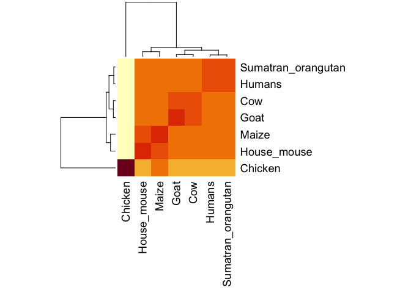

Midterm
================

## Finding a Gene project

Question 7:

Make a heatmap of the MSA data that is a fasta file:

``` r
library(bio3d)
tree <- read.fasta("phylogenic tree data.fst")
head(tree)
```

    ## $id
    ## [1] "Chicken"            "House_mouse"        "Maize"             
    ## [4] "Cow"                "Goat"               "Sumatran_orangutan"
    ## [7] "Humans"            
    ## 
    ## $ali
    ##                    [,1] [,2] [,3] [,4] [,5] [,6] [,7] [,8] [,9] [,10] [,11]
    ## Chicken            "M"  "A"  "R"  "L"  "L"  "T"  "T"  "C"  "C"  "L"   "L"  
    ## House_mouse        "-"  "-"  "M"  "A"  "N"  "L"  "G"  "Y"  "W"  "L"   "L"  
    ## Maize              "-"  "-"  "M"  "A"  "N"  "L"  "G"  "Y"  "W"  "L"   "L"  
    ## Cow                "M"  "V"  "K"  "S"  "H"  "I"  "G"  "S"  "W"  "I"   "L"  
    ## Goat               "M"  "V"  "K"  "S"  "H"  "I"  "G"  "S"  "W"  "I"   "L"  
    ## Sumatran_orangutan "-"  "-"  "M"  "A"  "N"  "L"  "G"  "C"  "W"  "M"   "L"  
    ## Humans             "-"  "-"  "M"  "A"  "N"  "L"  "G"  "C"  "W"  "M"   "L"  
    ##                    [,12] [,13] [,14] [,15] [,16] [,17] [,18] [,19] [,20] [,21]
    ## Chicken            "A"   "L"   "L"   "L"   "A"   "A"   "C"   "T"   "D"   "V"  
    ## House_mouse        "A"   "L"   "F"   "V"   "T"   "M"   "W"   "T"   "D"   "V"  
    ## Maize              "A"   "L"   "F"   "V"   "T"   "T"   "C"   "T"   "D"   "V"  
    ## Cow                "V"   "L"   "F"   "V"   "A"   "M"   "W"   "S"   "D"   "V"  
    ## Goat               "V"   "L"   "F"   "V"   "A"   "M"   "W"   "S"   "D"   "V"  
    ## Sumatran_orangutan "V"   "L"   "F"   "V"   "A"   "T"   "W"   "S"   "N"   "L"  
    ## Humans             "V"   "L"   "F"   "V"   "A"   "T"   "W"   "S"   "D"   "L"  
    ##                    [,22] [,23] [,24] [,25] [,26] [,27] [,28] [,29] [,30] [,31]
    ## Chicken            "A"   "L"   "S"   "K"   "K"   "G"   "K"   "G"   "K"   "P"  
    ## House_mouse        "G"   "L"   "C"   "K"   "K"   "-"   "-"   "-"   "R"   "P"  
    ## Maize              "G"   "L"   "C"   "K"   "K"   "-"   "-"   "-"   "R"   "P"  
    ## Cow                "G"   "L"   "C"   "K"   "K"   "-"   "-"   "-"   "R"   "P"  
    ## Goat               "G"   "L"   "C"   "K"   "K"   "-"   "-"   "-"   "R"   "P"  
    ## Sumatran_orangutan "G"   "L"   "C"   "K"   "K"   "-"   "-"   "-"   "R"   "P"  
    ## Humans             "G"   "L"   "C"   "K"   "K"   "-"   "-"   "-"   "R"   "P"  
    ##                    [,32] [,33] [,34] [,35] [,36] [,37] [,38] [,39] [,40] [,41]
    ## Chicken            "S"   "G"   "-"   "G"   "G"   "W"   "G"   "A"   "G"   "S"  
    ## House_mouse        "K"   "P"   "-"   "G"   "G"   "W"   "N"   "T"   "G"   "G"  
    ## Maize              "K"   "P"   "-"   "G"   "G"   "W"   "N"   "T"   "G"   "G"  
    ## Cow                "K"   "P"   "G"   "G"   "G"   "W"   "N"   "T"   "G"   "G"  
    ## Goat               "K"   "P"   "G"   "G"   "G"   "W"   "N"   "T"   "G"   "G"  
    ## Sumatran_orangutan "K"   "P"   "-"   "G"   "G"   "W"   "N"   "T"   "G"   "G"  
    ## Humans             "K"   "P"   "-"   "G"   "G"   "W"   "N"   "T"   "G"   "G"  
    ##                    [,42] [,43] [,44] [,45] [,46] [,47] [,48] [,49] [,50] [,51]
    ## Chicken            "H"   "R"   "Q"   "P"   "S"   "Y"   "P"   "R"   "Q"   "P"  
    ## House_mouse        "S"   "R"   "-"   "-"   "-"   "Y"   "P"   "G"   "Q"   "-"  
    ## Maize              "S"   "R"   "-"   "-"   "-"   "Y"   "P"   "G"   "Q"   "-"  
    ## Cow                "S"   "R"   "-"   "-"   "-"   "Y"   "P"   "G"   "Q"   "-"  
    ## Goat               "S"   "R"   "-"   "-"   "-"   "Y"   "P"   "G"   "Q"   "-"  
    ## Sumatran_orangutan "S"   "R"   "-"   "-"   "-"   "Y"   "P"   "G"   "Q"   "-"  
    ## Humans             "S"   "R"   "-"   "-"   "-"   "Y"   "P"   "G"   "Q"   "-"  
    ##                    [,52] [,53] [,54] [,55] [,56] [,57] [,58] [,59] [,60] [,61]
    ## Chicken            "G"   "Y"   "P"   "H"   "N"   "P"   "G"   "Y"   "P"   "H"  
    ## House_mouse        "G"   "S"   "P"   "G"   "G"   "N"   "R"   "Y"   "P"   "P"  
    ## Maize              "G"   "S"   "P"   "G"   "G"   "N"   "R"   "Y"   "P"   "P"  
    ## Cow                "G"   "S"   "P"   "G"   "G"   "N"   "R"   "Y"   "P"   "P"  
    ## Goat               "G"   "S"   "P"   "G"   "G"   "N"   "R"   "Y"   "P"   "P"  
    ## Sumatran_orangutan "G"   "S"   "P"   "G"   "G"   "N"   "R"   "Y"   "P"   "P"  
    ## Humans             "G"   "S"   "P"   "G"   "G"   "N"   "R"   "Y"   "P"   "P"  
    ##                    [,62] [,63] [,64] [,65] [,66] [,67] [,68] [,69] [,70] [,71]
    ## Chicken            "N"   "P"   "-"   "-"   "-"   "-"   "-"   "-"   "-"   "-"  
    ## House_mouse        "Q"   "G"   "-"   "-"   "-"   "-"   "-"   "-"   "-"   "-"  
    ## Maize              "Q"   "S"   "-"   "-"   "-"   "-"   "-"   "-"   "-"   "-"  
    ## Cow                "Q"   "G"   "G"   "G"   "G"   "W"   "G"   "Q"   "P"   "H"  
    ## Goat               "Q"   "G"   "-"   "-"   "-"   "-"   "-"   "-"   "-"   "-"  
    ## Sumatran_orangutan "Q"   "G"   "-"   "-"   "-"   "-"   "-"   "-"   "-"   "-"  
    ## Humans             "Q"   "G"   "-"   "-"   "-"   "-"   "-"   "-"   "-"   "-"  
    ##                    [,72] [,73] [,74] [,75] [,76] [,77] [,78] [,79] [,80] [,81]
    ## Chicken            "-"   "-"   "-"   "-"   "G"   "Y"   "P"   "H"   "N"   "P"  
    ## House_mouse        "-"   "G"   "T"   "W"   "G"   "Q"   "P"   "H"   "G"   "G"  
    ## Maize              "G"   "G"   "T"   "W"   "G"   "Q"   "P"   "H"   "G"   "G"  
    ## Cow                "G"   "G"   "G"   "W"   "G"   "Q"   "P"   "H"   "G"   "G"  
    ## Goat               "G"   "G"   "G"   "W"   "G"   "Q"   "P"   "H"   "G"   "G"  
    ## Sumatran_orangutan "G"   "G"   "G"   "W"   "G"   "Q"   "P"   "H"   "G"   "G"  
    ## Humans             "G"   "G"   "G"   "W"   "G"   "Q"   "P"   "H"   "G"   "G"  
    ##                    [,82] [,83] [,84] [,85] [,86] [,87] [,88] [,89] [,90] [,91]
    ## Chicken            "G"   "Y"   "-"   "-"   "P"   "H"   "N"   "P"   "G"   "Y"  
    ## House_mouse        "G"   "W"   "G"   "Q"   "P"   "H"   "G"   "G"   "S"   "W"  
    ## Maize              "G"   "W"   "G"   "Q"   "P"   "H"   "G"   "G"   "G"   "W"  
    ## Cow                "G"   "W"   "G"   "Q"   "P"   "H"   "G"   "G"   "G"   "W"  
    ## Goat               "G"   "W"   "G"   "Q"   "P"   "H"   "G"   "G"   "G"   "W"  
    ## Sumatran_orangutan "G"   "W"   "G"   "Q"   "P"   "H"   "G"   "G"   "G"   "W"  
    ## Humans             "G"   "W"   "G"   "Q"   "P"   "H"   "G"   "G"   "G"   "W"  
    ##                    [,92] [,93] [,94] [,95] [,96] [,97] [,98] [,99] [,100]
    ## Chicken            "-"   "-"   "P"   "H"   "N"   "P"   "G"   "Y"   "P"   
    ## House_mouse        "G"   "Q"   "P"   "H"   "G"   "G"   "S"   "W"   "-"   
    ## Maize              "G"   "Q"   "P"   "H"   "G"   "G"   "G"   "W"   "-"   
    ## Cow                "G"   "Q"   "P"   "H"   "G"   "G"   "G"   "W"   "-"   
    ## Goat               "G"   "Q"   "P"   "H"   "G"   "G"   "G"   "W"   "-"   
    ## Sumatran_orangutan "G"   "Q"   "P"   "H"   "G"   "G"   "G"   "W"   "-"   
    ## Humans             "G"   "Q"   "P"   "H"   "G"   "G"   "G"   "W"   "-"   
    ##                    [,101] [,102] [,103] [,104] [,105] [,106] [,107] [,108]
    ## Chicken            "Q"    "N"    "P"    "G"    "Y"    "P"    "H"    "N"   
    ## House_mouse        "-"    "-"    "-"    "G"    "Q"    "P"    "H"    "-"   
    ## Maize              "-"    "-"    "-"    "G"    "Q"    "P"    "H"    "-"   
    ## Cow                "-"    "-"    "-"    "G"    "Q"    "P"    "H"    "G"   
    ## Goat               "-"    "-"    "-"    "G"    "Q"    "P"    "H"    "G"   
    ## Sumatran_orangutan "-"    "-"    "-"    "G"    "Q"    "P"    "H"    "-"   
    ## Humans             "-"    "-"    "-"    "G"    "Q"    "P"    "H"    "-"   
    ##                    [,109] [,110] [,111] [,112] [,113] [,114] [,115] [,116]
    ## Chicken            "P"    "G"    "Y"    "P"    "G"    "W"    "G"    "Q"   
    ## House_mouse        "G"    "G"    "-"    "-"    "G"    "W"    "G"    "Q"   
    ## Maize              "G"    "G"    "-"    "-"    "G"    "W"    "S"    "Q"   
    ## Cow                "G"    "G"    "-"    "-"    "G"    "W"    "G"    "Q"   
    ## Goat               "G"    "G"    "-"    "-"    "G"    "W"    "G"    "Q"   
    ## Sumatran_orangutan "G"    "G"    "-"    "-"    "G"    "W"    "G"    "Q"   
    ## Humans             "G"    "G"    "-"    "-"    "G"    "W"    "G"    "Q"   
    ##                    [,117] [,118] [,119] [,120] [,121] [,122] [,123] [,124]
    ## Chicken            "G"    "Y"    "N"    "P"    "S"    "S"    "G"    "G"   
    ## House_mouse        "G"    "-"    "-"    "-"    "-"    "-"    "G"    "G"   
    ## Maize              "G"    "-"    "-"    "-"    "-"    "-"    "G"    "G"   
    ## Cow                "-"    "-"    "-"    "-"    "-"    "-"    "G"    "G"   
    ## Goat               "-"    "-"    "-"    "-"    "-"    "-"    "G"    "G"   
    ## Sumatran_orangutan "G"    "-"    "-"    "-"    "-"    "-"    "G"    "G"   
    ## Humans             "G"    "-"    "-"    "-"    "-"    "-"    "G"    "G"   
    ##                    [,125] [,126] [,127] [,128] [,129] [,130] [,131] [,132]
    ## Chicken            "S"    "Y"    "H"    "N"    "Q"    "K"    "P"    "W"   
    ## House_mouse        "T"    "H"    "N"    "Q"    "W"    "N"    "K"    "P"   
    ## Maize              "T"    "H"    "N"    "Q"    "W"    "N"    "K"    "P"   
    ## Cow                "T"    "H"    "G"    "Q"    "W"    "N"    "K"    "P"   
    ## Goat               "S"    "H"    "S"    "Q"    "W"    "N"    "K"    "P"   
    ## Sumatran_orangutan "T"    "H"    "S"    "Q"    "W"    "N"    "K"    "P"   
    ## Humans             "T"    "H"    "S"    "Q"    "W"    "N"    "K"    "P"   
    ##                    [,133] [,134] [,135] [,136] [,137] [,138] [,139] [,140]
    ## Chicken            "K"    "P"    "P"    "K"    "T"    "N"    "F"    "K"   
    ## House_mouse        "S"    "K"    "P"    "K"    "T"    "N"    "L"    "K"   
    ## Maize              "S"    "K"    "P"    "K"    "T"    "N"    "L"    "K"   
    ## Cow                "S"    "K"    "P"    "K"    "T"    "N"    "M"    "K"   
    ## Goat               "S"    "K"    "P"    "K"    "T"    "N"    "M"    "K"   
    ## Sumatran_orangutan "S"    "K"    "P"    "K"    "T"    "N"    "M"    "K"   
    ## Humans             "S"    "K"    "P"    "K"    "T"    "N"    "M"    "K"   
    ##                    [,141] [,142] [,143] [,144] [,145] [,146] [,147] [,148]
    ## Chicken            "H"    "V"    "A"    "G"    "A"    "A"    "A"    "A"   
    ## House_mouse        "H"    "V"    "A"    "G"    "A"    "A"    "A"    "A"   
    ## Maize              "H"    "V"    "A"    "G"    "A"    "A"    "A"    "A"   
    ## Cow                "H"    "V"    "A"    "G"    "A"    "A"    "A"    "A"   
    ## Goat               "H"    "V"    "A"    "G"    "A"    "A"    "A"    "A"   
    ## Sumatran_orangutan "H"    "M"    "A"    "G"    "A"    "A"    "A"    "A"   
    ## Humans             "H"    "M"    "A"    "G"    "A"    "A"    "A"    "A"   
    ##                    [,149] [,150] [,151] [,152] [,153] [,154] [,155] [,156]
    ## Chicken            "G"    "A"    "V"    "V"    "G"    "G"    "L"    "G"   
    ## House_mouse        "G"    "A"    "V"    "V"    "G"    "G"    "L"    "G"   
    ## Maize              "G"    "A"    "V"    "V"    "G"    "G"    "L"    "G"   
    ## Cow                "G"    "A"    "V"    "V"    "G"    "G"    "L"    "G"   
    ## Goat               "G"    "A"    "V"    "V"    "G"    "S"    "L"    "G"   
    ## Sumatran_orangutan "G"    "A"    "V"    "V"    "G"    "G"    "L"    "G"   
    ## Humans             "G"    "A"    "V"    "V"    "G"    "G"    "L"    "G"   
    ##                    [,157] [,158] [,159] [,160] [,161] [,162] [,163] [,164]
    ## Chicken            "G"    "Y"    "A"    "M"    "G"    "R"    "V"    "M"   
    ## House_mouse        "G"    "Y"    "M"    "L"    "G"    "S"    "A"    "M"   
    ## Maize              "G"    "Y"    "M"    "L"    "G"    "S"    "A"    "M"   
    ## Cow                "G"    "Y"    "M"    "L"    "G"    "S"    "A"    "M"   
    ## Goat               "G"    "Y"    "M"    "L"    "G"    "S"    "A"    "M"   
    ## Sumatran_orangutan "G"    "Y"    "M"    "L"    "G"    "S"    "A"    "M"   
    ## Humans             "G"    "Y"    "M"    "L"    "G"    "S"    "A"    "M"   
    ##                    [,165] [,166] [,167] [,168] [,169] [,170] [,171] [,172]
    ## Chicken            "S"    "G"    "M"    "N"    "Y"    "H"    "F"    "D"   
    ## House_mouse        "S"    "R"    "P"    "M"    "I"    "H"    "F"    "G"   
    ## Maize              "S"    "R"    "P"    "M"    "L"    "H"    "F"    "G"   
    ## Cow                "S"    "R"    "P"    "L"    "I"    "H"    "F"    "G"   
    ## Goat               "S"    "R"    "P"    "L"    "I"    "H"    "F"    "G"   
    ## Sumatran_orangutan "S"    "R"    "P"    "I"    "I"    "H"    "F"    "G"   
    ## Humans             "S"    "R"    "P"    "I"    "I"    "H"    "F"    "G"   
    ##                    [,173] [,174] [,175] [,176] [,177] [,178] [,179] [,180]
    ## Chicken            "S"    "P"    "D"    "E"    "Y"    "R"    "W"    "W"   
    ## House_mouse        "N"    "D"    "W"    "E"    "D"    "R"    "Y"    "Y"   
    ## Maize              "N"    "D"    "W"    "E"    "D"    "R"    "Y"    "Y"   
    ## Cow                "S"    "D"    "Y"    "E"    "D"    "R"    "Y"    "Y"   
    ## Goat               "N"    "D"    "Y"    "E"    "D"    "R"    "Y"    "Y"   
    ## Sumatran_orangutan "N"    "D"    "Y"    "E"    "D"    "R"    "Y"    "Y"   
    ## Humans             "S"    "D"    "Y"    "E"    "D"    "R"    "Y"    "Y"   
    ##                    [,181] [,182] [,183] [,184] [,185] [,186] [,187] [,188]
    ## Chicken            "S"    "E"    "N"    "S"    "A"    "R"    "Y"    "P"   
    ## House_mouse        "R"    "E"    "N"    "M"    "Y"    "R"    "Y"    "P"   
    ## Maize              "R"    "E"    "N"    "M"    "Y"    "R"    "Y"    "P"   
    ## Cow                "R"    "E"    "N"    "M"    "H"    "R"    "Y"    "P"   
    ## Goat               "R"    "E"    "N"    "M"    "Y"    "R"    "Y"    "P"   
    ## Sumatran_orangutan "R"    "E"    "N"    "M"    "Y"    "R"    "Y"    "P"   
    ## Humans             "R"    "E"    "N"    "M"    "H"    "R"    "Y"    "P"   
    ##                    [,189] [,190] [,191] [,192] [,193] [,194] [,195] [,196]
    ## Chicken            "N"    "R"    "V"    "Y"    "Y"    "R"    "D"    "Y"   
    ## House_mouse        "N"    "Q"    "V"    "Y"    "Y"    "R"    "P"    "V"   
    ## Maize              "N"    "Q"    "V"    "Y"    "Y"    "R"    "P"    "V"   
    ## Cow                "N"    "Q"    "V"    "Y"    "Y"    "R"    "P"    "V"   
    ## Goat               "N"    "Q"    "V"    "Y"    "Y"    "R"    "P"    "V"   
    ## Sumatran_orangutan "N"    "Q"    "V"    "Y"    "Y"    "R"    "P"    "V"   
    ## Humans             "N"    "Q"    "V"    "Y"    "Y"    "R"    "P"    "M"   
    ##                    [,197] [,198] [,199] [,200] [,201] [,202] [,203] [,204]
    ## Chicken            "S"    "S"    "P"    "V"    "P"    "Q"    "D"    "V"   
    ## House_mouse        "D"    "Q"    "Y"    "S"    "N"    "Q"    "N"    "N"   
    ## Maize              "D"    "Q"    "Y"    "S"    "N"    "Q"    "N"    "N"   
    ## Cow                "D"    "Q"    "Y"    "S"    "N"    "Q"    "N"    "N"   
    ## Goat               "D"    "Q"    "Y"    "S"    "N"    "Q"    "N"    "N"   
    ## Sumatran_orangutan "D"    "Q"    "Y"    "S"    "N"    "Q"    "N"    "N"   
    ## Humans             "D"    "E"    "Y"    "S"    "N"    "Q"    "N"    "N"   
    ##                    [,205] [,206] [,207] [,208] [,209] [,210] [,211] [,212]
    ## Chicken            "F"    "V"    "A"    "D"    "C"    "F"    "N"    "I"   
    ## House_mouse        "F"    "V"    "H"    "D"    "C"    "V"    "N"    "I"   
    ## Maize              "F"    "V"    "H"    "D"    "C"    "V"    "N"    "I"   
    ## Cow                "F"    "V"    "H"    "D"    "C"    "V"    "N"    "I"   
    ## Goat               "F"    "V"    "H"    "D"    "C"    "V"    "N"    "I"   
    ## Sumatran_orangutan "F"    "V"    "H"    "D"    "C"    "V"    "N"    "I"   
    ## Humans             "F"    "V"    "H"    "D"    "C"    "V"    "N"    "I"   
    ##                    [,213] [,214] [,215] [,216] [,217] [,218] [,219] [,220]
    ## Chicken            "T"    "V"    "T"    "E"    "Y"    "S"    "I"    "G"   
    ## House_mouse        "T"    "I"    "K"    "Q"    "H"    "T"    "V"    "T"   
    ## Maize              "T"    "-"    "-"    "-"    "-"    "-"    "-"    "-"   
    ## Cow                "T"    "V"    "K"    "E"    "H"    "T"    "V"    "T"   
    ## Goat               "T"    "V"    "K"    "Q"    "H"    "T"    "V"    "T"   
    ## Sumatran_orangutan "T"    "I"    "K"    "Q"    "H"    "T"    "V"    "T"   
    ## Humans             "T"    "I"    "K"    "Q"    "H"    "T"    "V"    "T"   
    ##                    [,221] [,222] [,223] [,224] [,225] [,226] [,227] [,228]
    ## Chicken            "P"    "A"    "A"    "K"    "K"    "N"    "T"    "S"   
    ## House_mouse        "T"    "T"    "T"    "K"    "-"    "-"    "-"    "-"   
    ## Maize              "-"    "-"    "-"    "-"    "-"    "-"    "-"    "-"   
    ## Cow                "T"    "T"    "T"    "K"    "-"    "-"    "-"    "-"   
    ## Goat               "T"    "T"    "T"    "K"    "-"    "-"    "-"    "-"   
    ## Sumatran_orangutan "T"    "T"    "T"    "K"    "-"    "-"    "-"    "-"   
    ## Humans             "T"    "T"    "T"    "K"    "-"    "-"    "-"    "-"   
    ##                    [,229] [,230] [,231] [,232] [,233] [,234] [,235] [,236]
    ## Chicken            "E"    "A"    "V"    "A"    "A"    "A"    "N"    "Q"   
    ## House_mouse        "-"    "-"    "-"    "-"    "-"    "-"    "G"    "E"   
    ## Maize              "-"    "-"    "-"    "-"    "-"    "-"    "-"    "-"   
    ## Cow                "-"    "-"    "-"    "-"    "-"    "-"    "G"    "E"   
    ## Goat               "-"    "-"    "-"    "-"    "-"    "-"    "G"    "E"   
    ## Sumatran_orangutan "-"    "-"    "-"    "-"    "-"    "-"    "G"    "E"   
    ## Humans             "-"    "-"    "-"    "-"    "-"    "-"    "G"    "E"   
    ##                    [,237] [,238] [,239] [,240] [,241] [,242] [,243] [,244]
    ## Chicken            "T"    "E"    "V"    "E"    "M"    "E"    "N"    "K"   
    ## House_mouse        "N"    "F"    "T"    "E"    "T"    "D"    "V"    "K"   
    ## Maize              "-"    "-"    "-"    "-"    "-"    "-"    "-"    "-"   
    ## Cow                "N"    "F"    "T"    "E"    "T"    "D"    "I"    "K"   
    ## Goat               "N"    "F"    "T"    "E"    "T"    "D"    "I"    "K"   
    ## Sumatran_orangutan "N"    "F"    "T"    "E"    "T"    "D"    "V"    "K"   
    ## Humans             "N"    "F"    "T"    "E"    "T"    "D"    "V"    "K"   
    ##                    [,245] [,246] [,247] [,248] [,249] [,250] [,251] [,252]
    ## Chicken            "V"    "V"    "T"    "K"    "V"    "I"    "R"    "E"   
    ## House_mouse        "M"    "M"    "E"    "R"    "V"    "V"    "E"    "Q"   
    ## Maize              "-"    "-"    "-"    "-"    "-"    "-"    "-"    "-"   
    ## Cow                "M"    "M"    "E"    "R"    "V"    "V"    "E"    "Q"   
    ## Goat               "I"    "M"    "E"    "R"    "V"    "V"    "E"    "Q"   
    ## Sumatran_orangutan "M"    "M"    "E"    "R"    "V"    "V"    "E"    "Q"   
    ## Humans             "M"    "M"    "E"    "R"    "V"    "V"    "E"    "Q"   
    ##                    [,253] [,254] [,255] [,256] [,257] [,258] [,259] [,260]
    ## Chicken            "M"    "C"    "V"    "Q"    "Q"    "Y"    "R"    "E"   
    ## House_mouse        "M"    "C"    "V"    "T"    "Q"    "Y"    "Q"    "K"   
    ## Maize              "-"    "-"    "-"    "-"    "-"    "-"    "-"    "-"   
    ## Cow                "M"    "C"    "I"    "T"    "Q"    "Y"    "Q"    "R"   
    ## Goat               "M"    "C"    "I"    "T"    "Q"    "Y"    "Q"    "R"   
    ## Sumatran_orangutan "M"    "C"    "I"    "T"    "Q"    "Y"    "E"    "R"   
    ## Humans             "M"    "C"    "I"    "T"    "Q"    "Y"    "E"    "R"   
    ##                    [,261] [,262] [,263] [,264] [,265] [,266] [,267] [,268]
    ## Chicken            "-"    "-"    "-"    "-"    "-"    "Y"    "R"    "L"   
    ## House_mouse        "E"    "S"    "Q"    "A"    "Y"    "Y"    "D"    "G"   
    ## Maize              "-"    "-"    "-"    "-"    "-"    "-"    "-"    "-"   
    ## Cow                "E"    "S"    "Q"    "A"    "Y"    "Y"    "Q"    "-"   
    ## Goat               "E"    "S"    "Q"    "A"    "Y"    "Y"    "Q"    "-"   
    ## Sumatran_orangutan "E"    "S"    "Q"    "A"    "Y"    "Y"    "Q"    "-"   
    ## Humans             "E"    "S"    "Q"    "A"    "Y"    "Y"    "Q"    "-"   
    ##                    [,269] [,270] [,271] [,272] [,273] [,274] [,275] [,276]
    ## Chicken            "A"    "S"    "G"    "I"    "Q"    "L"    "H"    "P"   
    ## House_mouse        "R"    "R"    "S"    "S"    "S"    "T"    "V"    "L"   
    ## Maize              "-"    "-"    "-"    "-"    "-"    "-"    "-"    "-"   
    ## Cow                "-"    "R"    "G"    "A"    "S"    "V"    "I"    "L"   
    ## Goat               "-"    "R"    "G"    "A"    "S"    "V"    "I"    "L"   
    ## Sumatran_orangutan "-"    "R"    "G"    "S"    "S"    "M"    "V"    "L"   
    ## Humans             "-"    "R"    "G"    "S"    "S"    "M"    "V"    "L"   
    ##                    [,277] [,278] [,279] [,280] [,281] [,282] [,283] [,284]
    ## Chicken            "A"    "D"    "T"    "W"    "L"    "A"    "V"    "L"   
    ## House_mouse        "F"    "S"    "S"    "P"    "P"    "V"    "I"    "L"   
    ## Maize              "-"    "-"    "-"    "-"    "-"    "-"    "-"    "-"   
    ## Cow                "F"    "S"    "S"    "P"    "P"    "V"    "I"    "L"   
    ## Goat               "F"    "S"    "P"    "P"    "P"    "V"    "I"    "L"   
    ## Sumatran_orangutan "F"    "S"    "S"    "P"    "P"    "V"    "I"    "L"   
    ## Humans             "F"    "S"    "S"    "P"    "P"    "V"    "I"    "L"   
    ##                    [,285] [,286] [,287] [,288] [,289] [,290] [,291] [,292]
    ## Chicken            "L"    "L"    "L"    "L"    "T"    "T"    "L"    "F"   
    ## House_mouse        "L"    "I"    "S"    "F"    "L"    "I"    "F"    "L"   
    ## Maize              "-"    "-"    "-"    "-"    "-"    "-"    "-"    "-"   
    ## Cow                "L"    "I"    "S"    "F"    "L"    "I"    "F"    "L"   
    ## Goat               "L"    "I"    "S"    "F"    "L"    "I"    "F"    "L"   
    ## Sumatran_orangutan "L"    "I"    "S"    "F"    "L"    "I"    "F"    "L"   
    ## Humans             "L"    "I"    "S"    "F"    "L"    "I"    "F"    "L"   
    ##                    [,293] [,294] [,295]
    ## Chicken            "A"    "M"    "H"   
    ## House_mouse        "I"    "V"    "G"   
    ## Maize              "-"    "-"    "-"   
    ## Cow                "I"    "V"    "G"   
    ## Goat               "I"    "V"    "G"   
    ## Sumatran_orangutan "I"    "V"    "G"   
    ## Humans             "I"    "V"    "G"   
    ## 
    ## $call
    ## read.fasta(file = "phylogenic tree data.fst")

Calculate a sequence identity matrix from the data:

``` r
mat <- seqidentity(tree)
mat
```

    ##                    Chicken House_mouse Maize   Cow  Goat Sumatran_orangutan
    ## Chicken              1.000       0.421 0.526 0.434 0.426              0.417
    ## House_mouse          0.421       1.000 0.962 0.888 0.884              0.913
    ## Maize                0.526       0.962 1.000 0.885 0.885              0.907
    ## Cow                  0.434       0.888 0.885 1.000 0.969              0.917
    ## Goat                 0.426       0.884 0.885 0.969 1.000              0.917
    ## Sumatran_orangutan   0.417       0.913 0.907 0.917 0.917              1.000
    ## Humans               0.425       0.901 0.891 0.921 0.905              0.980
    ##                    Humans
    ## Chicken             0.425
    ## House_mouse         0.901
    ## Maize               0.891
    ## Cow                 0.921
    ## Goat                0.905
    ## Sumatran_orangutan  0.980
    ## Humans              1.000

Make a heatmap:

``` r
heatmap(mat, margins = c(12,12))
```

<!-- -->

Generate a consensus sequence:

``` r
new <- consensus(tree)
```

Search the main protein structure database for the most similar atomic
resolution structures to the aligned
    sequences:

``` r
h <- blast.pdb(new$seq)
```

    ##  Searching ... please wait (updates every 5 seconds) RID = 6FKD8PDS01R 
    ##  .
    ##  Reporting 104 hits

``` r
head(h)
```

    ## $hit.tbl
    ##         queryid subjectids identity alignmentlength mismatches gapopens q.start
    ## 1   Query_52183     1QLX_A   87.981             208         10       11      14
    ## 2   Query_52183     4KML_A   87.923             207         10       11      15
    ## 3   Query_52183     1DX0_A   75.234             214         30       10      14
    ## 4   Query_52183     1QM0_A   85.315             143          7       10      78
    ## 5   Query_52183     2LFT_A   85.816             141          6       10      80
    ## 6   Query_52183     2LSB_A   85.816             141          6       10      80
    ## 7   Query_52183     6DU9_A   85.816             141          6       10      80
    ## 8   Query_52183     1B10_A   84.892             139          8        8      80
    ## 9   Query_52183     2LEJ_A   85.106             141          7       10      80
    ## 10  Query_52183     5YJ4_A   85.000             140          7       10      81
    ## 11  Query_52183     5YJ5_A   85.714             140          6       10      81
    ## 12  Query_52183     2M8T_A   83.448             145         10       10      76
    ## 13  Query_52183     4YXL_A   83.217             143         11        8      80
    ## 14  Query_52183     1FKC_A   85.106             141          7       10      80
    ## 15  Query_52183     5L6R_A   86.131             137          6        9      80
    ## 16  Query_52183     3HEQ_A   85.106             141          7       10      80
    ## 17  Query_52183     4YX2_A   83.333             144         11        9      74
    ## 18  Query_52183     3HES_A   85.106             141          7       10      80
    ## 19  Query_52183     2KUN_A   85.106             141          7       10      80
    ## 20  Query_52183     6FNV_A   84.672             137          9        8      80
    ## 21  Query_52183     2JOH_A   82.734             139         12        8      81
    ## 22  Query_52183     3HAF_A   85.106             141          7       10      80
    ## 23  Query_52183     2N53_A   84.962             133          8        8      84
    ## 24  Query_52183     2L1H_A   85.455             110          5        7     107
    ## 25  Query_52183     6HHD_A   87.037             108          3        7     107
    ## 26  Query_52183     1DWY_A   85.321             109          5        7     107
    ## 27  Query_52183     2K56_A   84.545             110          6        7     107
    ## 28  Query_52183     2W9E_A   84.821             112          5        8     107
    ## 29  Query_52183     2JOM_A   82.014             139         13        8      81
    ## 30  Query_52183     2K5O_A   84.545             110          6        7     107
    ## 31  Query_52183     2KFO_A   84.545             110          6        7     107
    ## 32  Query_52183     2K1D_A   82.759             145         11       10      76
    ## 33  Query_52183     1Y2S_A   84.404             109          6        7     107
    ## 34  Query_52183     1I4M_A   85.185             108          5        7     107
    ## 35  Query_52183     6HHD_C   86.916             107          3        7     107
    ## 36  Query_52183     1QM2_A   83.929             112          6        8     107
    ## 37  Query_52183     4DGI_A   84.685             111          5        8     108
    ## 38  Query_52183     1XYX_A   86.111             108          4        7     109
    ## 39  Query_52183     3HER_A   84.397             141          8       10      80
    ## 40  Query_52183     2L40_A   84.545             110          6        7     107
    ## 41  Query_52183     2FJ3_A   81.884             138         13        8      81
    ## 42  Query_52183     1XYJ_A   85.047             107          5        7     109
    ## 43  Query_52183     2L1E_A   84.545             110          6        7     107
    ## 44  Query_52183     2KU5_A   84.404             109          6        7     108
    ## 45  Query_52183     4H88_A   85.185             108          5        7     109
    ## 46  Query_52183     4HMM_A   85.185             108          5        7     108
    ## 47  Query_52183     1Y15_A   85.185             108          5        7     109
    ## 48  Query_52183     1XYU_A   85.047             107          5        7     109
    ## 49  Query_52183     1H0L_A   83.784             111          6        8     108
    ## 50  Query_52183     2KFM_A   85.849             106          4        7     107
    ## 51  Query_52183     2L1D_A   84.545             110          6        7     107
    ## 52  Query_52183     4HMR_A   84.259             108          6        7     108
    ## 53  Query_52183     2KU6_A   83.486             109          7        7     108
    ## 54  Query_52183     1Y16_A   84.259             108          6        7     109
    ## 55  Query_52183     1XYW_A   83.178             107          7        7     109
    ## 56  Query_52183     2L1K_A   84.906             106          5        7     107
    ## 57  Query_52183     1XYK_A   83.178             107          7        7     109
    ## 58  Query_52183     4HLS_A   83.333             108          7        7     108
    ## 59  Query_52183     1AG2_A   86.408             103          3        7     112
    ## 60  Query_52183     4YXK_A   82.407             108          8        7     108
    ## 61  Query_52183     4YXH_A   82.407             108          8        7     108
    ## 62  Query_52183     1XYQ_A   83.168             101          8        6     109
    ## 63  Query_52183     2LH8_A   82.692             104          7        6     113
    ## 64  Query_52183     1TQB_A   85.294             102          4        7     112
    ## 65  Query_52183     2KU4_A   81.553             103         10        6     107
    ## 66  Query_52183     1TQC_A   85.294             102          4        7     112
    ## 67  Query_52183     1HJM_A   83.495             103          6        7     113
    ## 68  Query_52183     6AQ7_A   85.294             102          4        7     113
    ## 69  Query_52183     1E1G_A   84.314             102          5        7     114
    ## 70  Query_52183     2MV9_A   81.955             133          8        9      84
    ## 71  Query_52183     1UW3_A   84.466             103          5        7     113
    ## 72  Query_52183     3HAK_A   82.524             103          7        7     113
    ## 73  Query_52183     1E1U_A   83.333             102          6        7     114
    ## 74  Query_52183     1HJN_A   83.333             102          6        7     114
    ## 75  Query_52183     4MA7_A   85.149             101          4        7     116
    ## 76  Query_52183     1TPX_A   85.000             100          4        7     116
    ## 77  Query_52183     3O79_A   81.731             104          8        7     114
    ## 78  Query_52183     6HER_A   85.859              99          3        7     116
    ## 79  Query_52183     1E1P_A   82.353             102          7        7     114
    ## 80  Query_52183     2MV8_A   80.153             131         10        8      84
    ## 81  Query_52183     3HJX_A   81.905             105          7        8     114
    ## 82  Query_52183     2KKG_A   96.471              85          1        2      13
    ## 83  Query_52183     2KFL_A   76.699             103         15        6     107
    ## 84  Query_52183     2KTM_A   81.818              66          5        4     146
    ## 85  Query_52183     1U5L_A   44.792              96         45        6     107
    ## 86  Query_52183     1U3M_A   39.815             108         47        5     107
    ## 87  Query_52183     2RMV_A   95.238              21          0        1     131
    ## 88  Query_52183     1G04_A   95.238              21          0        1     131
    ## 89  Query_52183     1XU0_A   34.058             138         69       10      82
    ## 90  Query_52183     2IV5_A   86.364              22          1        1     158
    ## 91  Query_52183     2RMW_A   90.476              21          1        1     131
    ## 92  Query_52183     2IV6_A   81.818              22          2        1     158
    ## 93  Query_52183     1S4T_A   80.000              20          1        2     123
    ## 94  Query_52183     4J8R_I   87.500              16          2        0      50
    ## 95  Query_52183     4J8R_I   87.500              16          2        0      58
    ## 96  Query_52183     4J8R_I   87.500              16          2        0      66
    ## 97  Query_52183     4J8R_I   81.250              16          3        0      42
    ## 98  Query_52183     1SKH_A   84.211              19          1        2       3
    ## 99  Query_52183     6IR9_W   34.848              66         35        3      28
    ## 100 Query_52183     6IR9_W   33.898              59         33        2      35
    ## 101 Query_52183     5Z58_2   30.508              59         32        2       8
    ## 102 Query_52183     2RSK_C  100.000              11          0        0      87
    ## 103 Query_52183     2IV4_A   71.429              14          4        0     164
    ## 104 Query_52183     3IC3_A   31.034              29         20        0     163
    ##     q.end s.start s.end   evalue bitscore positives mlog.evalue pdb.id    acc
    ## 1     206       3   210 5.26e-65    201.0     89.90 148.0079000 1QLX_A 1QLX_A
    ## 2     206      34   240 1.55e-63    198.0     89.86 144.6246059 4KML_A 4KML_A
    ## 3     204       3   216 9.22e-59    185.0     76.17 133.6311454 1DX0_A 1DX0_A
    ## 4     206       1   143 3.75e-58    181.0     88.11 132.2281796 1QM0_A 1QM0_A
    ## 5     206       1   141 6.62e-58    180.0     88.65 131.6598400 2LFT_A 2LFT_A
    ## 6     206       1   141 7.79e-58    180.0     88.65 131.4970945 2LSB_A 2LSB_A
    ## 7     206       1   141 9.70e-58    180.0     88.65 131.2778095 6DU9_A 6DU9_A
    ## 8     205       1   139 1.33e-57    179.0     88.49 130.9621714 1B10_A 1B10_A
    ## 9     206       6   146 2.07e-57    179.0     88.65 130.5198017 2LEJ_A 2LEJ_A
    ## 10    206       2   141 2.17e-57    179.0     87.86 130.4726231 5YJ4_A 5YJ4_A
    ## 11    206       2   141 2.17e-57    179.0     88.57 130.4726231 5YJ5_A 5YJ5_A
    ## 12    206       1   145 2.69e-57    179.0     86.90 130.2578091 2M8T_A 2M8T_A
    ## 13    209      24   166 2.74e-57    179.0     86.71 130.2393924 4YXL_A 4YXL_A
    ## 14    206       1   141 3.40e-57    179.0     88.65 130.0235749 1FKC_A 1FKC_A
    ## 15    203       1   137 4.55e-57    178.0     89.05 129.7322231 5L6R_A 5L6R_A
    ## 16    206       1   141 5.03e-57    178.0     88.65 129.6319303 3HEQ_A 3HEQ_A
    ## 17    204      16   159 7.40e-57    178.0     85.42 129.2458703 4YX2_A 4YX2_A
    ## 18    206       1   141 1.33e-56    177.0     87.94 128.6595863 3HES_A 3HES_A
    ## 19    206       1   141 2.80e-56    176.0     87.94 127.9151458 2KUN_A 2KUN_A
    ## 20    204       1   137 2.03e-55    174.0     87.59 125.9341443 6FNV_A 6FNV_A
    ## 21    207       3   141 7.51e-54    170.0     87.05 122.3233596 2JOH_A 2JOH_A
    ## 22    206       1   141 8.80e-54    170.0     88.65 122.1648433 3HAF_A 3HAF_A
    ## 23    204      18   150 9.37e-54    170.0     87.97 122.1020819 2N53_A 2N53_A
    ## 24    205       1   110 1.20e-53    169.0     88.18 121.8546884 2L1H_A 2L1H_A
    ## 25    203       1   108 1.27e-53    168.0     88.89 121.7979930 6HHD_A 6HHD_A
    ## 26    204       1   109 1.87e-53    168.0     88.07 121.4110715 1DWY_A 1DWY_A
    ## 27    205       1   110 2.06e-53    168.0     88.18 121.3143039 2K56_A 2K56_A
    ## 28    206       1   112 2.40e-53    168.0     87.50 121.1615412 2W9E_A 2W9E_A
    ## 29    207       3   141 4.38e-53    168.0     87.05 120.5599612 2JOM_A 2JOM_A
    ## 30    205       1   110 5.30e-53    167.0     88.18 120.3693031 2K5O_A 2K5O_A
    ## 31    205       1   110 5.79e-53    167.0     87.27 120.2808776 2KFO_A 2KFO_A
    ## 32    206       1   145 5.89e-53    168.0     86.90 120.2637539 2K1D_A 2K1D_A
    ## 33    204       1   109 5.92e-53    167.0     88.99 120.2586735 1Y2S_A 1Y2S_A
    ## 34    203       1   108 8.54e-53    166.0     87.96 119.8922489 1I4M_A 1I4M_A
    ## 35    202       1   107 8.75e-53    166.0     88.79 119.8679562 6HHD_C 6HHD_C
    ## 36    206       1   112 9.17e-53    166.0     87.50 119.8210726 1QM2_A 1QM2_A
    ## 37    206       1   111 1.00e-52    166.0     87.39 119.7344248 4DGI_A 4DGI_A
    ## 38    205       1   108 1.01e-52    166.0     87.96 119.7244745 1XYX_A 1XYX_A
    ## 39    206       1   141 1.56e-52    167.0     87.94 119.2897390 3HER_A 3HER_A
    ## 40    205       1   110 1.61e-52    166.0     87.27 119.2581907 2L40_A 2L40_A
    ## 41    206       1   138 2.22e-52    166.0     86.96 118.9369176 2FJ3_A 2FJ3_A
    ## 42    204       1   107 2.27e-52    165.0     88.79 118.9146450 1XYJ_A 1XYJ_A
    ## 43    205       1   110 2.29e-52    165.0     87.27 118.9058730 2L1E_A 2L1E_A
    ## 44    205       1   109 4.65e-52    164.0     87.16 118.1975576 2KU5_A 2KU5_A
    ## 45    205       1   108 5.92e-52    164.0     87.04 117.9560884 4H88_A 4H88_A
    ## 46    204      22   129 6.43e-52    165.0     87.96 117.8734503 4HMM_A 4HMM_A
    ## 47    205       1   108 7.44e-52    164.0     87.04 117.7275540 1Y15_A 1Y15_A
    ## 48    204       1   107 8.96e-52    164.0     87.85 117.5416546 1XYU_A 1XYU_A
    ## 49    206       2   112 9.05e-52    164.0     86.49 117.5316601 1H0L_A 1H0L_A
    ## 50    201       1   106 9.74e-52    164.0     88.68 117.4581837 2KFM_A 2KFM_A
    ## 51    205       1   110 9.85e-52    164.0     87.27 117.4469534 2L1D_A 2L1D_A
    ## 52    204      22   129 2.59e-51    163.0     87.96 116.4801819 4HMR_A 4HMR_A
    ## 53    205       1   109 3.00e-51    162.0     86.24 116.3332275 2KU6_A 2KU6_A
    ## 54    205       1   108 3.27e-51    162.0     87.04 116.2470498 1Y16_A 1Y16_A
    ## 55    204       1   107 8.84e-51    161.0     87.85 115.2525529 1XYW_A 1XYW_A
    ## 56    201       1   106 1.17e-50    161.0     87.74 114.9722509 2L1K_A 2L1K_A
    ## 57    204       1   107 1.40e-50    160.0     87.85 114.7927824 1XYK_A 1XYK_A
    ## 58    204      22   129 1.50e-50    161.0     87.96 114.7237895 4HLS_A 4HLS_A
    ## 59    203       1   103 2.91e-50    159.0     88.35 114.0611016 1AG2_A 1AG2_A
    ## 60    204      27   134 5.28e-50    160.0     87.04 113.4653286 4YXK_A 4YXK_A
    ## 61    204      27   134 7.64e-50    159.0     87.04 113.0958570 4YXH_A 4YXH_A
    ## 62    200       1   101 3.26e-49    157.0     88.12 111.6449424 1XYQ_A 1XYQ_A
    ## 63    205       1   104 4.01e-49    157.0     86.54 111.4378783 2LH8_A 2LH8_A
    ## 64    202       1   102 4.34e-49    156.0     87.25 111.3587952 1TQB_A 1TQB_A
    ## 65    200       1   103 4.55e-49    157.0     87.38 111.3115423 2KU4_A 2KU4_A
    ## 66    202       1   102 4.59e-49    156.0     88.24 111.3027895 1TQC_A 1TQC_A
    ## 67    204       1   103 7.62e-49    156.0     87.38 110.7958932 1HJM_A 1HJM_A
    ## 68    203      21   122 1.18e-48    156.0     88.24 110.3585700 6AQ7_A 6AQ7_A
    ## 69    204       2   103 1.62e-48    155.0     87.25 110.0416583 1E1G_A 1E1G_A
    ## 70    204      18   146 1.63e-48    157.0     84.96 110.0355044 2MV9_A 2MV9_A
    ## 71    204       1   103 1.86e-48    155.0     87.38 109.9035080 1UW3_A 1UW3_A
    ## 72    204       1   103 3.91e-48    154.0     87.38 109.1605471 3HAK_A 3HAK_A
    ## 73    204       2   103 4.40e-48    154.0     87.25 109.0424799 1E1U_A 1E1U_A
    ## 74    204       2   103 5.18e-48    154.0     87.25 108.8792794 1HJN_A 1HJN_A
    ## 75    205      12   112 1.14e-47    153.0     87.13 108.0904711 4MA7_A 4MA7_A
    ## 76    204      18   117 1.16e-47    154.0     88.00 108.0730794 1TPX_A 1TPX_A
    ## 77    206       1   104 1.77e-47    152.0     86.54 107.6505198 3O79_A 3O79_A
    ## 78    203      11   109 2.11e-47    152.0     87.88 107.4748114 6HER_A 6HER_A
    ## 79    204       2   103 2.18e-47    152.0     87.25 107.4421745 1E1P_A 1E1P_A
    ## 80    204      18   142 7.51e-47    152.0     83.21 106.2052639 2MV8_A 2MV8_A
    ## 81    206       1   105 8.39e-47    151.0     86.67 106.0944589 3HJX_A 3HJX_A
    ## 82     95       1    85 1.91e-44    144.0     96.47 100.6666408 2KKG_A 2KKG_A
    ## 83    200       1   103 8.77e-41    135.0     86.41  92.2346520 2KFL_A 2KFL_A
    ## 84    204      20    85 1.46e-27    101.0     86.36  61.7913611 2KTM_A 2KTM_A
    ## 85    194       1    96 2.45e-12     62.4     62.50  26.7349331 1U5L_A 1U5L_A
    ## 86    196       1   108 4.43e-12     61.6     50.93  26.1426215 1U3M_A 1U3M_A
    ## 87    150       5    25 1.82e-06     44.3     95.24  13.2166741 2RMV_A 2RMV_A
    ## 88    150       5    25 2.98e-06     43.5     95.24  12.7235873 1G04_A 1G04_A
    ## 89    206       2   130 1.11e-05     44.7     54.35  11.4085654 1XU0_A 1XU0_A
    ## 90    177       2    23 1.17e-05     42.0     90.91  11.3559217 2IV5_A 2IV5_A
    ## 91    150       5    25 2.62e-05     40.8     90.48  10.5497511 2RMW_A 2RMW_A
    ## 92    177       2    23 5.62e-05     40.0     90.91   9.7865938 2IV6_A 2IV6_A
    ## 93    139       1    20 5.90e-02     31.6     85.00   2.8302178 1S4T_A 1S4T_A
    ## 94     65       1    16 6.20e-02     31.6     87.50   2.7806209 4J8R_I 4J8R_I
    ## 95     73       1    16 6.20e-02     31.6     87.50   2.7806209 4J8R_I 4J8R_I
    ## 96     81       1    16 6.20e-02     31.6     87.50   2.7806209 4J8R_I 4J8R_I
    ## 97     57       1    16 4.30e-01     29.3     81.25   0.8439701 4J8R_I 4J8R_I
    ## 98     19      12    30 6.90e-02     31.6     89.47   2.6736488 1SKH_A 1SKH_A
    ## 99     93     839   896 1.00e+00     31.6     36.36   0.0000000 6IR9_W 6IR9_W
    ## 100    93     835   887 6.30e+00     28.9     37.29  -1.8405496 6IR9_W 6IR9_W
    ## 101    66     632   681 3.10e+00     30.0     42.37  -1.1314021 5Z58_2 5Z58_2
    ## 102    97       2    12 3.40e+00     26.6    100.00  -1.2237754 2RSK_C 2RSK_C
    ## 103   177       3    16 5.80e+00     25.8     85.71  -1.7578579 2IV4_A 2IV4_A
    ## 104   191      53    81 9.00e+00     27.3     58.62  -2.1972246 3IC3_A 3IC3_A
    ## 
    ## $raw
    ##         queryid subjectids identity alignmentlength mismatches gapopens q.start
    ## 1   Query_52183     1QLX_A   87.981             208         10       11      14
    ## 2   Query_52183     4KML_A   87.923             207         10       11      15
    ## 3   Query_52183     1DX0_A   75.234             214         30       10      14
    ## 4   Query_52183     1QM0_A   85.315             143          7       10      78
    ## 5   Query_52183     2LFT_A   85.816             141          6       10      80
    ## 6   Query_52183     2LSB_A   85.816             141          6       10      80
    ## 7   Query_52183     6DU9_A   85.816             141          6       10      80
    ## 8   Query_52183     1B10_A   84.892             139          8        8      80
    ## 9   Query_52183     2LEJ_A   85.106             141          7       10      80
    ## 10  Query_52183     5YJ4_A   85.000             140          7       10      81
    ## 11  Query_52183     5YJ5_A   85.714             140          6       10      81
    ## 12  Query_52183     2M8T_A   83.448             145         10       10      76
    ## 13  Query_52183     4YXL_A   83.217             143         11        8      80
    ## 14  Query_52183     1FKC_A   85.106             141          7       10      80
    ## 15  Query_52183     5L6R_A   86.131             137          6        9      80
    ## 16  Query_52183     3HEQ_A   85.106             141          7       10      80
    ## 17  Query_52183     4YX2_A   83.333             144         11        9      74
    ## 18  Query_52183     3HES_A   85.106             141          7       10      80
    ## 19  Query_52183     2KUN_A   85.106             141          7       10      80
    ## 20  Query_52183     6FNV_A   84.672             137          9        8      80
    ## 21  Query_52183     2JOH_A   82.734             139         12        8      81
    ## 22  Query_52183     3HAF_A   85.106             141          7       10      80
    ## 23  Query_52183     2N53_A   84.962             133          8        8      84
    ## 24  Query_52183     2L1H_A   85.455             110          5        7     107
    ## 25  Query_52183     6HHD_A   87.037             108          3        7     107
    ## 26  Query_52183     1DWY_A   85.321             109          5        7     107
    ## 27  Query_52183     2K56_A   84.545             110          6        7     107
    ## 28  Query_52183     2W9E_A   84.821             112          5        8     107
    ## 29  Query_52183     2JOM_A   82.014             139         13        8      81
    ## 30  Query_52183     2K5O_A   84.545             110          6        7     107
    ## 31  Query_52183     2KFO_A   84.545             110          6        7     107
    ## 32  Query_52183     2K1D_A   82.759             145         11       10      76
    ## 33  Query_52183     1Y2S_A   84.404             109          6        7     107
    ## 34  Query_52183     1I4M_A   85.185             108          5        7     107
    ## 35  Query_52183     6HHD_C   86.916             107          3        7     107
    ## 36  Query_52183     1QM2_A   83.929             112          6        8     107
    ## 37  Query_52183     4DGI_A   84.685             111          5        8     108
    ## 38  Query_52183     1XYX_A   86.111             108          4        7     109
    ## 39  Query_52183     3HER_A   84.397             141          8       10      80
    ## 40  Query_52183     2L40_A   84.545             110          6        7     107
    ## 41  Query_52183     2FJ3_A   81.884             138         13        8      81
    ## 42  Query_52183     1XYJ_A   85.047             107          5        7     109
    ## 43  Query_52183     2L1E_A   84.545             110          6        7     107
    ## 44  Query_52183     2KU5_A   84.404             109          6        7     108
    ## 45  Query_52183     4H88_A   85.185             108          5        7     109
    ## 46  Query_52183     4HMM_A   85.185             108          5        7     108
    ## 47  Query_52183     1Y15_A   85.185             108          5        7     109
    ## 48  Query_52183     1XYU_A   85.047             107          5        7     109
    ## 49  Query_52183     1H0L_A   83.784             111          6        8     108
    ## 50  Query_52183     2KFM_A   85.849             106          4        7     107
    ## 51  Query_52183     2L1D_A   84.545             110          6        7     107
    ## 52  Query_52183     4HMR_A   84.259             108          6        7     108
    ## 53  Query_52183     2KU6_A   83.486             109          7        7     108
    ## 54  Query_52183     1Y16_A   84.259             108          6        7     109
    ## 55  Query_52183     1XYW_A   83.178             107          7        7     109
    ## 56  Query_52183     2L1K_A   84.906             106          5        7     107
    ## 57  Query_52183     1XYK_A   83.178             107          7        7     109
    ## 58  Query_52183     4HLS_A   83.333             108          7        7     108
    ## 59  Query_52183     1AG2_A   86.408             103          3        7     112
    ## 60  Query_52183     4YXK_A   82.407             108          8        7     108
    ## 61  Query_52183     4YXH_A   82.407             108          8        7     108
    ## 62  Query_52183     1XYQ_A   83.168             101          8        6     109
    ## 63  Query_52183     2LH8_A   82.692             104          7        6     113
    ## 64  Query_52183     1TQB_A   85.294             102          4        7     112
    ## 65  Query_52183     2KU4_A   81.553             103         10        6     107
    ## 66  Query_52183     1TQC_A   85.294             102          4        7     112
    ## 67  Query_52183     1HJM_A   83.495             103          6        7     113
    ## 68  Query_52183     6AQ7_A   85.294             102          4        7     113
    ## 69  Query_52183     1E1G_A   84.314             102          5        7     114
    ## 70  Query_52183     2MV9_A   81.955             133          8        9      84
    ## 71  Query_52183     1UW3_A   84.466             103          5        7     113
    ## 72  Query_52183     3HAK_A   82.524             103          7        7     113
    ## 73  Query_52183     1E1U_A   83.333             102          6        7     114
    ## 74  Query_52183     1HJN_A   83.333             102          6        7     114
    ## 75  Query_52183     4MA7_A   85.149             101          4        7     116
    ## 76  Query_52183     1TPX_A   85.000             100          4        7     116
    ## 77  Query_52183     3O79_A   81.731             104          8        7     114
    ## 78  Query_52183     6HER_A   85.859              99          3        7     116
    ## 79  Query_52183     1E1P_A   82.353             102          7        7     114
    ## 80  Query_52183     2MV8_A   80.153             131         10        8      84
    ## 81  Query_52183     3HJX_A   81.905             105          7        8     114
    ## 82  Query_52183     2KKG_A   96.471              85          1        2      13
    ## 83  Query_52183     2KFL_A   76.699             103         15        6     107
    ## 84  Query_52183     2KTM_A   81.818              66          5        4     146
    ## 85  Query_52183     1U5L_A   44.792              96         45        6     107
    ## 86  Query_52183     1U3M_A   39.815             108         47        5     107
    ## 87  Query_52183     2RMV_A   95.238              21          0        1     131
    ## 88  Query_52183     1G04_A   95.238              21          0        1     131
    ## 89  Query_52183     1XU0_A   34.058             138         69       10      82
    ## 90  Query_52183     2IV5_A   86.364              22          1        1     158
    ## 91  Query_52183     2RMW_A   90.476              21          1        1     131
    ## 92  Query_52183     2IV6_A   81.818              22          2        1     158
    ## 93  Query_52183     1S4T_A   80.000              20          1        2     123
    ## 94  Query_52183     4J8R_I   87.500              16          2        0      50
    ## 95  Query_52183     4J8R_I   87.500              16          2        0      58
    ## 96  Query_52183     4J8R_I   87.500              16          2        0      66
    ## 97  Query_52183     4J8R_I   81.250              16          3        0      42
    ## 98  Query_52183     1SKH_A   84.211              19          1        2       3
    ## 99  Query_52183     6IR9_W   34.848              66         35        3      28
    ## 100 Query_52183     6IR9_W   33.898              59         33        2      35
    ## 101 Query_52183     5Z58_2   30.508              59         32        2       8
    ## 102 Query_52183     2RSK_C  100.000              11          0        0      87
    ## 103 Query_52183     2IV4_A   71.429              14          4        0     164
    ## 104 Query_52183     3IC3_A   31.034              29         20        0     163
    ##     q.end s.start s.end   evalue bitscore positives
    ## 1     206       3   210 5.26e-65    201.0     89.90
    ## 2     206      34   240 1.55e-63    198.0     89.86
    ## 3     204       3   216 9.22e-59    185.0     76.17
    ## 4     206       1   143 3.75e-58    181.0     88.11
    ## 5     206       1   141 6.62e-58    180.0     88.65
    ## 6     206       1   141 7.79e-58    180.0     88.65
    ## 7     206       1   141 9.70e-58    180.0     88.65
    ## 8     205       1   139 1.33e-57    179.0     88.49
    ## 9     206       6   146 2.07e-57    179.0     88.65
    ## 10    206       2   141 2.17e-57    179.0     87.86
    ## 11    206       2   141 2.17e-57    179.0     88.57
    ## 12    206       1   145 2.69e-57    179.0     86.90
    ## 13    209      24   166 2.74e-57    179.0     86.71
    ## 14    206       1   141 3.40e-57    179.0     88.65
    ## 15    203       1   137 4.55e-57    178.0     89.05
    ## 16    206       1   141 5.03e-57    178.0     88.65
    ## 17    204      16   159 7.40e-57    178.0     85.42
    ## 18    206       1   141 1.33e-56    177.0     87.94
    ## 19    206       1   141 2.80e-56    176.0     87.94
    ## 20    204       1   137 2.03e-55    174.0     87.59
    ## 21    207       3   141 7.51e-54    170.0     87.05
    ## 22    206       1   141 8.80e-54    170.0     88.65
    ## 23    204      18   150 9.37e-54    170.0     87.97
    ## 24    205       1   110 1.20e-53    169.0     88.18
    ## 25    203       1   108 1.27e-53    168.0     88.89
    ## 26    204       1   109 1.87e-53    168.0     88.07
    ## 27    205       1   110 2.06e-53    168.0     88.18
    ## 28    206       1   112 2.40e-53    168.0     87.50
    ## 29    207       3   141 4.38e-53    168.0     87.05
    ## 30    205       1   110 5.30e-53    167.0     88.18
    ## 31    205       1   110 5.79e-53    167.0     87.27
    ## 32    206       1   145 5.89e-53    168.0     86.90
    ## 33    204       1   109 5.92e-53    167.0     88.99
    ## 34    203       1   108 8.54e-53    166.0     87.96
    ## 35    202       1   107 8.75e-53    166.0     88.79
    ## 36    206       1   112 9.17e-53    166.0     87.50
    ## 37    206       1   111 1.00e-52    166.0     87.39
    ## 38    205       1   108 1.01e-52    166.0     87.96
    ## 39    206       1   141 1.56e-52    167.0     87.94
    ## 40    205       1   110 1.61e-52    166.0     87.27
    ## 41    206       1   138 2.22e-52    166.0     86.96
    ## 42    204       1   107 2.27e-52    165.0     88.79
    ## 43    205       1   110 2.29e-52    165.0     87.27
    ## 44    205       1   109 4.65e-52    164.0     87.16
    ## 45    205       1   108 5.92e-52    164.0     87.04
    ## 46    204      22   129 6.43e-52    165.0     87.96
    ## 47    205       1   108 7.44e-52    164.0     87.04
    ## 48    204       1   107 8.96e-52    164.0     87.85
    ## 49    206       2   112 9.05e-52    164.0     86.49
    ## 50    201       1   106 9.74e-52    164.0     88.68
    ## 51    205       1   110 9.85e-52    164.0     87.27
    ## 52    204      22   129 2.59e-51    163.0     87.96
    ## 53    205       1   109 3.00e-51    162.0     86.24
    ## 54    205       1   108 3.27e-51    162.0     87.04
    ## 55    204       1   107 8.84e-51    161.0     87.85
    ## 56    201       1   106 1.17e-50    161.0     87.74
    ## 57    204       1   107 1.40e-50    160.0     87.85
    ## 58    204      22   129 1.50e-50    161.0     87.96
    ## 59    203       1   103 2.91e-50    159.0     88.35
    ## 60    204      27   134 5.28e-50    160.0     87.04
    ## 61    204      27   134 7.64e-50    159.0     87.04
    ## 62    200       1   101 3.26e-49    157.0     88.12
    ## 63    205       1   104 4.01e-49    157.0     86.54
    ## 64    202       1   102 4.34e-49    156.0     87.25
    ## 65    200       1   103 4.55e-49    157.0     87.38
    ## 66    202       1   102 4.59e-49    156.0     88.24
    ## 67    204       1   103 7.62e-49    156.0     87.38
    ## 68    203      21   122 1.18e-48    156.0     88.24
    ## 69    204       2   103 1.62e-48    155.0     87.25
    ## 70    204      18   146 1.63e-48    157.0     84.96
    ## 71    204       1   103 1.86e-48    155.0     87.38
    ## 72    204       1   103 3.91e-48    154.0     87.38
    ## 73    204       2   103 4.40e-48    154.0     87.25
    ## 74    204       2   103 5.18e-48    154.0     87.25
    ## 75    205      12   112 1.14e-47    153.0     87.13
    ## 76    204      18   117 1.16e-47    154.0     88.00
    ## 77    206       1   104 1.77e-47    152.0     86.54
    ## 78    203      11   109 2.11e-47    152.0     87.88
    ## 79    204       2   103 2.18e-47    152.0     87.25
    ## 80    204      18   142 7.51e-47    152.0     83.21
    ## 81    206       1   105 8.39e-47    151.0     86.67
    ## 82     95       1    85 1.91e-44    144.0     96.47
    ## 83    200       1   103 8.77e-41    135.0     86.41
    ## 84    204      20    85 1.46e-27    101.0     86.36
    ## 85    194       1    96 2.45e-12     62.4     62.50
    ## 86    196       1   108 4.43e-12     61.6     50.93
    ## 87    150       5    25 1.82e-06     44.3     95.24
    ## 88    150       5    25 2.98e-06     43.5     95.24
    ## 89    206       2   130 1.11e-05     44.7     54.35
    ## 90    177       2    23 1.17e-05     42.0     90.91
    ## 91    150       5    25 2.62e-05     40.8     90.48
    ## 92    177       2    23 5.62e-05     40.0     90.91
    ## 93    139       1    20 5.90e-02     31.6     85.00
    ## 94     65       1    16 6.20e-02     31.6     87.50
    ## 95     73       1    16 6.20e-02     31.6     87.50
    ## 96     81       1    16 6.20e-02     31.6     87.50
    ## 97     57       1    16 4.30e-01     29.3     81.25
    ## 98     19      12    30 6.90e-02     31.6     89.47
    ## 99     93     839   896 1.00e+00     31.6     36.36
    ## 100    93     835   887 6.30e+00     28.9     37.29
    ## 101    66     632   681 3.10e+00     30.0     42.37
    ## 102    97       2    12 3.40e+00     26.6    100.00
    ## 103   177       3    16 5.80e+00     25.8     85.71
    ## 104   191      53    81 9.00e+00     27.3     58.62
    ## 
    ## $url
    ##                                                                                                                                                        6FKD8PDS01R 
    ## "https://blast.ncbi.nlm.nih.gov/Blast.cgi?CMD=Get&FORMAT_OBJECT=Alignment&ALIGNMENT_VIEW=Tabular&RESULTS_FILE=on&FORMAT_TYPE=CSV&ALIGNMENTS=20000&RID=6FKD8PDS01R"

``` r
pdb.annotate("6DU9")
```

    ##        structureId chainId experimentalTechnique resolution ligandId
    ## 6DU9_A        6DU9       A     X-RAY DIFFRACTION       2.33    CD,CL
    ##                      ligandName       source scopDomain   classification
    ## 6DU9_A CADMIUM ION,CHLORIDE ION Homo sapiens       <NA> MEMBRANE PROTEIN
    ##                   compound                                           title
    ## 6DU9_A Major prion protein Crystal Structure of Human Prion Protein 90-231
    ##                                     citationAuthor     journalName
    ## 6DU9_A Rangel, V.L., Nonato, M.C., Pavlovici, F.A. To Be Published
    ##        publicationYear                                  structureTitle
    ## 6DU9_A            <NA> Crystal Structure of Human Prion Protein 90-231
    ##        depositionDate structureMolecularWeight macromoleculeType entityId
    ## 6DU9_A     2018-06-20                 16454.61           Protein        1
    ##                                                                                                                                             sequence
    ## 6DU9_A GQGGGTHSQWNKPSKPKTNMKHMAGAAAAGAVVGGLGGYMLGSAMSRPIIHFGSDYEDRYYRENMHRYPNQVYYRPMDEYSNQNNFVHDCVNITIKQHTVTTTTKGENFTETDVKMMERVVEQMCITQYERESQAYYQRGS
    ##        chainLength  db_id db_name rObserved rFree spaceGroup
    ## 6DU9_A         141 P04156 UniProt     0.197 0.235   I 41 2 2
    ##                                    citation
    ## 6DU9_A Rangel et al. To Be Published (null)

``` r
pdb.annotate("4KML")
```

    ##        structureId chainId experimentalTechnique resolution ligandId ligandName
    ## 4KML_A        4KML       A     X-RAY DIFFRACTION        1.5     <NA>       <NA>
    ## 4KML_B        4KML       B     X-RAY DIFFRACTION        1.5     <NA>       <NA>
    ##              source scopDomain                   classification
    ## 4KML_A Homo sapiens       <NA> MEMBRANE PROTEIN/PROTEIN BINDING
    ## 4KML_B   Lama glama       <NA> MEMBRANE PROTEIN/PROTEIN BINDING
    ##                   compound
    ## 4KML_A Major prion protein
    ## 4KML_B            Nanobody
    ##                                                                                                                        title
    ## 4KML_A Probing the N-Terminal beta-Sheet Conversion in the Crystal Structure of the Human Prion Protein Bound to a Nanobody.
    ## 4KML_B Probing the N-Terminal beta-Sheet Conversion in the Crystal Structure of the Human Prion Protein Bound to a Nanobody.
    ##                                                                                         citationAuthor
    ## 4KML_A Abskharon, R.N., Giachin, G., Wohlkonig, A., Soror, S.H., Pardon, E., Legname, G., Steyaert, J.
    ## 4KML_B Abskharon, R.N., Giachin, G., Wohlkonig, A., Soror, S.H., Pardon, E., Legname, G., Steyaert, J.
    ##           journalName publicationYear
    ## 4KML_A J.Am.Chem.Soc.            2014
    ## 4KML_B J.Am.Chem.Soc.            2014
    ##                                                                                                                          structureTitle
    ## 4KML_A Probing the N-terminal beta-sheet conversion in the crystal structure of the full-length human prion protein bound to a Nanobody
    ## 4KML_B Probing the N-terminal beta-sheet conversion in the crystal structure of the full-length human prion protein bound to a Nanobody
    ##        depositionDate structureMolecularWeight macromoleculeType entityId
    ## 4KML_A     2013-05-08                 40478.66           Protein        1
    ## 4KML_B     2013-05-08                 40478.66           Protein        2
    ##                                                                                                                                                                                                                                                 sequence
    ## 4KML_A MGSSHHHHHHSSGLVPRGSHMASMTGGQQMGRGKRPKPGGWNTGGSRYPGQGSPGGNRYPPQGGGGWGQPHGGGWGQPHGGGWGQPHGGGWGQPHGGGWGQGGGTHSQWNKPSKPKTNMKHMAGAAAAGAVVGGLGGYMLGSAMSRPIIHFGSDYEDRYYRENMHRYPNQVYYRPMDEYSNQNNFVHDCVNITIKQHTVTTTTKGENFTETDVKMMERVVEQMCITQYERESQAYYQRGSS
    ## 4KML_B                                                                                                                AVQLQESGGGLVQPGGSLRLSCAASGRTFSSYNMGWFRQAPGKGREFVASITSSGDKSDYTDSVKGRFTISRDNAKNTMYLQMNNLKPEDTATYYCARGLGIYIIRARGGYDHWGQGTQVTVSSHHHHHH
    ##        chainLength  db_id db_name rObserved rFree spaceGroup
    ## 4KML_A         241 P04156 UniProt     0.176 0.192    C 1 2 1
    ## 4KML_B         130   4KML     PDB     0.176 0.192    C 1 2 1
    ##                                      citation
    ## 4KML_A Abskharon et al. J.Am.Chem.Soc. (2014)
    ## 4KML_B Abskharon et al. J.Am.Chem.Soc. (2014)

``` r
pdb.annotate("4YXL")
```

    ##        structureId chainId experimentalTechnique resolution ligandId ligandName
    ## 4YXL_A        4YXL       A     X-RAY DIFFRACTION        2.6     <NA>       <NA>
    ## 4YXL_H        4YXL       H     X-RAY DIFFRACTION        2.6     <NA>       <NA>
    ## 4YXL_L        4YXL       L     X-RAY DIFFRACTION        2.6       NA SODIUM ION
    ##                      source scopDomain classification             compound
    ## 4YXL_A Mesocricetus auratus       <NA>  IMMUNE SYSTEM  Major prion protein
    ## 4YXL_H         Mus musculus       <NA>  IMMUNE SYSTEM POM1 FAB HEAVY CHAIN
    ## 4YXL_L         Mus musculus       <NA>  IMMUNE SYSTEM POM1 FAB LIGHT CHAIN
    ##                                                                                                                                title
    ## 4YXL_A X-ray structural and molecular dynamical studies of the globular domains of cow, deer, elk and Syrian hamster prion proteins.
    ## 4YXL_H X-ray structural and molecular dynamical studies of the globular domains of cow, deer, elk and Syrian hamster prion proteins.
    ## 4YXL_L X-ray structural and molecular dynamical studies of the globular domains of cow, deer, elk and Syrian hamster prion proteins.
    ##                                                citationAuthor    journalName
    ## 4YXL_A Baral, P.K., Swayampakula, M., Aguzzi, A., James, M.N. J.Struct.Biol.
    ## 4YXL_H Baral, P.K., Swayampakula, M., Aguzzi, A., James, M.N. J.Struct.Biol.
    ## 4YXL_L Baral, P.K., Swayampakula, M., Aguzzi, A., James, M.N. J.Struct.Biol.
    ##        publicationYear
    ## 4YXL_A            2015
    ## 4YXL_H            2015
    ## 4YXL_L            2015
    ##                                                                   structureTitle
    ## 4YXL_A Crystal structure of Syrian hamster prion protein complexed with POM1 FAB
    ## 4YXL_H Crystal structure of Syrian hamster prion protein complexed with POM1 FAB
    ## 4YXL_L Crystal structure of Syrian hamster prion protein complexed with POM1 FAB
    ##        depositionDate structureMolecularWeight macromoleculeType entityId
    ## 4YXL_A     2015-03-23                 65795.76           Protein        1
    ## 4YXL_H     2015-03-23                 65795.76           Protein        2
    ## 4YXL_L     2015-03-23                 65795.76           Protein        3
    ##                                                                                                                                                                                                                          sequence
    ## 4YXL_A                                                     MGSSHHHHHHSSGLVPRGSHMLEGQGGGTHNQWNKPSKPKTNMKHMAGAAAAGAVVGGLGGYMLGSAMSRPMMHFGNDWEDRYYRENMNRYPNQVYYRPVDQYNNQNNFVHDCVNITIKQHTVTTTTKGENFTETDIKIMERVVEQMCTTQYQKESQAYYDGRRSS
    ## 4YXL_H QVQLQQSGTELVMPGASVKMSCKASGYTFTDYWMHWVKQRPGQGLEWIGSIDPSDSYTSHNEKFKGKATLTVDESSSTAYMQLSSLTSEDSAVYFCSRSGYGYYAMEYWGQGTSVTVSSAKTAPPSVYPLAPGGGATNSMVTLGCLVKGYFPEPVTVTWNSGSLSGGVHTFPAVLQSDLYTLSSSVTVPSSTWPSETVTCNVAHPASSTKVDKKIVPR
    ## 4YXL_L      DIVLTQSPAILSVSPGERVSFSCRASQNIGTSIHWYQQRTNESPRLIIKYASESISGIPSRFSGSGSGTDFTLSINSVESEDIADYYCQQSNTWPYTFGGGTKLELKRADAAPTVSIFPPSSEQLTSGGASVVCFLNNFYPKDINVKWKIDGSERQNGVLNSETDQDSKDSTYSMSSTLTLTKDEYERHNTYTCEATHKTSTSPIVKSFNRNE
    ##        chainLength  db_id db_name rObserved rFree spaceGroup
    ## 4YXL_A         166 P04273 UniProt     0.264  0.31    C 1 2 1
    ## 4YXL_H         218   4YXL     PDB     0.264  0.31    C 1 2 1
    ## 4YXL_L         213   4YXL     PDB     0.264  0.31    C 1 2 1
    ##                                  citation
    ## 4YXL_A Baral et al. J.Struct.Biol. (2015)
    ## 4YXL_H Baral et al. J.Struct.Biol. (2015)
    ## 4YXL_L Baral et al. J.Struct.Biol. (2015)

``` r
x <- blast.pdb(tree)
```

    ## Warning in blast.pdb(tree): Multiple sequences detected - using only the first
    ## sequence in input object

    ##  Searching ... please wait (updates every 5 seconds) RID = 6FKDJAFS01R 
    ##  .
    ##  Reporting 95 hits

``` r
head(x)
```

    ## $hit.tbl
    ##        queryid subjectids identity alignmentlength mismatches gapopens q.start
    ## 1  Query_39033     1U3M_A   98.291             117          2        0     132
    ## 2  Query_39033     1U5L_A   54.622             119         42        3     132
    ## 3  Query_39033     1DWY_A   42.342             111         54        2     132
    ## 4  Query_39033     2W9E_A   41.818             110         54        2     132
    ## 5  Query_39033     1I4M_A   41.818             110         54        2     132
    ## 6  Query_39033     2KU4_A   41.071             112         56        2     132
    ## 7  Query_39033     1QM2_A   40.909             110         55        2     132
    ## 8  Query_39033     1Y2S_A   40.541             111         56        2     132
    ## 9  Query_39033     4HMM_A   40.541             111         56        2     133
    ## 10 Query_39033     4HLS_A   40.541             111         56        2     133
    ## 11 Query_39033     6HHD_C   41.071             112         56        2     132
    ## 12 Query_39033     2L1K_A   40.179             112         57        2     132
    ## 13 Query_39033     6HHD_A   41.071             112         56        2     132
    ## 14 Query_39033     4HMR_A   40.541             111         56        2     133
    ## 15 Query_39033     2L40_A   40.179             112         57        2     132
    ## 16 Query_39033     1XYQ_A   40.909             110         55        2     134
    ## 17 Query_39033     1XYJ_A   41.818             110         54        2     134
    ## 18 Query_39033     1XU0_A   42.667             150         58        7      98
    ## 19 Query_39033     4DGI_A   41.284             109         54        2     133
    ## 20 Query_39033     2LEJ_A   47.183             142         62        4     102
    ## 21 Query_39033     2L1D_A   40.179             112         57        2     132
    ## 22 Query_39033     2KFM_A   40.179             112         57        2     132
    ## 23 Query_39033     2K56_A   40.179             112         57        2     132
    ## 24 Query_39033     2L1H_A   40.179             112         57        2     132
    ## 25 Query_39033     1XYK_A   40.909             110         55        2     134
    ## 26 Query_39033     2KFO_A   40.179             112         57        2     132
    ## 27 Query_39033     2M8T_A   45.833             144         65        4     100
    ## 28 Query_39033     2K5O_A   40.179             112         57        2     132
    ## 29 Query_39033     2KU5_A   40.541             111         56        2     133
    ## 30 Query_39033     1XYW_A   40.367             109         55        2     134
    ## 31 Query_39033     1H0L_A   40.367             109         55        2     133
    ## 32 Query_39033     2N53_A   47.794             136         60        3     107
    ## 33 Query_39033     4YXK_A   40.367             109         55        2     134
    ## 34 Query_39033     1XYU_A   40.367             109         55        2     134
    ## 35 Query_39033     2KU6_A   40.541             111         56        2     133
    ## 36 Query_39033     3HES_A   47.101             138         60        4     106
    ## 37 Query_39033     1Y15_A   40.000             110         56        2     134
    ## 38 Query_39033     2LFT_A   46.763             139         61        4     106
    ## 39 Query_39033     1Y16_A   40.000             110         56        2     134
    ## 40 Query_39033     4YXH_A   39.450             109         56        2     134
    ## 41 Query_39033     4YXL_A   46.099             141         63        4     105
    ## 42 Query_39033     1XYX_A   40.000             110         56        2     134
    ## 43 Query_39033     5YJ4_A   46.377             138         61        4     106
    ## 44 Query_39033     5YJ5_A   47.101             138         60        4     106
    ## 45 Query_39033     2KFL_A   39.831             118         60        3     132
    ## 46 Query_39033     1QM0_A   47.101             138         60        4     106
    ## 47 Query_39033     2LSB_A   47.101             138         60        4     106
    ## 48 Query_39033     1B10_A   46.099             141         63        4     105
    ## 49 Query_39033     5L6R_A   47.101             138         60        4     106
    ## 50 Query_39033     6DU9_A   47.101             138         60        4     106
    ## 51 Query_39033     4H88_A   40.000             110         56        2     134
    ## 52 Query_39033     2L1E_A   39.286             112         58        2     132
    ## 53 Query_39033     4YX2_A   49.231             130         55        3     113
    ## 54 Query_39033     1TQB_A   39.623             106         54        2     137
    ## 55 Query_39033     2JOM_A   47.482             139         60        4     107
    ## 56 Query_39033     2MV9_A   47.794             136         56        3     107
    ## 57 Query_39033     1FKC_A   46.377             138         61        4     106
    ## 58 Query_39033     2FJ3_A   46.763             139         61        4     107
    ## 59 Query_39033     3HEQ_A   46.377             138         61        4     106
    ## 60 Query_39033     2KUN_A   47.101             138         60        4     106
    ## 61 Query_39033     2JOH_A   46.763             139         61        4     107
    ## 62 Query_39033     6FNV_A   47.101             138         60        4     107
    ## 63 Query_39033     1DX0_A   48.855             131         56        3     113
    ## 64 Query_39033     1TQC_A   38.679             106         55        2     137
    ## 65 Query_39033     1QLX_A   47.287             129         57        3     113
    ## 66 Query_39033     4KML_A   47.287             129         57        3     113
    ## 67 Query_39033     1AG2_A   38.318             107         56        2     137
    ## 68 Query_39033     2K1D_A   45.833             144         65        4     100
    ## 69 Query_39033     2MV8_A   47.059             136         53        3     107
    ## 70 Query_39033     3HER_A   47.101             138         60        4     106
    ## 71 Query_39033     3HAK_A   38.462             104         54        2     138
    ## 72 Query_39033     1HJM_A   38.462             104         54        2     138
    ## 73 Query_39033     3O79_A   37.143             105         56        2     139
    ## 74 Query_39033     3HAF_A   47.101             138         60        4     106
    ## 75 Query_39033     2LH8_A   36.792             106         57        2     138
    ## 76 Query_39033     1E1U_A   37.143             105         56        2     139
    ## 77 Query_39033     1HJN_A   37.864             103         54        2     139
    ## 78 Query_39033     6AQ7_A   36.792             106         57        2     138
    ## 79 Query_39033     1E1G_A   37.864             103         54        2     139
    ## 80 Query_39033     1E1P_A   37.864             103         54        2     139
    ## 81 Query_39033     1UW3_A   37.143             105         56        2     138
    ## 82 Query_39033     3HJX_A   36.893             103         55        2     139
    ## 83 Query_39033     1TPX_A   38.679             106         55        2     137
    ## 84 Query_39033     6HER_A   38.318             107         56        2     137
    ## 85 Query_39033     4MA7_A   38.318             107         56        2     137
    ## 86 Query_39033     2KTM_A   32.759              58         29        2     185
    ## 87 Query_39033     2RMV_A   68.421              19          6        0     159
    ## 88 Query_39033     5U1C_A   25.225             111         65        5      81
    ## 89 Query_39033     1G04_A   63.158              19          7        0     159
    ## 90 Query_39033     5HOT_A   24.324             111         66        5      81
    ## 91 Query_39033     6PUT_A   24.324             111         66        5      81
    ## 92 Query_39033     1DEQ_A   32.593             135         49        9      12
    ## 93 Query_39033     6BE6_A   32.143              56         33        2      58
    ## 94 Query_39033     6BDZ_A   32.143              56         33        2      58
    ## 95 Query_39033     6U8Q_A   24.324             111         66        5      81
    ##    q.end s.start s.end   evalue bitscore positives mlog.evalue pdb.id    acc
    ## 1    248       1   117 4.63e-82    243.0     99.15 187.2794208 1U3M_A 1U3M_A
    ## 2    249       1   108 2.01e-33    118.0     73.11  75.2871733 1U5L_A 1U5L_A
    ## 3    242       1   101 6.01e-21     86.3     58.56  46.5608622 1DWY_A 1DWY_A
    ## 4    241       1   100 1.67e-20     85.1     58.18  45.5388782 2W9E_A 2W9E_A
    ## 5    241       1   100 1.86e-20     84.7     58.18  45.4311254 1I4M_A 1I4M_A
    ## 6    243       1   102 1.96e-20     84.7     58.93  45.3787574 2KU4_A 2KU4_A
    ## 7    241       1   100 3.96e-20     84.0     58.18  44.6754578 1QM2_A 1QM2_A
    ## 8    242       1   101 5.07e-20     84.0     58.56  44.4283610 1Y2S_A 1Y2S_A
    ## 9    243      22   122 5.18e-20     84.3     58.56  44.4068968 4HMM_A 4HMM_A
    ## 10   243      22   122 5.18e-20     84.3     58.56  44.4068968 4HLS_A 4HLS_A
    ## 11   243       1   102 6.29e-20     83.2     58.93  44.2127408 6HHD_C 6HHD_C
    ## 12   243       1   102 7.21e-20     83.6     58.93  44.0762329 2L1K_A 2L1K_A
    ## 13   243       1   102 7.56e-20     83.2     58.93  44.0288307 6HHD_A 6HHD_A
    ## 14   243      22   122 8.37e-20     84.0     58.56  43.9270480 4HMR_A 4HMR_A
    ## 15   243       1   102 8.52e-20     83.2     58.93  43.9092855 2L40_A 2L40_A
    ## 16   243       1   100 9.19e-20     83.2     58.18  43.8335859 1XYQ_A 1XYQ_A
    ## 17   243       1   100 9.29e-20     83.2     58.18  43.8227633 1XYJ_A 1XYJ_A
    ## 18   242       1   127 1.04e-19     83.6     57.33  43.7098961 1XU0_A 1XU0_A
    ## 19   241       1    99 1.09e-19     82.8     57.80  43.6629391 4DGI_A 4DGI_A
    ## 20   241       4   134 1.39e-19     83.6     61.27  43.4198130 2LEJ_A 2LEJ_A
    ## 21   243       1   102 1.45e-19     82.8     58.93  43.3775532 2L1D_A 2L1D_A
    ## 22   243       1   102 1.73e-19     82.4     58.93  43.2009954 2KFM_A 2KFM_A
    ## 23   243       1   102 1.97e-19     82.4     58.93  43.0710832 2K56_A 2K56_A
    ## 24   243       1   102 2.27e-19     82.0     58.93  42.9293369 2L1H_A 2L1H_A
    ## 25   243       1   100 2.84e-19     81.6     58.18  42.7053127 1XYK_A 1XYK_A
    ## 26   243       1   102 2.89e-19     81.6     58.93  42.6878603 2KFO_A 2KFO_A
    ## 27   241       1   133 2.90e-19     82.8     61.11  42.6844060 2M8T_A 2M8T_A
    ## 28   243       1   102 3.18e-19     81.6     58.93  42.5922356 2K5O_A 2K5O_A
    ## 29   243       1   101 3.89e-19     81.3     59.46  42.3907076 2KU5_A 2KU5_A
    ## 30   242       1    99 5.26e-19     80.9     57.80  42.0889857 1XYW_A 1XYW_A
    ## 31   241       2   100 5.52e-19     80.9     57.80  42.0407389 1H0L_A 1H0L_A
    ## 32   242      18   142 5.80e-19     82.0     63.24  41.9912588 2N53_A 2N53_A
    ## 33   242      28   126 5.84e-19     81.6     57.80  41.9843860 4YXK_A 4YXK_A
    ## 34   242       1    99 5.84e-19     80.9     57.80  41.9843860 1XYU_A 1XYU_A
    ## 35   243       1   101 6.91e-19     80.9     58.56  41.8161471 2KU6_A 2KU6_A
    ## 36   241       3   129 8.48e-19     81.3     61.59  41.6114063 3HES_A 3HES_A
    ## 37   243       1   100 8.73e-19     80.5     58.18  41.5823514 1Y15_A 1Y15_A
    ## 38   242       3   130 1.17e-18     80.9     61.87  41.2895279 2LFT_A 2LFT_A
    ## 39   243       1   100 1.34e-18     80.1     58.18  41.1538621 1Y16_A 1Y16_A
    ## 40   242      28   126 1.63e-18     80.5     57.80  40.9579517 4YXH_A 4YXH_A
    ## 41   243      25   154 2.22e-18     80.9     60.99  40.6490245 4YXL_A 4YXL_A
    ## 42   243       1   100 2.40e-18     79.3     58.18  40.5710629 1XYX_A 1XYX_A
    ## 43   241       3   129 2.42e-18     80.1     60.87  40.5627641 5YJ4_A 5YJ4_A
    ## 44   241       3   129 2.42e-18     80.1     61.59  40.5627641 5YJ5_A 5YJ5_A
    ## 45   248       1   108 2.42e-18     79.3     56.78  40.5627641 2KFL_A 2KFL_A
    ## 46   241       5   131 2.46e-18     80.1     61.59  40.5463703 1QM0_A 1QM0_A
    ## 47   241       3   129 2.60e-18     80.1     61.59  40.4910202 2LSB_A 2LSB_A
    ## 48   243       2   131 2.63e-18     80.1     60.99  40.4795478 1B10_A 1B10_A
    ## 49   241       3   129 2.66e-18     80.1     61.59  40.4682056 5L6R_A 5L6R_A
    ## 50   241       3   129 2.73e-18     80.1     61.59  40.4422301 6DU9_A 6DU9_A
    ## 51   243       1   100 4.79e-18     78.6     58.18  39.8800013 4H88_A 4H88_A
    ## 52   243       1   102 5.18e-18     78.6     58.04  39.8017266 2L1E_A 2L1E_A
    ## 53   242      33   151 7.67e-18     79.3     62.31  39.4092151 4YX2_A 4YX2_A
    ## 54   242       1    96 8.58e-18     77.4     57.55  39.2970978 1TQB_A 1TQB_A
    ## 55   243       4   131 9.12e-18     79.0     61.87  39.2360619 2JOM_A 2JOM_A
    ## 56   242      18   138 9.87e-18     79.0     62.50  39.1570318 2MV9_A 2MV9_A
    ## 57   241       3   129 1.03e-17     78.6     61.59  39.1143878 1FKC_A 1FKC_A
    ## 58   243       2   129 1.25e-17     78.2     61.87  38.9208030 2FJ3_A 2FJ3_A
    ## 59   241       3   129 1.53e-17     78.2     61.59  38.7186788 3HEQ_A 3HEQ_A
    ## 60   241       3   129 1.66e-17     78.2     60.87  38.6371290 2KUN_A 2KUN_A
    ## 61   243       4   131 1.92e-17     77.8     61.87  38.4916214 2JOH_A 2JOH_A
    ## 62   242       3   129 4.17e-17     76.6     61.59  37.7160305 6FNV_A 6FNV_A
    ## 63   243      90   209 5.72e-17     78.6     61.83  37.3999778 1DX0_A 1DX0_A
    ## 64   242       1    96 5.92e-17     75.5     56.60  37.3656101 1TQC_A 1TQC_A
    ## 65   241      81   198 8.22e-17     77.8     62.02  37.0373764 1QLX_A 1QLX_A
    ## 66   241     111   228 9.37e-17     78.2     62.02  36.9064335 4KML_A 4KML_A
    ## 67   243       1    97 2.17e-16     73.9     57.01  36.0666343 1AG2_A 1AG2_A
    ## 68   241       1   133 2.43e-16     75.1     61.11  35.9534702 2K1D_A 2K1D_A
    ## 69   242      18   134 2.75e-16     74.7     60.29  35.8297606 2MV8_A 2MV8_A
    ## 70   241       3   129 2.95e-16     74.7     61.59  35.7595563 3HER_A 3HER_A
    ## 71   241       1    94 3.38e-16     73.2     55.77  35.6234858 3HAK_A 3HAK_A
    ## 72   241       1    94 4.99e-16     72.8     55.77  35.2339256 1HJM_A 1HJM_A
    ## 73   243       1    95 7.57e-16     72.4     56.19  34.8171684 3O79_A 3O79_A
    ## 74   241       3   129 8.84e-16     73.2     61.59  34.6620746 3HAF_A 3HAF_A
    ## 75   243       1    96 1.89e-15     71.2     55.66  33.9021996 2LH8_A 2LH8_A
    ## 76   243       2    96 2.46e-15     70.9     55.24  33.6386150 1E1U_A 1E1U_A
    ## 77   241       2    94 2.76e-15     70.9     55.34  33.5235457 1HJN_A 1HJN_A
    ## 78   243      21   116 2.76e-15     71.2     56.60  33.5235457 6AQ7_A 6AQ7_A
    ## 79   241       2    94 3.25e-15     70.9     55.34  33.3601214 1E1G_A 1E1G_A
    ## 80   241       2    94 4.16e-15     70.5     55.34  33.1132613 1E1P_A 1E1P_A
    ## 81   242       1    95 5.84e-15     70.1     55.24  32.7740456 1UW3_A 1UW3_A
    ## 82   241       1    93 1.02e-14     69.3     55.34  32.2163887 3HJX_A 3HJX_A
    ## 83   242      14   109 5.51e-13     65.1     56.60  28.2270416 1TPX_A 1TPX_A
    ## 84   243       7   103 3.16e-12     62.8     57.01  26.4804491 6HER_A 6HER_A
    ## 85   243       8   104 3.55e-12     62.8     57.01  26.3640735 4MA7_A 4MA7_A
    ## 86   242      30    77 3.00e-03     37.0     55.17   5.8091430 2KTM_A 2KTM_A
    ## 87   177       5    23 2.20e-01     30.0     84.21   1.5141277 2RMV_A 2RMV_A
    ## 88   183     229   329 9.40e-01     32.0     38.74   0.0618754 5U1C_A 5U1C_A
    ## 89   177       5    23 1.70e+00     27.7     78.95  -0.5306283 1G04_A 1G04_A
    ## 90   183     134   234 1.70e+00     30.8     38.74  -0.5306283 5HOT_A 5HOT_A
    ## 91   183     229   329 2.50e+00     30.4     38.74  -0.9162907 6PUT_A 6PUT_A
    ## 92   105     234   367 4.70e+00     29.6     36.30  -1.5475625 1DEQ_A 1DEQ_A
    ## 93   113     168   218 4.90e+00     29.6     44.64  -1.5892352 6BE6_A 6BE6_A
    ## 94   113     162   212 6.00e+00     29.3     44.64  -1.7917595 6BDZ_A 6BDZ_A
    ## 95   183     210   310 8.20e+00     28.9     38.74  -2.1041342 6U8Q_A 6U8Q_A
    ## 
    ## $raw
    ##        queryid subjectids identity alignmentlength mismatches gapopens q.start
    ## 1  Query_39033     1U3M_A   98.291             117          2        0     132
    ## 2  Query_39033     1U5L_A   54.622             119         42        3     132
    ## 3  Query_39033     1DWY_A   42.342             111         54        2     132
    ## 4  Query_39033     2W9E_A   41.818             110         54        2     132
    ## 5  Query_39033     1I4M_A   41.818             110         54        2     132
    ## 6  Query_39033     2KU4_A   41.071             112         56        2     132
    ## 7  Query_39033     1QM2_A   40.909             110         55        2     132
    ## 8  Query_39033     1Y2S_A   40.541             111         56        2     132
    ## 9  Query_39033     4HMM_A   40.541             111         56        2     133
    ## 10 Query_39033     4HLS_A   40.541             111         56        2     133
    ## 11 Query_39033     6HHD_C   41.071             112         56        2     132
    ## 12 Query_39033     2L1K_A   40.179             112         57        2     132
    ## 13 Query_39033     6HHD_A   41.071             112         56        2     132
    ## 14 Query_39033     4HMR_A   40.541             111         56        2     133
    ## 15 Query_39033     2L40_A   40.179             112         57        2     132
    ## 16 Query_39033     1XYQ_A   40.909             110         55        2     134
    ## 17 Query_39033     1XYJ_A   41.818             110         54        2     134
    ## 18 Query_39033     1XU0_A   42.667             150         58        7      98
    ## 19 Query_39033     4DGI_A   41.284             109         54        2     133
    ## 20 Query_39033     2LEJ_A   47.183             142         62        4     102
    ## 21 Query_39033     2L1D_A   40.179             112         57        2     132
    ## 22 Query_39033     2KFM_A   40.179             112         57        2     132
    ## 23 Query_39033     2K56_A   40.179             112         57        2     132
    ## 24 Query_39033     2L1H_A   40.179             112         57        2     132
    ## 25 Query_39033     1XYK_A   40.909             110         55        2     134
    ## 26 Query_39033     2KFO_A   40.179             112         57        2     132
    ## 27 Query_39033     2M8T_A   45.833             144         65        4     100
    ## 28 Query_39033     2K5O_A   40.179             112         57        2     132
    ## 29 Query_39033     2KU5_A   40.541             111         56        2     133
    ## 30 Query_39033     1XYW_A   40.367             109         55        2     134
    ## 31 Query_39033     1H0L_A   40.367             109         55        2     133
    ## 32 Query_39033     2N53_A   47.794             136         60        3     107
    ## 33 Query_39033     4YXK_A   40.367             109         55        2     134
    ## 34 Query_39033     1XYU_A   40.367             109         55        2     134
    ## 35 Query_39033     2KU6_A   40.541             111         56        2     133
    ## 36 Query_39033     3HES_A   47.101             138         60        4     106
    ## 37 Query_39033     1Y15_A   40.000             110         56        2     134
    ## 38 Query_39033     2LFT_A   46.763             139         61        4     106
    ## 39 Query_39033     1Y16_A   40.000             110         56        2     134
    ## 40 Query_39033     4YXH_A   39.450             109         56        2     134
    ## 41 Query_39033     4YXL_A   46.099             141         63        4     105
    ## 42 Query_39033     1XYX_A   40.000             110         56        2     134
    ## 43 Query_39033     5YJ4_A   46.377             138         61        4     106
    ## 44 Query_39033     5YJ5_A   47.101             138         60        4     106
    ## 45 Query_39033     2KFL_A   39.831             118         60        3     132
    ## 46 Query_39033     1QM0_A   47.101             138         60        4     106
    ## 47 Query_39033     2LSB_A   47.101             138         60        4     106
    ## 48 Query_39033     1B10_A   46.099             141         63        4     105
    ## 49 Query_39033     5L6R_A   47.101             138         60        4     106
    ## 50 Query_39033     6DU9_A   47.101             138         60        4     106
    ## 51 Query_39033     4H88_A   40.000             110         56        2     134
    ## 52 Query_39033     2L1E_A   39.286             112         58        2     132
    ## 53 Query_39033     4YX2_A   49.231             130         55        3     113
    ## 54 Query_39033     1TQB_A   39.623             106         54        2     137
    ## 55 Query_39033     2JOM_A   47.482             139         60        4     107
    ## 56 Query_39033     2MV9_A   47.794             136         56        3     107
    ## 57 Query_39033     1FKC_A   46.377             138         61        4     106
    ## 58 Query_39033     2FJ3_A   46.763             139         61        4     107
    ## 59 Query_39033     3HEQ_A   46.377             138         61        4     106
    ## 60 Query_39033     2KUN_A   47.101             138         60        4     106
    ## 61 Query_39033     2JOH_A   46.763             139         61        4     107
    ## 62 Query_39033     6FNV_A   47.101             138         60        4     107
    ## 63 Query_39033     1DX0_A   48.855             131         56        3     113
    ## 64 Query_39033     1TQC_A   38.679             106         55        2     137
    ## 65 Query_39033     1QLX_A   47.287             129         57        3     113
    ## 66 Query_39033     4KML_A   47.287             129         57        3     113
    ## 67 Query_39033     1AG2_A   38.318             107         56        2     137
    ## 68 Query_39033     2K1D_A   45.833             144         65        4     100
    ## 69 Query_39033     2MV8_A   47.059             136         53        3     107
    ## 70 Query_39033     3HER_A   47.101             138         60        4     106
    ## 71 Query_39033     3HAK_A   38.462             104         54        2     138
    ## 72 Query_39033     1HJM_A   38.462             104         54        2     138
    ## 73 Query_39033     3O79_A   37.143             105         56        2     139
    ## 74 Query_39033     3HAF_A   47.101             138         60        4     106
    ## 75 Query_39033     2LH8_A   36.792             106         57        2     138
    ## 76 Query_39033     1E1U_A   37.143             105         56        2     139
    ## 77 Query_39033     1HJN_A   37.864             103         54        2     139
    ## 78 Query_39033     6AQ7_A   36.792             106         57        2     138
    ## 79 Query_39033     1E1G_A   37.864             103         54        2     139
    ## 80 Query_39033     1E1P_A   37.864             103         54        2     139
    ## 81 Query_39033     1UW3_A   37.143             105         56        2     138
    ## 82 Query_39033     3HJX_A   36.893             103         55        2     139
    ## 83 Query_39033     1TPX_A   38.679             106         55        2     137
    ## 84 Query_39033     6HER_A   38.318             107         56        2     137
    ## 85 Query_39033     4MA7_A   38.318             107         56        2     137
    ## 86 Query_39033     2KTM_A   32.759              58         29        2     185
    ## 87 Query_39033     2RMV_A   68.421              19          6        0     159
    ## 88 Query_39033     5U1C_A   25.225             111         65        5      81
    ## 89 Query_39033     1G04_A   63.158              19          7        0     159
    ## 90 Query_39033     5HOT_A   24.324             111         66        5      81
    ## 91 Query_39033     6PUT_A   24.324             111         66        5      81
    ## 92 Query_39033     1DEQ_A   32.593             135         49        9      12
    ## 93 Query_39033     6BE6_A   32.143              56         33        2      58
    ## 94 Query_39033     6BDZ_A   32.143              56         33        2      58
    ## 95 Query_39033     6U8Q_A   24.324             111         66        5      81
    ##    q.end s.start s.end   evalue bitscore positives
    ## 1    248       1   117 4.63e-82    243.0     99.15
    ## 2    249       1   108 2.01e-33    118.0     73.11
    ## 3    242       1   101 6.01e-21     86.3     58.56
    ## 4    241       1   100 1.67e-20     85.1     58.18
    ## 5    241       1   100 1.86e-20     84.7     58.18
    ## 6    243       1   102 1.96e-20     84.7     58.93
    ## 7    241       1   100 3.96e-20     84.0     58.18
    ## 8    242       1   101 5.07e-20     84.0     58.56
    ## 9    243      22   122 5.18e-20     84.3     58.56
    ## 10   243      22   122 5.18e-20     84.3     58.56
    ## 11   243       1   102 6.29e-20     83.2     58.93
    ## 12   243       1   102 7.21e-20     83.6     58.93
    ## 13   243       1   102 7.56e-20     83.2     58.93
    ## 14   243      22   122 8.37e-20     84.0     58.56
    ## 15   243       1   102 8.52e-20     83.2     58.93
    ## 16   243       1   100 9.19e-20     83.2     58.18
    ## 17   243       1   100 9.29e-20     83.2     58.18
    ## 18   242       1   127 1.04e-19     83.6     57.33
    ## 19   241       1    99 1.09e-19     82.8     57.80
    ## 20   241       4   134 1.39e-19     83.6     61.27
    ## 21   243       1   102 1.45e-19     82.8     58.93
    ## 22   243       1   102 1.73e-19     82.4     58.93
    ## 23   243       1   102 1.97e-19     82.4     58.93
    ## 24   243       1   102 2.27e-19     82.0     58.93
    ## 25   243       1   100 2.84e-19     81.6     58.18
    ## 26   243       1   102 2.89e-19     81.6     58.93
    ## 27   241       1   133 2.90e-19     82.8     61.11
    ## 28   243       1   102 3.18e-19     81.6     58.93
    ## 29   243       1   101 3.89e-19     81.3     59.46
    ## 30   242       1    99 5.26e-19     80.9     57.80
    ## 31   241       2   100 5.52e-19     80.9     57.80
    ## 32   242      18   142 5.80e-19     82.0     63.24
    ## 33   242      28   126 5.84e-19     81.6     57.80
    ## 34   242       1    99 5.84e-19     80.9     57.80
    ## 35   243       1   101 6.91e-19     80.9     58.56
    ## 36   241       3   129 8.48e-19     81.3     61.59
    ## 37   243       1   100 8.73e-19     80.5     58.18
    ## 38   242       3   130 1.17e-18     80.9     61.87
    ## 39   243       1   100 1.34e-18     80.1     58.18
    ## 40   242      28   126 1.63e-18     80.5     57.80
    ## 41   243      25   154 2.22e-18     80.9     60.99
    ## 42   243       1   100 2.40e-18     79.3     58.18
    ## 43   241       3   129 2.42e-18     80.1     60.87
    ## 44   241       3   129 2.42e-18     80.1     61.59
    ## 45   248       1   108 2.42e-18     79.3     56.78
    ## 46   241       5   131 2.46e-18     80.1     61.59
    ## 47   241       3   129 2.60e-18     80.1     61.59
    ## 48   243       2   131 2.63e-18     80.1     60.99
    ## 49   241       3   129 2.66e-18     80.1     61.59
    ## 50   241       3   129 2.73e-18     80.1     61.59
    ## 51   243       1   100 4.79e-18     78.6     58.18
    ## 52   243       1   102 5.18e-18     78.6     58.04
    ## 53   242      33   151 7.67e-18     79.3     62.31
    ## 54   242       1    96 8.58e-18     77.4     57.55
    ## 55   243       4   131 9.12e-18     79.0     61.87
    ## 56   242      18   138 9.87e-18     79.0     62.50
    ## 57   241       3   129 1.03e-17     78.6     61.59
    ## 58   243       2   129 1.25e-17     78.2     61.87
    ## 59   241       3   129 1.53e-17     78.2     61.59
    ## 60   241       3   129 1.66e-17     78.2     60.87
    ## 61   243       4   131 1.92e-17     77.8     61.87
    ## 62   242       3   129 4.17e-17     76.6     61.59
    ## 63   243      90   209 5.72e-17     78.6     61.83
    ## 64   242       1    96 5.92e-17     75.5     56.60
    ## 65   241      81   198 8.22e-17     77.8     62.02
    ## 66   241     111   228 9.37e-17     78.2     62.02
    ## 67   243       1    97 2.17e-16     73.9     57.01
    ## 68   241       1   133 2.43e-16     75.1     61.11
    ## 69   242      18   134 2.75e-16     74.7     60.29
    ## 70   241       3   129 2.95e-16     74.7     61.59
    ## 71   241       1    94 3.38e-16     73.2     55.77
    ## 72   241       1    94 4.99e-16     72.8     55.77
    ## 73   243       1    95 7.57e-16     72.4     56.19
    ## 74   241       3   129 8.84e-16     73.2     61.59
    ## 75   243       1    96 1.89e-15     71.2     55.66
    ## 76   243       2    96 2.46e-15     70.9     55.24
    ## 77   241       2    94 2.76e-15     70.9     55.34
    ## 78   243      21   116 2.76e-15     71.2     56.60
    ## 79   241       2    94 3.25e-15     70.9     55.34
    ## 80   241       2    94 4.16e-15     70.5     55.34
    ## 81   242       1    95 5.84e-15     70.1     55.24
    ## 82   241       1    93 1.02e-14     69.3     55.34
    ## 83   242      14   109 5.51e-13     65.1     56.60
    ## 84   243       7   103 3.16e-12     62.8     57.01
    ## 85   243       8   104 3.55e-12     62.8     57.01
    ## 86   242      30    77 3.00e-03     37.0     55.17
    ## 87   177       5    23 2.20e-01     30.0     84.21
    ## 88   183     229   329 9.40e-01     32.0     38.74
    ## 89   177       5    23 1.70e+00     27.7     78.95
    ## 90   183     134   234 1.70e+00     30.8     38.74
    ## 91   183     229   329 2.50e+00     30.4     38.74
    ## 92   105     234   367 4.70e+00     29.6     36.30
    ## 93   113     168   218 4.90e+00     29.6     44.64
    ## 94   113     162   212 6.00e+00     29.3     44.64
    ## 95   183     210   310 8.20e+00     28.9     38.74
    ## 
    ## $url
    ##                                                                                                                                                        6FKDJAFS01R 
    ## "https://blast.ncbi.nlm.nih.gov/Blast.cgi?CMD=Get&FORMAT_OBJECT=Alignment&ALIGNMENT_VIEW=Tabular&RESULTS_FILE=on&FORMAT_TYPE=CSV&ALIGNMENTS=20000&RID=6FKDJAFS01R"
