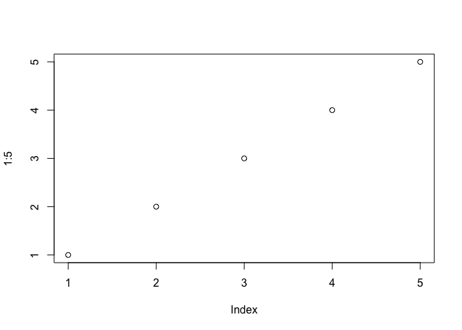
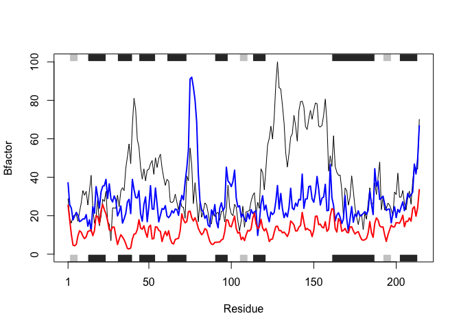
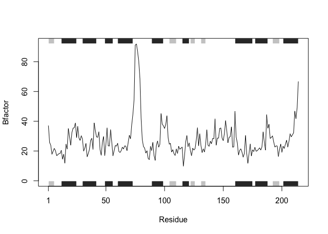
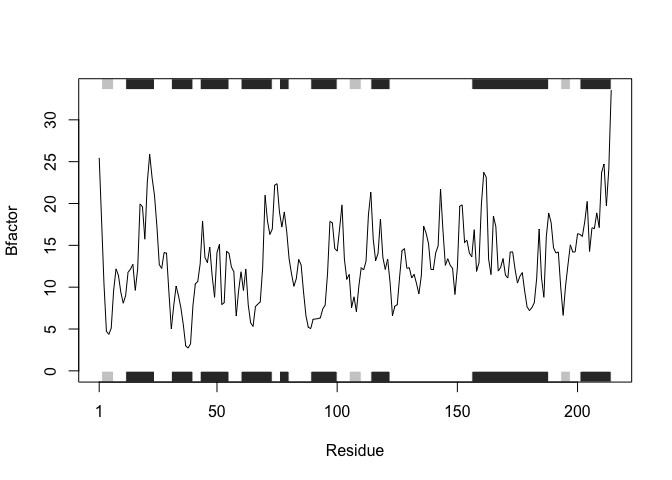

Class 6: R Functions
================
Cindy Tran
1/23/2020

# Function

## My level 2 heading

### My level 3 heading

``` r
# This is a silly plot!
plot(1:5)
```

<!-- -->

# Start of today’s class

Lets see more about **file import** (i.e. reading files into R). The
main read function iin base R is `read.table()`

Help for `read.table` can be brought up as a ?

Read all of the test files: Test1 normally: read.table(“test1.txt”,
header = TRUE, sep = “,” If you do read.csv() you don’t need to put in
all the extra stuff.

``` r
t1 <- read.csv("test1.txt")
t1
```

    ##   Col1 Col2 Col3
    ## 1    1    2    3
    ## 2    4    5    6
    ## 3    7    8    9
    ## 4    a    b    c

Test2

``` r
t2 <- read.table("test2.txt", header = TRUE, sep = "$")
t2
```

    ##   Col1 Col2 Col3
    ## 1    1    2    3
    ## 2    4    5    6
    ## 3    7    8    9
    ## 4    a    b    c

Test3

``` r
t3 <- read.table("test3.txt")
t3
```

    ##   V1 V2 V3
    ## 1  1  6  a
    ## 2  2  7  b
    ## 3  3  8  c
    ## 4  4  9  d
    ## 5  5 10  e

The default for `read.table()` is `header=FALSE`

# Back to functions

Our first example function:

``` r
add <- function(x, y=1) {
  # Sum of the input x and y
  x + y
}
```

Lets try using this function:

``` r
add(7)
```

    ## [1] 8

``` r
add(7, 3)
```

    ## [1] 10

How does this work with vectors:

``` r
add(c(1, 2, 4))
```

    ## [1] 2 3 5

It gives you back a vector\!

``` r
add(c(1,2,4),4)
```

    ## [1] 5 6 8

This adds 4 to the vectors because the y value is now 4.

``` r
add(c(1, 2, 4), c(1, 2, 4))
```

    ## [1] 2 4 8

The first vector is your x and the second is your y so it adds the
repective locations together.

Can’t do `add(c(1, 2, 4), 4, 5, 6)` because it is more than 2 arguments.
It’s more than just an x and y.

Moving on…. What is this range function?

``` r
x <- c(4,4,10,3, 11)
max(x)
```

    ## [1] 11

``` r
min(x)
```

    ## [1] 3

``` r
range(x)
```

    ## [1]  3 11

It gives you both the min and the max of the vector. Min is first and
max is second.

Test the function from the slides (Function 2):

``` r
rescale <- function(x) {
   rng <-range(x)
   (x - rng[1]) / (rng[2] - rng[1])
}
rescale(x)
```

    ## [1] 0.125 0.125 0.875 0.000 1.000

Test it on the value of
    1:10:

``` r
rescale(1:10)
```

    ##  [1] 0.0000000 0.1111111 0.2222222 0.3333333 0.4444444 0.5555556 0.6666667
    ##  [8] 0.7777778 0.8888889 1.0000000

How would it work here:

``` r
rescale(c(1,2,NA,3,10))
```

    ## [1] NA NA NA NA NA

but you want to get a value, not NA’s… This is why you get NA’s:

``` r
y <- c(1,2,NA,3,10)
rng <-range(y)
rng
```

    ## [1] NA NA

You can fix it by doing this:

``` r
y <- c(1,2,NA,3,10)
rng <-range(y, na.rm=TRUE)
rng
```

    ## [1]  1 10

`na.rm=TRUE` means that you are removing any NA from being considered in
your function

So now what…

``` r
rescale2 <- function(x) {
   rng <-range(x, na.rm = TRUE)
   (x - rng[1]) / (rng[2] - rng[1])
}
rescale2(c(1,2,NA,3,10))
```

    ## [1] 0.0000000 0.1111111        NA 0.2222222 1.0000000

Now it works and it skips the NA value\!

If you type `rescale` into your console region it will return the
description of your code telling you what the function was.

Lets do some more complicated stuff…

``` r
 rescale3 <- function(x, na.rm=TRUE, plot=FALSE) {
    rng <-range(x, na.rm=na.rm)
    print("Hello")
   answer <- (x - rng[1]) / (rng[2] - rng[1])
   print("is it me you are looking for?")
   if(plot) {
     print("Don't sing again please!")
      plot(answer, typ="b", lwd=4)
   }
   print("I can see it in ...")
   return(answer)
 }
```

Lets try this:

``` r
rescale3(x)
```

    ## [1] "Hello"
    ## [1] "is it me you are looking for?"
    ## [1] "I can see it in ..."

    ## [1] 0.125 0.125 0.875 0.000 1.000

We added the “dont sing again\!” print:

``` r
rescale3(y, plot=TRUE)
```

    ## [1] "Hello"
    ## [1] "is it me you are looking for?"
    ## [1] "Don't sing again please!"

<!-- -->

    ## [1] "I can see it in ..."

    ## [1] 0.0000000 0.1111111        NA 0.2222222 1.0000000

# Handout

Section B First we installed the package in the console section because
it only needs to be installed one time: used `install.packages("bio3d")`

Now we will call it so we can use everything in it:

``` r
library(bio3d)
```

Paste everything from the handout into here:

``` r
library(bio3d)
s1 <- read.pdb("4AKE")  # kinase with drug
```

    ##   Note: Accessing on-line PDB file

``` r
s2 <- read.pdb("1AKE")  # kinase no drug
```

    ##   Note: Accessing on-line PDB file
    ##    PDB has ALT records, taking A only, rm.alt=TRUE

``` r
s3 <- read.pdb("1E4Y")  # kinase with drug
```

    ##   Note: Accessing on-line PDB file

``` r
s1.chainA <- trim.pdb(s1, chain="A", elety="CA")
s2.chainA <- trim.pdb(s2, chain="A", elety="CA")
s3.chainA <- trim.pdb(s3, chain="A", elety="CA")
s1.b <- s1.chainA$atom$b
s2.b <- s2.chainA$atom$b
s3.b <- s3.chainA$atom$b
plotb3(s1.b, sse=s1.chainA, typ="l", ylab="Bfactor")
```

<!-- -->

``` r
plotb3(s2.b, sse=s2.chainA, typ="l", ylab="Bfactor")
```

<!-- -->

``` r
plotb3(s3.b, sse=s3.chainA, typ="l", ylab="Bfactor")
```

<!-- --> This is
complicated. We have to figure out what this code does so that we can
shorten this. Lets make a function for this for **HOMEWORK**:

Q1: It pulls up data into the Global Environment section from PDB about
the protein you chose. Its a large list of 8 things and of class “pdb”,
“sse”. Q2:It “produces a new smaller PDB object that contains a subset
of atoms from a given larger PDB object”. It trims the larger PDB file
giving a smaller version of the information on the protein. Q3: The
parameter “sse” in the plot code removes the black and gray marginal
rectangles. They represent the secondary structure object returned from
dssp, stride or in certain cases read.pdb. In dssp, it could be a helix,
sheet, or turn.  
Q4: A better plot is plotting the three plots on one on top of one
another.

``` r
plotb3(s1.b, sse=s1.chainA, typ="l", ylab="Bfactor")
points(s2.b, typ="l", col="blue", lwd=2)
points(s3.b, typ="l", col= "red", lwd=2)
```

<!-- --> Q5: The
s2.b and s3.b are more similar to eachother in their B-factor because
they are on the same branch in the cluster dendrogram. “dist” quantifies
the distance between the structures so you could use that value to see
how similar they are to one another.

``` r
hc <- hclust( dist( rbind(s1.b, s2.b, s3.b) ) )
plot(hc)
```

<!-- -->

Q6:

``` r
 library(bio3d) #This line calls the library that the proteins are coming from. 
drug <- function(x) {
  s <- read.pdb(x)
  chainA <- trim.pdb(s, chain="A", elety="CA")
  b <- chainA$atom$b
  plotb3(b, sse=chainA, typ="l", ylab = "Bfactor")
}
drug("4AKE")
```

    ##   Note: Accessing on-line PDB file

    ## Warning in get.pdb(file, path = tempdir(), verbose = FALSE): /var/folders/d8/
    ## k_56_zys0wn002mcsgbrftq40000gn/T//RtmpqKD2pP/4AKE.pdb exists. Skipping download

<!-- -->

``` r
drug("1AKE")
```

    ##   Note: Accessing on-line PDB file

    ## Warning in get.pdb(file, path = tempdir(), verbose = FALSE): /var/folders/d8/
    ## k_56_zys0wn002mcsgbrftq40000gn/T//RtmpqKD2pP/1AKE.pdb exists. Skipping download

    ##    PDB has ALT records, taking A only, rm.alt=TRUE

<!-- -->

``` r
drug("1E4Y")
```

    ##   Note: Accessing on-line PDB file

    ## Warning in get.pdb(file, path = tempdir(), verbose = FALSE): /var/folders/d8/
    ## k_56_zys0wn002mcsgbrftq40000gn/T//RtmpqKD2pP/1E4Y.pdb exists. Skipping download

<!-- -->
