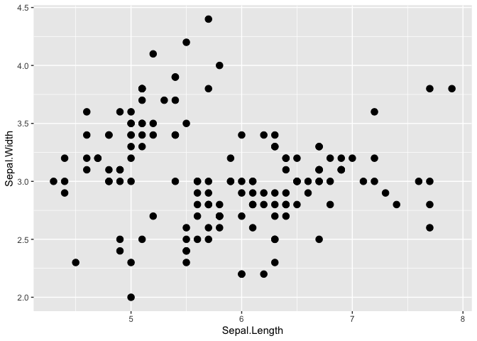
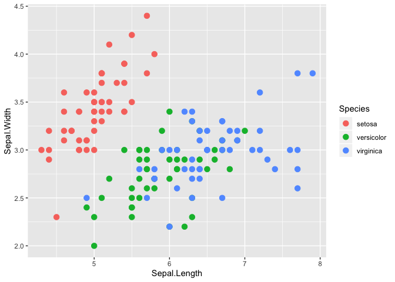
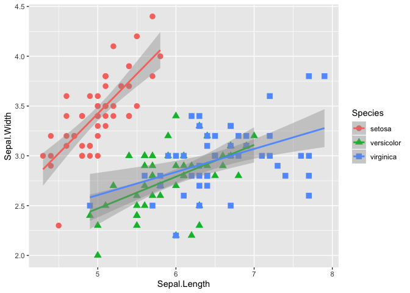
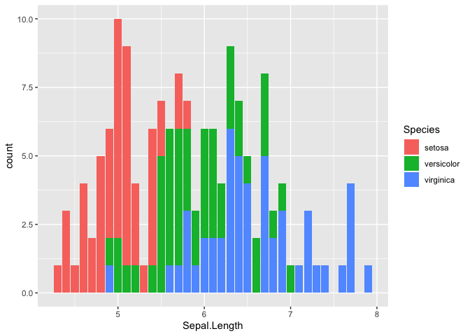

class07
================
Cindy Tran
1/28/2020

These are functions here, look here

``` r
# Functions
rescale <- function(x, na.rm=TRUE, plot=FALSE, ...) {
  # Our rescale function from the end of lecture 6
  if(!is.numeric(x)) { #If the x is numeric, then it skips the stop, but if it is not, it throws an error with the exact text below. This chunk is to tell us what the error is to see how it failed
    stop("Input x should be numeric", call. = FALSE)
  }

  if(na.rm) {
    rng <-range(x, na.rm=TRUE)
  } else {
    rng <-range(x)
  }

  answer <- (x - rng[1]) / (rng[2] - rng[1])
  if(plot) { 
    plot(answer, ...) 
  }

  return(answer)
}
```

Ex:

``` r
#rescale(1:10)
#rescale("S") # gives error message
```

Exercise

``` r
x <- c(1, 2, NA, 3, NA)
y <- c(NA, 3, NA, 3, 4)
# How do you detect where the NA are?
is.na(x) #will also work on characters (i.e."s")
```

    ## [1] FALSE FALSE  TRUE FALSE  TRUE

``` r
is.na(x) & is.na(y) # gives TRUE in position 3 because that the only part where they are both NA
```

    ## [1] FALSE FALSE  TRUE FALSE FALSE

``` r
#could write this as a function
is_both_na <- function(x,y){
  if(length(x)!=length(y)){
    stop("your inputs are not the same length")
  }
  is.na(x) & is.na(y)
}
is_both_na(x,y) #gives same vector as if you wrote them individually
```

    ## [1] FALSE FALSE  TRUE FALSE FALSE

``` r
z <- c(3, NA)
#is_both_na(x,z) # gives the error message because the vectors are not the smae length
```

both\_na3 function

``` r
rescale_new <- function(x, y) {
  ## Print some info on where NA's are as well as the number of them 
  if(length(x) != length(y)) {
    stop("Input x and y should be vectors of the same length", call.=FALSE)
  }
  na.in.both <- ( is.na(x) & is.na(y) )
  na.number  <- sum(na.in.both) # Sum a logical vetor just counts the truths. Tells you how many NA's in both there are.
  na.which   <- which(na.in.both) # returns 3 because thats position that we have both NA's that warrants a TRUE. Tells you where there are TRUE in the vector

  message("Found ", na.number, " NA's at position(s):", 
          paste(na.which, collapse=", ") ) 
  
  return( list(number=na.number, which=na.which) )
}
# Test this
```

## Data Frames

This information is in the data section on the right side. Data frames
are tables that you can do functions on. You can fragment parts of the
data frame by using df1\[1,2\] to give you the information on the 1st
row and 2nd column. You could also use headers to identify them
df1\[,“IDs”\]. This is functionally identical to df1$IDs. You can
rm(x), rm(y), rm(z) removes the variables stored.

We want to see which genes are present in both data sets.

``` r
# Start with a simple version of the problem
df1 <- data.frame(IDs=c("gene1", "gene2", "gene3"),
                  exp=c(2,1,1),
                  stringsAsFactors=FALSE)
df2 <- data.frame(IDs=c("gene2", "gene4", "gene3", "gene5"),
                  exp=c(-2, NA, 1, 2),
                  stringsAsFactors=FALSE)
x <- df1$IDs
y <- df2$IDs

intersect(x,y) 
```

    ## [1] "gene2" "gene3"

``` r
x %in% y # This makes a vector of what are the positions of x that are in y. Gives out FALSE TRUE TRUE because it asks is this from x in y?
```

    ## [1] FALSE  TRUE  TRUE

``` r
x[x%in%y] #This presents a subset of the names of the ones in x that are also in y so will say gene2 and gene3.
```

    ## [1] "gene2" "gene3"

``` r
y%in%x #This is the reverse
```

    ## [1]  TRUE FALSE  TRUE FALSE

``` r
y
```

    ## [1] "gene2" "gene4" "gene3" "gene5"

``` r
# now we subset
y[y%in%x] # It just prints out the names of the ones in both.
```

    ## [1] "gene2" "gene3"

``` r
#Now lets make a matrix of whats in y thats in x and whats in x thats in y
cbind(x[x%in%y], y[y%in%x]) #binds different vectors across the columns
```

    ##      [,1]    [,2]   
    ## [1,] "gene2" "gene2"
    ## [2,] "gene3" "gene3"

Another way you can make a function highlight code -\> go to code -\>
extract function -\> name it

``` r
x <- df1$IDs
y <- df2$IDs

gene_intersect <- function(x, y) {
  cbind(x[x%in%y], y[y%in%x])
}
gene_intersect(x,y)
```

    ##      [,1]    [,2]   
    ## [1,] "gene2" "gene2"
    ## [2,] "gene3" "gene3"

``` r
#Now we are going to make this function so that it can work with data frames
gene_intersect2 <- function(df1, df2) {
  cbind(df1[df1$IDs%in%df2$IDs, ], df2[df2$IDs%in%df1$IDs, ], "exp")
} # The extra comma and space gives us the enitre gene with its expression. You are subsetting by the gene ID then getting everything that goes along with it


# Now we can 
gene_intersect3 <- function(df1, df2, gene.colname= "IDs") {
  cbind(df1[df1[,gene.colname]%in%df2[,gene.colname], ], df2[df2[,gene.colname]%in%df1[,gene.colname], ], "exp")
}
gene_intersect3(df1,df2, gene.colname = "IDs")
```

    ##     IDs exp   IDs exp "exp"
    ## 2 gene2   1 gene2  -2   exp
    ## 3 gene3   1 gene3   1   exp

``` r
gene_intersect4 <- function(df1, df2, gene.colname= "IDs") {
  df1.name <- df1[, gene.colname] #This here returns a name
  df2.name <- df2[, gene.colname]
  
  df1.inds <- df1.name %in% df2.name
  df2.inds <- df2.name %in% df1.name
  
  cbind(df1[df1.inds,], df2[df2.inds,], "exp")
}
gene_intersect4(df1, df2, gene.colname = "IDs")
```

    ##     IDs exp   IDs exp "exp"
    ## 2 gene2   1 gene2  -2   exp
    ## 3 gene3   1 gene3   1   exp

Sidenote: To change a column name colnames(df1) \<- c(“new\_name”,
“exp”) colnames(df2) \<- c(“new\_name”, “exp”)

## Introduction to ggplot2

First we are going to have to install the package:

``` r
# install.packages('ggplot2')
```

Search R Graph in google to get R graph gallery… This is all the plots
you can generate in R.

``` r
library(ggplot2)
```

\#Geometry Plot Plot the data set (iris)

``` r
ggplot(data= iris, aes(x = Sepal.Length, y= Sepal.Width)) + geom_point()
```

<!-- -->

Change the point
size

``` r
ggplot(data= iris, aes(x = Sepal.Length, y= Sepal.Width)) + geom_point(size=3)
```

<!-- --> Add the
color for each species: It tells you the relationship between each
species.

``` r
ggplot(data= iris, aes(Sepal.Length, Sepal.Width, color = Species)) + geom_point(size=3)
```

<!-- --> If you want
to change the shapes of the dots to not be
circular:

``` r
ggplot(data= iris, aes(Sepal.Length, Sepal.Width, color = Species)) + geom_point(aes(shape = Species), size=3)
```

<!-- --> Within
geom\_point, you can change the x, y, stroke, size, shape, colour,
alpha…

Now, we want to add best fit lines for the three:

``` r
ggplot(data= iris, aes(Sepal.Length, Sepal.Width, color = Species)) +
  geom_point(aes(shape = Species), size=3) + # You need the + so that it plots on the same plot
  geom_smooth(method = "lm")
```

<!-- -->

``` r
# The gray shading is the confidence interval. It is usually 95% interval.
```

\#Distribution Plot

``` r
ggplot(iris, aes(Sepal.Length, fill = Species)) +
  geom_bar(stat = 'count')
```

<!-- -->

To change the transparency of the plot:

``` r
ggplot(iris, aes(Sepal.Length, fill = Species)) +
  geom_bar(stat = 'count')
```

<!-- --> You can
change the width of the bars:

You can add lines:

You can change the background with the themes:

There is a cheat sheet where you can find almost all the functions to
change the plots on
