class09
================
Cindy Tran
2/4/2020

## K-means Clustering

``` r
tmp <- c(rnorm(30,-3), rnorm(30,3))
# This rnorm is used to make up some data. 30 points drawn from a normal distribution all around -3 and then +3
x <- cbind(x=tmp, y=rev(tmp))
# cbind combines R objects by columns. We have a vector of 60 things (30 and 30) and taking it and combining it to the reverse of tmp (rev(tmp)). Example is the the column is red -3 and blue 3 so it makes it into blue 3 on red -3 of a two column to have the centers be (-3, 3) and (3, -3).
plot(x)
```

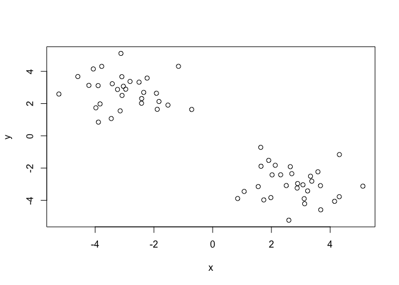<!-- --> Use the
kmeans() function setting k to 2 and nstart=20 and print out the
results:

``` r
km <- kmeans(x, centers = 2, nstart = 20)
```

Questions: 1. There are 30 points in each cluster. 2. The size is 30 in
each cluster. The cluster assignment/membership is in the cluster
component shown as clustering vector.The cluster center is (-2.772581,
2.887287) and (2.887287,
    -2.772581).

``` r
km$size
```

    ## [1] 30 30

``` r
km$cluster
```

    ##  [1] 2 2 2 2 2 2 2 2 2 2 2 2 2 2 2 2 2 2 2 2 2 2 2 2 2 2 2 2 2 2 1 1 1 1 1 1 1 1
    ## [39] 1 1 1 1 1 1 1 1 1 1 1 1 1 1 1 1 1 1 1 1 1 1

``` r
km$centers
```

    ##           x         y
    ## 1  2.770960 -2.992367
    ## 2 -2.992367  2.770960

``` r
table(km$cluster)
```

    ## 
    ##  1  2 
    ## 30 30

``` r
  #Tells you how many of each thing you have in your vector
```

Now plot x colors by the kmeans cluster assignment and add cluster
centers as blue points:

``` r
plot(x, col=km$cluster+4)
points(km$centers, col="blue", pch=15)
```

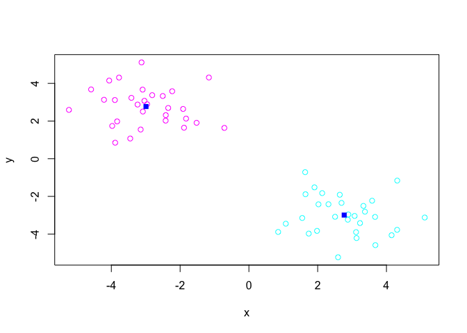<!-- -->

## Heirarchical Clustering

The main Hierarchical clustering function in R is called `hclust()`. An
important point her is that you have to calcuate the distance matrix
deom your input data before calling `hclust()`.

For this, we will use `dist()`.

``` r
# We will again use our x again from above...
d <- dist(x)
hc <- hclust(d)
hc
```

    ## 
    ## Call:
    ## hclust(d = d)
    ## 
    ## Cluster method   : complete 
    ## Distance         : euclidean 
    ## Number of objects: 60

``` r
#This is not very helpful so let's plot our data...
```

Folks, this data is usually seen in a
plot…

``` r
plot(hc)
```

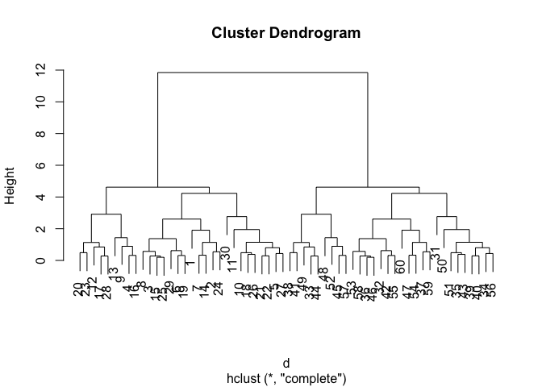<!-- -->

``` r
# The labels are the points. In the first tree is 1-30 and the second tree is 31-60. The height is the distance that the points are apart from one another. 
```

To get cluster membership vector I need to cut the tree at a certain
height to yield my seperate cluster branches.You want to cut the tree
right below the highest height…

``` r
plot(hc)
abline(h=6, col="red", lty=2)
```

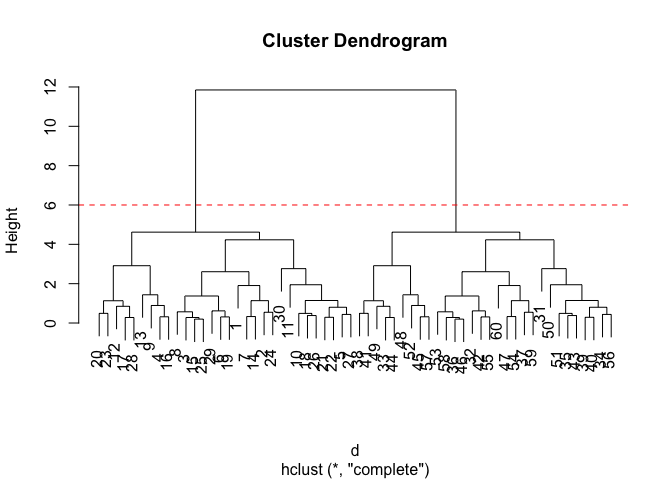<!-- -->

``` r
#this draws a line at the h=6
cutree(hc, h=6)
```

    ##  [1] 1 1 1 1 1 1 1 1 1 1 1 1 1 1 1 1 1 1 1 1 1 1 1 1 1 1 1 1 1 1 2 2 2 2 2 2 2 2
    ## [39] 2 2 2 2 2 2 2 2 2 2 2 2 2 2 2 2 2 2 2 2 2 2

``` r
# This gives you a matrix of 1 and 2 to say which clluster the point went in like the cluster value of kmeans.
```

Let’s take a look at what happens when you cut at h=3.

``` r
plot(hc)
abline(h=3, col="blue")
```

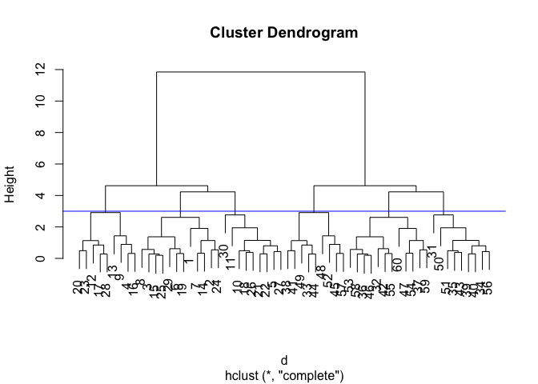<!-- -->

``` r
cutree(hc, h=3)
```

    ##  [1] 1 1 1 2 3 1 1 1 2 3 3 2 2 1 1 2 2 3 1 2 3 3 2 1 1 3 3 2 1 3 4 5 6 4 4 5 5 6
    ## [39] 4 4 6 5 4 6 6 5 5 6 6 4 4 6 5 5 5 4 6 5 5 5

``` r
# You get 6 clusters if you cut it here. 
```

With `cutree()` you could tell it how many groups you want with
    k.

``` r
cutree(hc, k=4)
```

    ##  [1] 1 1 1 2 1 1 1 1 2 1 1 2 2 1 1 2 2 1 1 2 1 1 2 1 1 1 1 2 1 1 3 3 4 3 3 3 3 4
    ## [39] 3 3 4 3 3 4 4 3 3 4 4 3 3 4 3 3 3 3 4 3 3 3

Looking at the your turn for looking at the different ways to determine
a cluster:

``` r
 # Step 1. Generate some example data for clustering
x <- rbind(
  matrix(rnorm(100, mean=0, sd = 0.3), ncol = 2),   # c1
  matrix(rnorm(100, mean = 1, sd = 0.3), ncol = 2), # c2
  matrix(c(rnorm(50, mean = 1, sd = 0.3),           # c3
           rnorm(50, mean = 0, sd = 0.3)), ncol = 2))
colnames(x) <- c("x", "y")
# Step 2. Plot the data without clustering
plot(x)
```

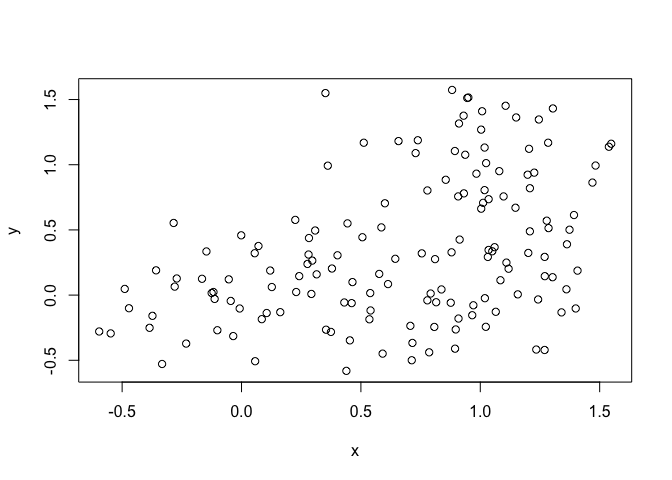<!-- -->

``` r
# Step 3. Generate colors for known clusters
#         (just so we can compare to hclust results)
col <- as.factor( rep(c("c1","c2","c3"), each=50) )
plot(x, col=col)
```

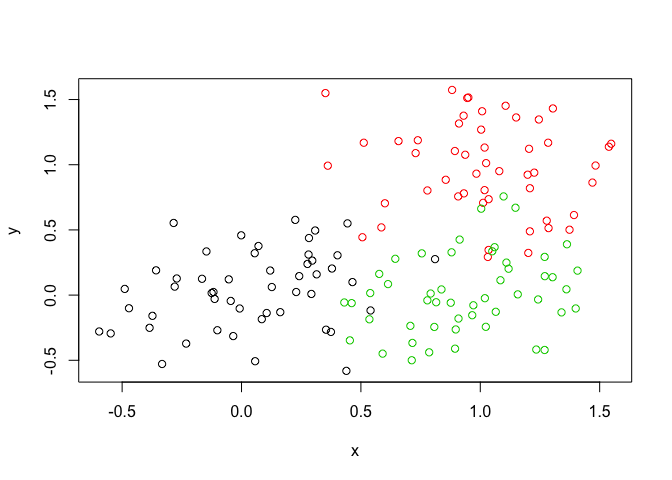<!-- -->

``` r
# There are three things here but the colors overlap making the boundaries not very clear
```

Our job is to convert the above into hierarchical clustering…

``` r
dist <- dist(x)
hi <- hclust(dist)
hi
```

    ## 
    ## Call:
    ## hclust(d = dist)
    ## 
    ## Cluster method   : complete 
    ## Distance         : euclidean 
    ## Number of objects: 150

``` r
plot(hi)
```

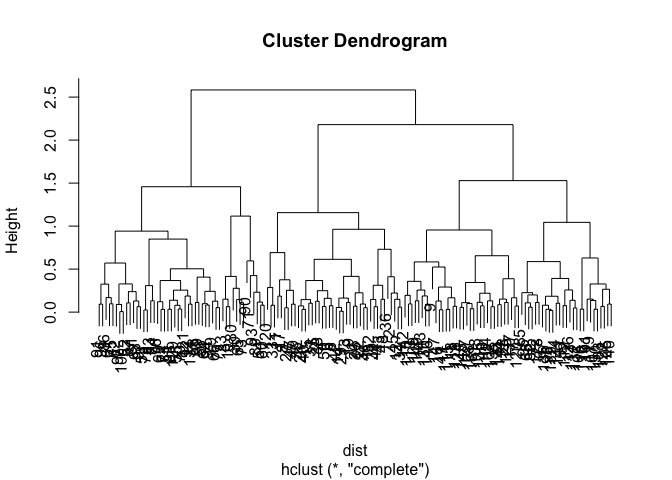<!-- -->

Now can you return two clusters to get cluster membership vector…

``` r
plot(hi)
abline(h=2.6, col="red", lty=2)
```

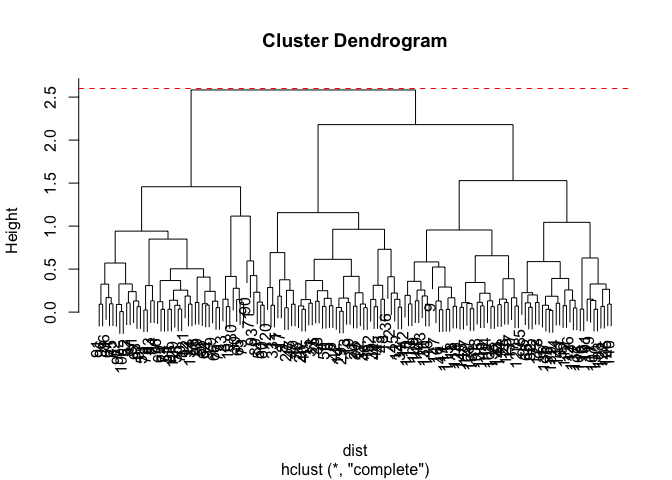<!-- -->

``` r
p <- cutree(hi, k=2)
p
```

    ##   [1] 1 1 2 1 1 1 1 1 1 2 1 1 1 1 1 1 1 1 1 1 1 1 2 1 1 1 1 1 1 2 1 1 1 1 1 1 1
    ##  [38] 1 1 1 1 1 1 1 1 1 1 1 1 1 2 2 2 2 2 2 2 2 1 2 2 2 2 2 2 2 1 1 2 2 2 1 2 2
    ##  [75] 2 2 2 2 2 2 2 1 2 2 1 2 2 2 2 2 2 2 2 2 1 2 2 1 2 2 1 1 1 1 1 1 1 1 1 1 1
    ## [112] 1 1 1 1 1 1 1 1 1 2 1 1 1 1 1 1 1 2 1 1 1 1 2 1 1 1 1 1 1 1 1 1 1 1 1 1 1
    ## [149] 1 1

``` r
table(p)
```

    ## p
    ##   1   2 
    ## 101  49

Try 3 clusters…

``` r
plot(hi)
abline(h=2, col="red", lty=2)
```

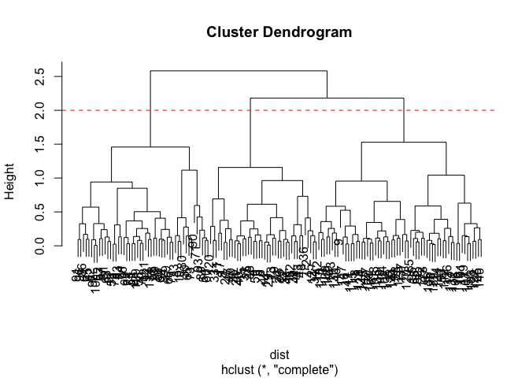<!-- -->

``` r
grps <- cutree(hi, k=3)
grps
```

    ##   [1] 1 1 2 1 1 1 3 1 3 2 1 1 1 1 1 3 1 3 1 1 1 1 2 1 1 1 1 3 1 2 1 1 1 1 1 1 1
    ##  [38] 1 1 1 3 1 1 1 1 1 1 1 1 1 2 2 2 2 2 2 2 2 3 2 2 2 2 2 2 2 3 3 2 2 2 3 2 2
    ##  [75] 2 2 2 2 2 2 2 3 2 2 3 2 2 2 2 2 2 2 2 2 3 2 2 3 2 2 3 3 3 3 3 3 3 3 3 3 3
    ## [112] 3 3 3 3 3 3 3 3 3 2 3 3 3 3 3 3 3 2 3 3 3 3 2 3 3 3 3 3 3 3 3 3 3 3 3 3 3
    ## [149] 3 3

``` r
table(grps) # Use this to see how many members in each cluster.
```

    ## grps
    ##  1  2  3 
    ## 40 49 61

Let’s plot the one with the 3 clusters…

``` r
plot(x, col=grps)
```

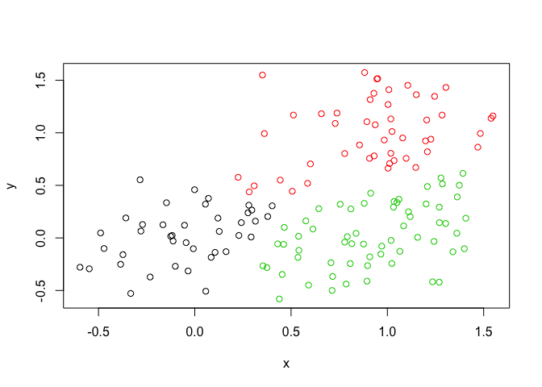<!-- -->

``` r
# There is no overlaping of colors or points anymore. 
```

## Hands on Worksheet

Read the data in:

``` r
x <- read.csv("UK_foods.csv", row.names = 1)
x
```

    ##                     England Wales Scotland N.Ireland
    ## Cheese                  105   103      103        66
    ## Carcass_meat            245   227      242       267
    ## Other_meat              685   803      750       586
    ## Fish                    147   160      122        93
    ## Fats_and_oils           193   235      184       209
    ## Sugars                  156   175      147       139
    ## Fresh_potatoes          720   874      566      1033
    ## Fresh_Veg               253   265      171       143
    ## Other_Veg               488   570      418       355
    ## Processed_potatoes      198   203      220       187
    ## Processed_Veg           360   365      337       334
    ## Fresh_fruit            1102  1137      957       674
    ## Cereals                1472  1582     1462      1494
    ## Beverages                57    73       53        47
    ## Soft_drinks            1374  1256     1572      1506
    ## Alcoholic_drinks        375   475      458       135
    ## Confectionery            54    64       62        41

How many rows and colums in UK\_foods?

``` r
nrow(x) #17 rows
```

    ## [1] 17

``` r
ncol(x) #5 columns but we changed it to 4 with row.names from earlier
```

    ## [1] 4

Let’s make some plots to explore our datat a bit more.

``` r
barplot(as.matrix(x), beside=T, col=rainbow(nrow(x)))
```

<!-- -->

``` r
# beside= FALSE stacks them on top of one another
barplot(as.matrix(x), beside=F, col=rainbow(nrow(x)))
```

<!-- -->

A “pairs” plot can be used to compare all the contries one on one
against one another with all the categories on the plot. Check out the
`pairs()` plot:

``` r
pairs(x, col=rainbow(10), pch=16)
```

<!-- --> This plot
plots the countries versus one another but places it in a matrix to see
all the different foods all at once. Each colored dot is a different
food category and the ones not on the line show that the category is
different. There are duplicate plots because the countries are the
margins.

Principal Component Analysis (PCA) `prcomp()` function

``` r
pca <- prcomp(t(x))
#t is taking the transpose to rotate our data so the row is our data of interest
pca
```

    ## Standard deviations (1, .., p=4):
    ## [1] 3.241502e+02 2.127478e+02 7.387622e+01 4.188568e-14
    ## 
    ## Rotation (n x k) = (17 x 4):
    ##                              PC1          PC2         PC3          PC4
    ## Cheese              -0.056955380 -0.016012850 -0.02394295 -0.691718038
    ## Carcass_meat         0.047927628 -0.013915823 -0.06367111  0.635384915
    ## Other_meat          -0.258916658  0.015331138  0.55384854  0.198175921
    ## Fish                -0.084414983  0.050754947 -0.03906481 -0.015824630
    ## Fats_and_oils       -0.005193623  0.095388656  0.12522257  0.052347444
    ## Sugars              -0.037620983  0.043021699  0.03605745  0.014481347
    ## Fresh_potatoes       0.401402060  0.715017078  0.20668248 -0.151706089
    ## Fresh_Veg           -0.151849942  0.144900268 -0.21382237  0.056182433
    ## Other_Veg           -0.243593729  0.225450923  0.05332841 -0.080722623
    ## Processed_potatoes  -0.026886233 -0.042850761  0.07364902 -0.022618707
    ## Processed_Veg       -0.036488269  0.045451802 -0.05289191  0.009235001
    ## Fresh_fruit         -0.632640898  0.177740743 -0.40012865 -0.021899087
    ## Cereals             -0.047702858  0.212599678  0.35884921  0.084667257
    ## Beverages           -0.026187756  0.030560542  0.04135860 -0.011880823
    ## Soft_drinks          0.232244140 -0.555124311  0.16942648 -0.144367046
    ## Alcoholic_drinks    -0.463968168 -0.113536523  0.49858320 -0.115797605
    ## Confectionery       -0.029650201 -0.005949921  0.05232164 -0.003695024

``` r
#there's a lot of information in this and it is very complicated 

#can use the summary to see your data
summary(pca)
```

    ## Importance of components:
    ##                             PC1      PC2      PC3       PC4
    ## Standard deviation     324.1502 212.7478 73.87622 4.189e-14
    ## Proportion of Variance   0.6744   0.2905  0.03503 0.000e+00
    ## Cumulative Proportion    0.6744   0.9650  1.00000 1.000e+00

``` r
# would write this as PC1 accounts for more than 67% of the sample variance.
```

What is in my result object ‘pca’? I can check the attributes…

``` r
attributes(pca)
```

    ## $names
    ## [1] "sdev"     "rotation" "center"   "scale"    "x"       
    ## 
    ## $class
    ## [1] "prcomp"

``` r
# gives you all the attributes in the pca object (the $ sign)
```

Then you can call what you want..

``` r
plot(pca$x[,1], pca$x[,2], xlab = "PC1", ylab = "PC2")
text(pca$x[,1], pca$x[,2], colnames(x), col=c("black", "red", "blue", "green"))
```

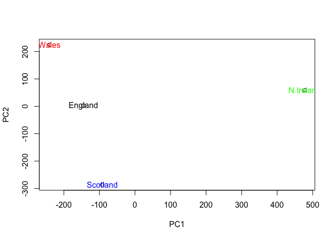<!-- -->

To see what the percentage of coverage of each PCA…

``` r
v <- round( pca$sdev^2/sum(pca$sdev^2) * 100 )
v
```

    ## [1] 67 29  4  0

Now we see that N. Ireland is different but how is it different?

``` r
par(mar=c(10, 3, 0.35, 0))
barplot( pca$rotation[,1], las=2 )
```

<!-- -->

``` r
# This shows how the food is different by country as in which country has more or what food and how much.
```
