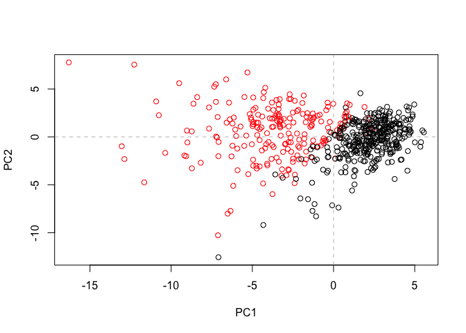
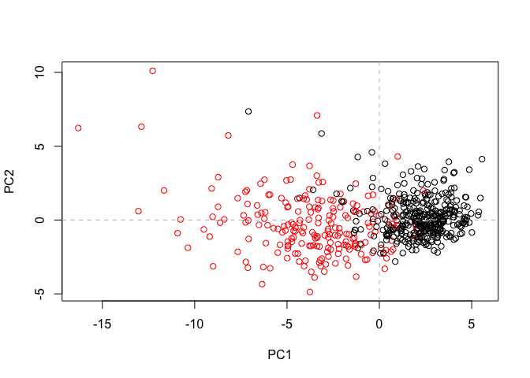
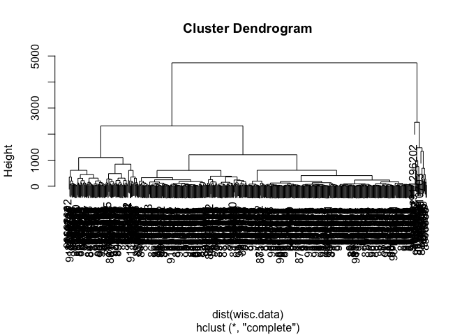
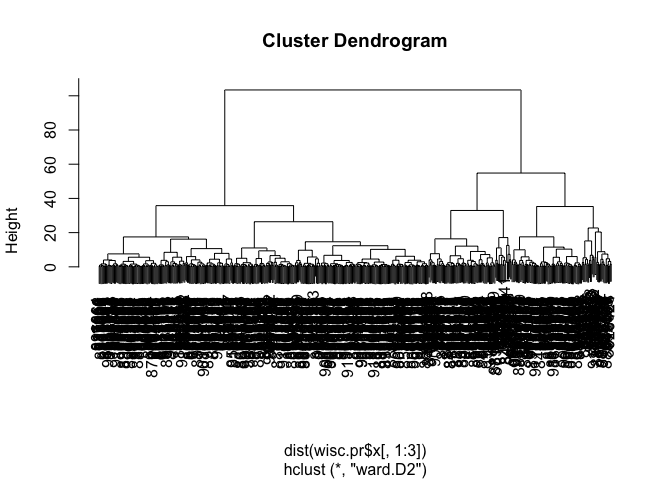
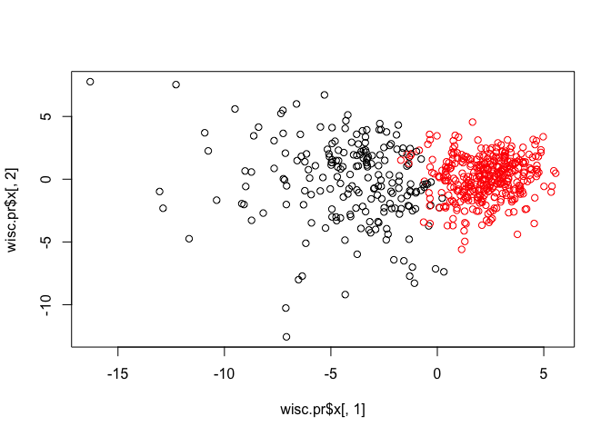

class10
================
Cindy Tran
2/6/2020

## Analysis of Human Breast Cancer Cells

# Section 1: Exploratory data analysis

First, we will import our data that we got from the class website:

``` r
wisc.df <- read.csv("WisconsinCancer.csv")
#To look at the first 6 rows of the data set:
head(wisc.df)
```

    ##         id diagnosis radius_mean texture_mean perimeter_mean area_mean
    ## 1   842302         M       17.99        10.38         122.80    1001.0
    ## 2   842517         M       20.57        17.77         132.90    1326.0
    ## 3 84300903         M       19.69        21.25         130.00    1203.0
    ## 4 84348301         M       11.42        20.38          77.58     386.1
    ## 5 84358402         M       20.29        14.34         135.10    1297.0
    ## 6   843786         M       12.45        15.70          82.57     477.1
    ##   smoothness_mean compactness_mean concavity_mean concave.points_mean
    ## 1         0.11840          0.27760         0.3001             0.14710
    ## 2         0.08474          0.07864         0.0869             0.07017
    ## 3         0.10960          0.15990         0.1974             0.12790
    ## 4         0.14250          0.28390         0.2414             0.10520
    ## 5         0.10030          0.13280         0.1980             0.10430
    ## 6         0.12780          0.17000         0.1578             0.08089
    ##   symmetry_mean fractal_dimension_mean radius_se texture_se perimeter_se
    ## 1        0.2419                0.07871    1.0950     0.9053        8.589
    ## 2        0.1812                0.05667    0.5435     0.7339        3.398
    ## 3        0.2069                0.05999    0.7456     0.7869        4.585
    ## 4        0.2597                0.09744    0.4956     1.1560        3.445
    ## 5        0.1809                0.05883    0.7572     0.7813        5.438
    ## 6        0.2087                0.07613    0.3345     0.8902        2.217
    ##   area_se smoothness_se compactness_se concavity_se concave.points_se
    ## 1  153.40      0.006399        0.04904      0.05373           0.01587
    ## 2   74.08      0.005225        0.01308      0.01860           0.01340
    ## 3   94.03      0.006150        0.04006      0.03832           0.02058
    ## 4   27.23      0.009110        0.07458      0.05661           0.01867
    ## 5   94.44      0.011490        0.02461      0.05688           0.01885
    ## 6   27.19      0.007510        0.03345      0.03672           0.01137
    ##   symmetry_se fractal_dimension_se radius_worst texture_worst perimeter_worst
    ## 1     0.03003             0.006193        25.38         17.33          184.60
    ## 2     0.01389             0.003532        24.99         23.41          158.80
    ## 3     0.02250             0.004571        23.57         25.53          152.50
    ## 4     0.05963             0.009208        14.91         26.50           98.87
    ## 5     0.01756             0.005115        22.54         16.67          152.20
    ## 6     0.02165             0.005082        15.47         23.75          103.40
    ##   area_worst smoothness_worst compactness_worst concavity_worst
    ## 1     2019.0           0.1622            0.6656          0.7119
    ## 2     1956.0           0.1238            0.1866          0.2416
    ## 3     1709.0           0.1444            0.4245          0.4504
    ## 4      567.7           0.2098            0.8663          0.6869
    ## 5     1575.0           0.1374            0.2050          0.4000
    ## 6      741.6           0.1791            0.5249          0.5355
    ##   concave.points_worst symmetry_worst fractal_dimension_worst  X
    ## 1               0.2654         0.4601                 0.11890 NA
    ## 2               0.1860         0.2750                 0.08902 NA
    ## 3               0.2430         0.3613                 0.08758 NA
    ## 4               0.2575         0.6638                 0.17300 NA
    ## 5               0.1625         0.2364                 0.07678 NA
    ## 6               0.1741         0.3985                 0.12440 NA

``` r
# The id column is the identification number of the patients. The diagnosis column is the diagnosis that the doctors in Wisconsin already gave these patients. It's weird because there is a column labeled 'x' that only includes 'NA'.
```

We are now going to create a matrix that does not include the ‘id’,
‘diagnosis’, and the ‘x’ column, the funky things that we are going to
ignore. This means the matrix will include columns 3 to 32.

``` r
wisc.data <- as.matrix(wisc.df[,3:32])
#check what you just did
head(wisc.data)
```

    ##      radius_mean texture_mean perimeter_mean area_mean smoothness_mean
    ## [1,]       17.99        10.38         122.80    1001.0         0.11840
    ## [2,]       20.57        17.77         132.90    1326.0         0.08474
    ## [3,]       19.69        21.25         130.00    1203.0         0.10960
    ## [4,]       11.42        20.38          77.58     386.1         0.14250
    ## [5,]       20.29        14.34         135.10    1297.0         0.10030
    ## [6,]       12.45        15.70          82.57     477.1         0.12780
    ##      compactness_mean concavity_mean concave.points_mean symmetry_mean
    ## [1,]          0.27760         0.3001             0.14710        0.2419
    ## [2,]          0.07864         0.0869             0.07017        0.1812
    ## [3,]          0.15990         0.1974             0.12790        0.2069
    ## [4,]          0.28390         0.2414             0.10520        0.2597
    ## [5,]          0.13280         0.1980             0.10430        0.1809
    ## [6,]          0.17000         0.1578             0.08089        0.2087
    ##      fractal_dimension_mean radius_se texture_se perimeter_se area_se
    ## [1,]                0.07871    1.0950     0.9053        8.589  153.40
    ## [2,]                0.05667    0.5435     0.7339        3.398   74.08
    ## [3,]                0.05999    0.7456     0.7869        4.585   94.03
    ## [4,]                0.09744    0.4956     1.1560        3.445   27.23
    ## [5,]                0.05883    0.7572     0.7813        5.438   94.44
    ## [6,]                0.07613    0.3345     0.8902        2.217   27.19
    ##      smoothness_se compactness_se concavity_se concave.points_se symmetry_se
    ## [1,]      0.006399        0.04904      0.05373           0.01587     0.03003
    ## [2,]      0.005225        0.01308      0.01860           0.01340     0.01389
    ## [3,]      0.006150        0.04006      0.03832           0.02058     0.02250
    ## [4,]      0.009110        0.07458      0.05661           0.01867     0.05963
    ## [5,]      0.011490        0.02461      0.05688           0.01885     0.01756
    ## [6,]      0.007510        0.03345      0.03672           0.01137     0.02165
    ##      fractal_dimension_se radius_worst texture_worst perimeter_worst area_worst
    ## [1,]             0.006193        25.38         17.33          184.60     2019.0
    ## [2,]             0.003532        24.99         23.41          158.80     1956.0
    ## [3,]             0.004571        23.57         25.53          152.50     1709.0
    ## [4,]             0.009208        14.91         26.50           98.87      567.7
    ## [5,]             0.005115        22.54         16.67          152.20     1575.0
    ## [6,]             0.005082        15.47         23.75          103.40      741.6
    ##      smoothness_worst compactness_worst concavity_worst concave.points_worst
    ## [1,]           0.1622            0.6656          0.7119               0.2654
    ## [2,]           0.1238            0.1866          0.2416               0.1860
    ## [3,]           0.1444            0.4245          0.4504               0.2430
    ## [4,]           0.2098            0.8663          0.6869               0.2575
    ## [5,]           0.1374            0.2050          0.4000               0.1625
    ## [6,]           0.1791            0.5249          0.5355               0.1741
    ##      symmetry_worst fractal_dimension_worst
    ## [1,]         0.4601                 0.11890
    ## [2,]         0.2750                 0.08902
    ## [3,]         0.3613                 0.08758
    ## [4,]         0.6638                 0.17300
    ## [5,]         0.2364                 0.07678
    ## [6,]         0.3985                 0.12440

Next we will set the row names to be the id of the patients.

``` r
row.names(wisc.data) <- wisc.df$id
#Let's check
head(wisc.data)
```

    ##          radius_mean texture_mean perimeter_mean area_mean smoothness_mean
    ## 842302         17.99        10.38         122.80    1001.0         0.11840
    ## 842517         20.57        17.77         132.90    1326.0         0.08474
    ## 84300903       19.69        21.25         130.00    1203.0         0.10960
    ## 84348301       11.42        20.38          77.58     386.1         0.14250
    ## 84358402       20.29        14.34         135.10    1297.0         0.10030
    ## 843786         12.45        15.70          82.57     477.1         0.12780
    ##          compactness_mean concavity_mean concave.points_mean symmetry_mean
    ## 842302            0.27760         0.3001             0.14710        0.2419
    ## 842517            0.07864         0.0869             0.07017        0.1812
    ## 84300903          0.15990         0.1974             0.12790        0.2069
    ## 84348301          0.28390         0.2414             0.10520        0.2597
    ## 84358402          0.13280         0.1980             0.10430        0.1809
    ## 843786            0.17000         0.1578             0.08089        0.2087
    ##          fractal_dimension_mean radius_se texture_se perimeter_se area_se
    ## 842302                  0.07871    1.0950     0.9053        8.589  153.40
    ## 842517                  0.05667    0.5435     0.7339        3.398   74.08
    ## 84300903                0.05999    0.7456     0.7869        4.585   94.03
    ## 84348301                0.09744    0.4956     1.1560        3.445   27.23
    ## 84358402                0.05883    0.7572     0.7813        5.438   94.44
    ## 843786                  0.07613    0.3345     0.8902        2.217   27.19
    ##          smoothness_se compactness_se concavity_se concave.points_se
    ## 842302        0.006399        0.04904      0.05373           0.01587
    ## 842517        0.005225        0.01308      0.01860           0.01340
    ## 84300903      0.006150        0.04006      0.03832           0.02058
    ## 84348301      0.009110        0.07458      0.05661           0.01867
    ## 84358402      0.011490        0.02461      0.05688           0.01885
    ## 843786        0.007510        0.03345      0.03672           0.01137
    ##          symmetry_se fractal_dimension_se radius_worst texture_worst
    ## 842302       0.03003             0.006193        25.38         17.33
    ## 842517       0.01389             0.003532        24.99         23.41
    ## 84300903     0.02250             0.004571        23.57         25.53
    ## 84348301     0.05963             0.009208        14.91         26.50
    ## 84358402     0.01756             0.005115        22.54         16.67
    ## 843786       0.02165             0.005082        15.47         23.75
    ##          perimeter_worst area_worst smoothness_worst compactness_worst
    ## 842302            184.60     2019.0           0.1622            0.6656
    ## 842517            158.80     1956.0           0.1238            0.1866
    ## 84300903          152.50     1709.0           0.1444            0.4245
    ## 84348301           98.87      567.7           0.2098            0.8663
    ## 84358402          152.20     1575.0           0.1374            0.2050
    ## 843786            103.40      741.6           0.1791            0.5249
    ##          concavity_worst concave.points_worst symmetry_worst
    ## 842302            0.7119               0.2654         0.4601
    ## 842517            0.2416               0.1860         0.2750
    ## 84300903          0.4504               0.2430         0.3613
    ## 84348301          0.6869               0.2575         0.6638
    ## 84358402          0.4000               0.1625         0.2364
    ## 843786            0.5355               0.1741         0.3985
    ##          fractal_dimension_worst
    ## 842302                   0.11890
    ## 842517                   0.08902
    ## 84300903                 0.08758
    ## 84348301                 0.17300
    ## 84358402                 0.07678
    ## 843786                   0.12440

Q1. How many observations are in this data set?

``` r
nrow(wisc.data)
```

    ## [1] 569

``` r
#569
```

Q2. How many of the observations have a malignant diagnosis?

``` r
table(wisc.df$diagnosis)
```

    ## 
    ##   B   M 
    ## 357 212

``` r
# 357 Benign and 212 Malignant
```

Q3. How many variables/features in the data are suffixed with
    \_mean?

``` r
grep("_mean", colnames(wisc.data), value=TRUE)
```

    ##  [1] "radius_mean"            "texture_mean"           "perimeter_mean"        
    ##  [4] "area_mean"              "smoothness_mean"        "compactness_mean"      
    ##  [7] "concavity_mean"         "concave.points_mean"    "symmetry_mean"         
    ## [10] "fractal_dimension_mean"

``` r
# Means the first 10 entries include the "_mean". The value gives you the names of the ones that has this.

length(grep("_mean", colnames(wisc.data), value=TRUE))
```

    ## [1] 10

``` r
# gives you that there are 10 places where this occurs
```

# Section 2: Principal Component Analysis

Before we turn to PCA, we need to think or consider whether we should
SCALE our input. The input variables use different units of measurement
and have significantly different variances.

Do this by checking the means and standard deviations of the
    columns:

``` r
round(colMeans(wisc.data), 2)
```

    ##             radius_mean            texture_mean          perimeter_mean 
    ##                   14.13                   19.29                   91.97 
    ##               area_mean         smoothness_mean        compactness_mean 
    ##                  654.89                    0.10                    0.10 
    ##          concavity_mean     concave.points_mean           symmetry_mean 
    ##                    0.09                    0.05                    0.18 
    ##  fractal_dimension_mean               radius_se              texture_se 
    ##                    0.06                    0.41                    1.22 
    ##            perimeter_se                 area_se           smoothness_se 
    ##                    2.87                   40.34                    0.01 
    ##          compactness_se            concavity_se       concave.points_se 
    ##                    0.03                    0.03                    0.01 
    ##             symmetry_se    fractal_dimension_se            radius_worst 
    ##                    0.02                    0.00                   16.27 
    ##           texture_worst         perimeter_worst              area_worst 
    ##                   25.68                  107.26                  880.58 
    ##        smoothness_worst       compactness_worst         concavity_worst 
    ##                    0.13                    0.25                    0.27 
    ##    concave.points_worst          symmetry_worst fractal_dimension_worst 
    ##                    0.11                    0.29                    0.08

``` r
round(apply(wisc.data,2,sd), 2)
```

    ##             radius_mean            texture_mean          perimeter_mean 
    ##                    3.52                    4.30                   24.30 
    ##               area_mean         smoothness_mean        compactness_mean 
    ##                  351.91                    0.01                    0.05 
    ##          concavity_mean     concave.points_mean           symmetry_mean 
    ##                    0.08                    0.04                    0.03 
    ##  fractal_dimension_mean               radius_se              texture_se 
    ##                    0.01                    0.28                    0.55 
    ##            perimeter_se                 area_se           smoothness_se 
    ##                    2.02                   45.49                    0.00 
    ##          compactness_se            concavity_se       concave.points_se 
    ##                    0.02                    0.03                    0.01 
    ##             symmetry_se    fractal_dimension_se            radius_worst 
    ##                    0.01                    0.00                    4.83 
    ##           texture_worst         perimeter_worst              area_worst 
    ##                    6.15                   33.60                  569.36 
    ##        smoothness_worst       compactness_worst         concavity_worst 
    ##                    0.02                    0.16                    0.21 
    ##    concave.points_worst          symmetry_worst fractal_dimension_worst 
    ##                    0.07                    0.06                    0.02

``` r
# 2 represents columns. 1 would be rows. The 'sd' is the standard deviation column.
```

Yes, we need to SCALE our data. Set scale=TRUE\!

Perform PCA on wisc.data by completing the following code:

``` r
wisc.pr <- prcomp(wisc.data, scale= TRUE)
summary(wisc.pr)
```

    ## Importance of components:
    ##                           PC1    PC2     PC3     PC4     PC5     PC6     PC7
    ## Standard deviation     3.6444 2.3857 1.67867 1.40735 1.28403 1.09880 0.82172
    ## Proportion of Variance 0.4427 0.1897 0.09393 0.06602 0.05496 0.04025 0.02251
    ## Cumulative Proportion  0.4427 0.6324 0.72636 0.79239 0.84734 0.88759 0.91010
    ##                            PC8    PC9    PC10   PC11    PC12    PC13    PC14
    ## Standard deviation     0.69037 0.6457 0.59219 0.5421 0.51104 0.49128 0.39624
    ## Proportion of Variance 0.01589 0.0139 0.01169 0.0098 0.00871 0.00805 0.00523
    ## Cumulative Proportion  0.92598 0.9399 0.95157 0.9614 0.97007 0.97812 0.98335
    ##                           PC15    PC16    PC17    PC18    PC19    PC20   PC21
    ## Standard deviation     0.30681 0.28260 0.24372 0.22939 0.22244 0.17652 0.1731
    ## Proportion of Variance 0.00314 0.00266 0.00198 0.00175 0.00165 0.00104 0.0010
    ## Cumulative Proportion  0.98649 0.98915 0.99113 0.99288 0.99453 0.99557 0.9966
    ##                           PC22    PC23   PC24    PC25    PC26    PC27    PC28
    ## Standard deviation     0.16565 0.15602 0.1344 0.12442 0.09043 0.08307 0.03987
    ## Proportion of Variance 0.00091 0.00081 0.0006 0.00052 0.00027 0.00023 0.00005
    ## Cumulative Proportion  0.99749 0.99830 0.9989 0.99942 0.99969 0.99992 0.99997
    ##                           PC29    PC30
    ## Standard deviation     0.02736 0.01153
    ## Proportion of Variance 0.00002 0.00000
    ## Cumulative Proportion  1.00000 1.00000

``` r
# Remember, PC1 is more important that PC2 and so on...
```

> Q4. From your results, what proportion of the original variance is
> captured by the first principal components (PC1)?

The first PC captures 44.27% of the original variance.

> Q5. How many principal components (PCs) are required to describe at
> least 70% of the original variance in the data?

PC1, PC2, and PC3 gives you 72.636%.

> Q6. How many principal components (PCs) are required to describe at
> least 90% of the original variance in the data?

PC1 to PC7 gives you 91.01%.

Let’s make some figures…

``` r
biplot(wisc.pr)
```

<!-- -->

``` r
# This is not a pretty plot. It is useless.
```

We have to make our own PC1 vs PC2 plot and lets color by the expert’s
diagnosis.

``` r
attributes(wisc.pr)
```

    ## $names
    ## [1] "sdev"     "rotation" "center"   "scale"    "x"       
    ## 
    ## $class
    ## [1] "prcomp"

``` r
# Tells you all the stuff that's in the results and we want to use the 'x' because it is the scores on our PC components.
```

Our graph of PC1
vs. PC2

``` r
plot(wisc.pr$x[,1], wisc.pr$x[,2], col=wisc.df$diagnosis, xlab = "PC1", ylab = "PC2")
# Draw a line at 0, horizontal and vertical
abline(h=0, col="gray", lty=2)
abline(v=0, col="gray", lty=2)
```

<!-- -->

Let’s graph PC1
vs. PC3

``` r
plot(wisc.pr$x[,1], wisc.pr$x[,3], col=wisc.df$diagnosis, xlab = "PC1", ylab = "PC2")
# Draw a line at 0, horizontal and vertical
abline(h=0, col="gray", lty=2)
abline(v=0, col="gray", lty=2)
```

<!-- -->

## CLuster in PC space

First let’s see if we can cluster the original data…

With Heirarichal clustering…

``` r
wisc.hc <- hclust(dist(wisc.data))
plot(wisc.hc)
```

<!-- --> With
k-means….

``` r
wisc.km <- kmeans(wisc.data, centers = 2, nstart = 20)
table(wisc.km$cluster)
```

    ## 
    ##   1   2 
    ## 131 438

Let’s see if PCA improves or degrades the performance of hierarchical
clustering.

Using the minimum number of principal components required to describe at
least 90% of the variability in the data, create a hierarchical
clustering model with the linkage method=“ward.D2”. We use Ward’s
criterion here because it is based on multidimensional variance like
principal components analysis. Assign the results to wisc.pr.hclust.

``` r
wisc.pr.hclust <- hclust( dist(wisc.pr$x[,1:3]), method="ward.D2" )
plot(wisc.pr.hclust)
```

<!-- -->

``` r
#This one looks so much better. You could see the two main groups.
cutree(wisc.pr.hclust, k=4)
```

    ##    842302    842517  84300903  84348301  84358402    843786    844359  84458202 
    ##         1         1         1         2         1         2         1         2 
    ##    844981  84501001    845636  84610002    846226    846381  84667401  84799002 
    ##         2         2         3         2         1         3         2         2 
    ##    848406  84862001    849014   8510426   8510653   8510824   8511133    851509 
    ##         3         2         1         3         4         4         2         1 
    ##    852552    852631    852763    852781    852973    853201    853401    853612 
    ##         1         1         2         1         2         3         1         2 
    ##  85382601    854002    854039    854253    854268    854941    855133    855138 
    ##         2         1         2         2         2         3         3         2 
    ##    855167    855563    855625    856106  85638502    857010  85713702     85715 
    ##         3         2         1         2         3         2         4         2 
    ##    857155    857156    857343    857373    857374    857392    857438  85759902 
    ##         3         3         3         3         3         1         3         3 
    ##    857637    857793    857810    858477    858970    858981    858986    859196 
    ##         1         2         3         4         4         4         2         4 
    ##  85922302    859283    859464    859465    859471    859487    859575    859711 
    ##         2         2         4         3         2         3         1         2 
    ##    859717    859983   8610175   8610404   8610629   8610637   8610862   8610908 
    ##         2         3         3         3         4         1         1         4 
    ##    861103   8611161   8611555   8611792   8612080   8612399  86135501  86135502 
    ##         4         2         1         1         4         1         3         1 
    ##    861597    861598    861648    861799    861853    862009    862028     86208 
    ##         4         2         3         3         3         3         2         1 
    ##     86211    862261    862485    862548    862717    862722    862965    862980 
    ##         4         4         3         2         3         4         3         4 
    ##    862989    863030    863031    863270     86355    864018    864033     86408 
    ##         4         2         4         3         1         4         4         4 
    ##     86409    864292    864496    864685    864726    864729    864877    865128 
    ##         2         4         4         4         4         2         2         3 
    ##    865137     86517    865423    865432    865468     86561    866083    866203 
    ##         3         1         1         3         3         3         3         1 
    ##    866458    866674    866714      8670  86730502    867387    867739    868202 
    ##         2         1         4         1         1         3         1         4 
    ##    868223    868682    868826    868871    868999    869104    869218    869224 
    ##         3         3         1         4         3         3         4         3 
    ##    869254    869476    869691  86973701  86973702    869931 871001501 871001502 
    ##         3         4         2         4         3         3         4         2 
    ##   8710441     87106   8711002   8711003   8711202   8711216    871122    871149 
    ##         2         3         4         4         1         3         3         3 
    ##   8711561   8711803    871201   8712064   8712289   8712291     87127   8712729 
    ##         4         1         1         4         1         3         3         3 
    ##   8712766   8712853  87139402     87163     87164    871641    871642    872113 
    ##         1         3         4         3         2         4         3         4 
    ##    872608  87281702    873357    873586    873592    873593    873701    873843 
    ##         2         2         3         3         1         1         1         4 
    ##    873885    874158    874217    874373    874662    874839    874858    875093 
    ##         3         4         3         3         3         3         2         3 
    ##    875099    875263  87556202    875878    875938    877159    877486    877500 
    ##         3         2         2         3         2         1         1         2 
    ##    877501    877989    878796     87880     87930    879523    879804    879830 
    ##         4         1         1         2         4         3         4         3 
    ##   8810158   8810436 881046502   8810528   8810703 881094802   8810955   8810987 
    ##         2         3         1         3         1         2         2         2 
    ##   8811523   8811779   8811842  88119002   8812816   8812818   8812844   8812877 
    ##         4         4         1         1         3         4         4         2 
    ##   8813129  88143502  88147101  88147102  88147202    881861    881972  88199202 
    ##         3         3         3         3         3         2         2         3 
    ##  88203002  88206102    882488  88249602  88299702    883263    883270  88330202 
    ##         3         1         4         3         1         1         3         1 
    ##  88350402    883539    883852  88411702    884180    884437    884448    884626 
    ##         3         3         2         3         1         4         3         2 
    ##  88466802    884689    884948  88518501    885429   8860702    886226    886452 
    ##         4         4         1         3         1         1         1         2 
    ##  88649001    886776    887181  88725602    887549    888264    888570    889403 
    ##         1         2         1         2         1         3         1         3 
    ##    889719  88995002   8910251   8910499   8910506   8910720   8910721   8910748 
    ##         1         1         4         3         4         4         3         3 
    ##   8910988   8910996   8911163   8911164   8911230   8911670   8911800   8911834 
    ##         1         4         3         4         3         3         3         3 
    ##   8912049   8912055     89122   8912280   8912284   8912521   8912909      8913 
    ##         1         3         1         2         4         3         4         3 
    ##   8913049  89143601  89143602      8915    891670    891703    891716    891923 
    ##         2         4         2         3         4         3         3         3 
    ##    891936    892189    892214    892399    892438    892604  89263202    892657 
    ##         3         3         3         4         1         4         1         4 
    ##     89296    893061     89344     89346    893526    893548    893783  89382601 
    ##         3         3         3         4         3         3         3         3 
    ##  89382602    893988    894047    894089    894090    894326    894329    894335 
    ##         4         3         4         3         3         1         2         3 
    ##    894604    894618    894855    895100  89511501  89511502     89524    895299 
    ##         4         1         4         1         3         3         3         3 
    ##   8953902    895633    896839    896864    897132    897137    897374  89742801 
    ##         2         2         2         4         4         3         3         1 
    ##    897604    897630    897880     89812     89813    898143     89827    898431 
    ##         4         1         4         1         2         4         4         1 
    ##  89864002    898677    898678     89869    898690    899147    899187    899667 
    ##         4         4         3         3         3         4         3         2 
    ##    899987   9010018    901011   9010258   9010259    901028   9010333 901034301 
    ##         1         2         4         4         4         3         4         4 
    ## 901034302    901041   9010598   9010872   9010877    901088   9011494   9011495 
    ##         3         3         4         3         3         1         1         3 
    ##   9011971   9012000   9012315   9012568   9012795    901288   9013005    901303 
    ##         1         1         2         3         1         1         3         3 
    ##    901315   9013579   9013594   9013838    901549    901836     90250     90251 
    ##         2         3         4         2         4         3         4         4 
    ##    902727     90291    902975    902976    903011     90312  90317302    903483 
    ##         3         3         4         3         4         1         3         4 
    ##    903507    903516    903554    903811  90401601  90401602    904302    904357 
    ##         2         1         4         3         3         3         3         4 
    ##  90439701    904647    904689      9047    904969    904971    905189    905190 
    ##         2         3         4         3         3         4         3         4 
    ##  90524101    905501    905502    905520    905539    905557    905680    905686 
    ##         1         4         3         3         4         3         3         4 
    ##    905978  90602302    906024    906290    906539    906564    906616    906878 
    ##         4         1         3         3         4         2         4         3 
    ##    907145    907367    907409     90745  90769601  90769602    907914    907915 
    ##         4         3         4         4         3         3         2         4 
    ##    908194    908445    908469    908489    908916    909220    909231    909410 
    ##         1         1         3         2         4         3         3         3 
    ##    909411    909445  90944601    909777   9110127   9110720   9110732   9110944 
    ##         4         1         3         4         1         4         1         3 
    ##    911150 911157302   9111596   9111805   9111843    911201    911202   9112085 
    ##         3         1         4         1         4         3         3         3 
    ##   9112366   9112367   9112594   9112712 911296201 911296202   9113156 911320501 
    ##         4         3         3         3         1         1         3         3 
    ## 911320502   9113239   9113455   9113514   9113538    911366   9113778   9113816 
    ##         3         2         3         4         1         4         4         3 
    ##    911384   9113846    911391    911408    911654    911673    911685    911916 
    ##         3         3         4         3         3         3         4         2 
    ##    912193     91227    912519    912558    912600    913063    913102    913505 
    ##         3         3         4         3         3         2         3         1 
    ##    913512    913535  91376701  91376702    914062    914101    914102    914333 
    ##         4         3         3         3         1         3         3         3 
    ##    914366    914580    914769     91485    914862     91504     91505    915143 
    ##         2         3         1         1         3         2         4         1 
    ##    915186    915276  91544001  91544002    915452    915460     91550    915664 
    ##         2         2         4         4         3         2         4         3 
    ##    915691    915940  91594602    916221    916799    916838    917062    917080 
    ##         2         3         3         4         1         1         4         4 
    ##    917092  91762702     91789    917896    917897     91805  91813701  91813702 
    ##         4         1         3         4         4         4         3         3 
    ##    918192    918465     91858  91903901  91903902  91930402    919537    919555 
    ##         4         4         4         4         3         1         4         1 
    ##  91979701    919812    921092    921362    921385    921386    921644    922296 
    ##         2         4         4         4         4         2         3         3 
    ##    922297    922576    922577    922840    923169    923465    923748    923780 
    ##         4         3         3         4         4         4         3         4 
    ##    924084    924342    924632    924934    924964    925236    925277    925291 
    ##         3         4         3         4         4         3         3         4 
    ##    925292    925311    925622    926125    926424    926682    926954    927241 
    ##         3         3         2         1         1         1         3         1 
    ##     92751 
    ##         3

``` r
#Let's cut this into 4 groups
```

To get our clusters out of this tree we need to CUT it with the
`cutree()` function.

``` r
grps3 <- cutree(wisc.pr.hclust, k=3)
table(grps3)
```

    ## grps3
    ##   1   2   3 
    ## 111  92 366

``` r
# 111 in group 1, 92 in group 2 and 366 in group 3
```

Now let’s plot this into groups..

``` r
plot(wisc.pr$x[,1], wisc.pr$x[,2], col=grps3)
```

<!-- -->

We can use the table function to compare the $diagnosis vector with our
cluster results vector.

``` r
table(grps3, wisc.df$diagnosis)
```

    ##      
    ## grps3   B   M
    ##     1   0 111
    ##     2  24  68
    ##     3 333  33

Change it to two groups…

``` r
grps2 <- cutree(wisc.pr.hclust, k=2)
table(grps2)
```

    ## grps2
    ##   1   2 
    ## 203 366

``` r
plot(wisc.pr$x[,1], wisc.pr$x[,2], col=grps2)
```

<!-- -->

``` r
table(grps2, wisc.df$diagnosis)
```

    ##      
    ## grps2   B   M
    ##     1  24 179
    ##     2 333  33

``` r
# This is telling me that in my cluster 1 I have 24 benign and 179 malignant so 24 are misclassified. Cluster 2 has 333 benign and 33 malignant soe 33 cases are misdiagnosed. This doesn't mean that the doctors were wrong, our program could be wrong, we don't know
```

## Section 7: Prediction

We will use the predict function that will take our PCA model from
before and new cancer cell data and project that data into our PCA
space. Read in new data:

``` r
new <- read.csv("new-samples-CSV.csv")
new
```

    ##   radius_mean texture_mean perimeter_mean area_mean smoothness_mean
    ## 1       8.598        20.98          54.66     221.8          0.1243
    ## 2      14.250        22.15          96.42     645.7          0.1049
    ##   compactness_mean concavity_mean concave.points_mean symmetry_mean
    ## 1          0.08963         0.0300            0.009259        0.1828
    ## 2          0.20080         0.2135            0.086530        0.1949
    ##   fractal_dimension_mean radius_se texture_se perimeter_se area_se
    ## 1                0.06757    0.3582      2.067        2.493   18.39
    ## 2                0.07292    0.7036      1.268        5.373   60.78
    ##   smoothness_se compactness_se concavity_se concave.points_se symmetry_se
    ## 1      0.011930        0.03162      0.03000          0.009259     0.03357
    ## 2      0.009407        0.07056      0.06899          0.018480     0.01700
    ##   fractal_dimension_se radius_worst texture_worst perimeter_worst area_worst
    ## 1             0.003048        9.565         27.04           62.06      273.9
    ## 2             0.006113       17.670         29.51          119.10      959.5
    ##   smoothness_worst compactness_worst concavity_worst concave.points_worst
    ## 1           0.1639            0.1698         0.09001              0.02778
    ## 2           0.1640            0.6247         0.69220              0.17850
    ##   symmetry_worst fractal_dimension_worst
    ## 1         0.2972                 0.07712
    ## 2         0.2844                 0.11320

Now use the `predict()` function with our previous PCA model and new
data…

``` r
npc <- predict(wisc.pr, newdata = new)
npc
```

    ##            PC1       PC2        PC3        PC4       PC5        PC6        PC7
    ## [1,]  2.576616 -3.135913  1.3990492 -0.7631950  2.781648 -0.8150185 -0.3959098
    ## [2,] -4.754928 -3.009033 -0.1660946 -0.6052952 -1.140698 -1.2189945  0.8193031
    ##             PC8       PC9       PC10      PC11      PC12      PC13     PC14
    ## [1,] -0.2307350 0.1029569 -0.9272861 0.3411457  0.375921 0.1610764 1.187882
    ## [2,] -0.3307423 0.5281896 -0.4855301 0.7173233 -1.185917 0.5893856 0.303029
    ##           PC15       PC16        PC17        PC18        PC19       PC20
    ## [1,] 0.3216974 -0.1743616 -0.07875393 -0.11207028 -0.08802955 -0.2495216
    ## [2,] 0.1299153  0.1448061 -0.40509706  0.06565549  0.25591230 -0.4289500
    ##            PC21       PC22       PC23       PC24        PC25         PC26
    ## [1,]  0.1228233 0.09358453 0.08347651  0.1223396  0.02124121  0.078884581
    ## [2,] -0.1224776 0.01732146 0.06316631 -0.2338618 -0.20755948 -0.009833238
    ##              PC27        PC28         PC29         PC30
    ## [1,]  0.220199544 -0.02946023 -0.015620933  0.005269029
    ## [2,] -0.001134152  0.09638361  0.002795349 -0.019015820

Now we want to add them to our plot:

``` r
plot(wisc.pr$x[,1], wisc.pr$x[,2], col=wisc.df$diagnosis)
  #prints the plot same as before
points(npc[,1], npc[,2], col= "blue", pch=15, cex= 3)
  #adds the two squares that show our new data of the two patients
text(npc[,1], npc[,2], labels = c(1,2), col="white")
```

<!-- -->

``` r
  #adds the labels of patient 1 and 2
```

From this plot, we want to prioritize patient 2 because it’s data falls
with the malignant category of our data.
