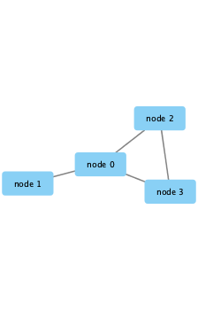
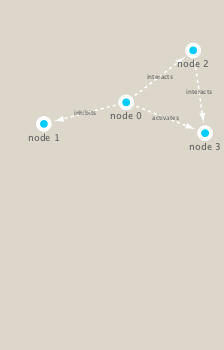

```{r setup, include=FALSE}
knitr::opts_chunk$set(echo = TRUE)
```

## Cytoscape Installation and Setup

First, you will have to install the R bioconductor package **RCy3** to drive the visualizaitions in Cytoscape. This also includes **igraph** from CRAN. Do this in the console. The code is:
`BiocManager::install("RCy3")`
`install.packages("igraph")`
`install.packages("RColorBrewer")`
Then we will need to input the packages into the library:
```{r}
library(RCy3)
library(igraph)
library(RColorBrewer)
```

We are then going to want to open Cytoscape and then test our connection with it. We can talk to cytoscape from R. Note that Cytoscape must be open and running at this point:
```{r}
# Test the connection to Cytoscape.
cytoscapePing()
#This should return "You are connected to Cytoscape!"
```

Make a simple igraph that we can send to Cytoscape to see if it works:
```{r}
g <- makeSimpleIgraph()
createNetworkFromIgraph(g,"myGraph")
```

We can include this Cytoscape rendered network image in our report with the following code:
```{r}
fig <- exportImage(filename="demo", type="png", height=350)


```

Play with representations in cytoscape:
```{r}
setVisualStyle("Marquee")
```

In Cytoscape you should see changes made to your network. We can also plot that into R:
```{r}
plot(g)
```

Lets save that into R:
```{r}
fig <- exportImage(filename="demo_marquee", type="png", height=350)


```

## Read our metagenomics data

Next, we will read in a species co-occurrence matrix that was calculated using Spearman Rank coefficient.
```{r}
## scripts for processing located in "inst/data-raw/"
prok_vir_cor <- read.delim("virus_prok_cor_abundant.tsv", stringsAsFactors = FALSE)

## Have a peak at the first 6 rows
head(prok_vir_cor)
```

How many connections (i.e. edges) do we have in our network?
```{r}
nrow(prok_vir_cor)
#1544
```

Here we will use the igraph package to convert the co-occurrence dataframe into a network that we can send to Cytoscape. 
In this case our graph is undirected (so we will set directed = FALSE) since we do not have any information about the direction of the interactions from this type of data.
```{r}
h <- graph.data.frame(prok_vir_cor, directed = FALSE)
```

We can check the class of our new object h and see that is is of class igraph. 
```{r}
class(h)
h
```
In this case the first line of output (“UNW- 854 1544 –”) tells that our network graph has 845 vertices (i.e. nodes, which represent our bacteria and viruses) and 1544 edges (i.e. linking lines, which indicate their co-occurrence). Note that the first four characters (i.e. the “UNW-” part) tell us about the network setup. In this case our network is Undirected, Named (i.e. has the ‘name’ node/vertex attribute set) and Weighted (i.e. the ‘weight’ edge attribute is set).

Next, plot h:
```{r}
plot(h)
```
Our current graph is a little too dense in terms of node labels etc. to have a useful ‘default’ plot figure. But we can have a look anyway.

Lets turn off the blue labels:
```{r}
plot(h, vertex.label=NA)
```

The nodes/vertex are too big. Lets make them smaller…
```{r}
plot(h, vertex.size=3, vertex.label=NA)
```

To send this network to Cytoscape we can use the command:
```{r}
createNetworkFromIgraph(h, "myIgraph")
```

## Network community detection

Lets cluster our network to find "community" structure...
Community structure detection algorithms try to find dense sub-graphs within larger network graphs (i.e. clusters of well connected nodes that are densely connected themselves but sparsely connected to other nodes outside the cluster) . Here we use the classic Girvan & Newman betweenness clustering method. The igraph package has lots of different community detection algorithms (i.e. different methods for finding communities).

```{r}
cb <- cluster_edge_betweenness(h)
cb
```

Now lets plot it:
```{r}
plot(cb, y=h, vertex.label=NA,  vertex.size=3)
```

You can extract a cluster/community membership vector for further inspection with the `membership()` function:
```{r}
head( membership(cb) )
```

## Centrality analysis

Centrality gives an estimation on how important a node or edge is for the connectivity (or the information flow) of a network. It is a particularly useful parameter in signaling networks and it is often used when trying to find drug targets for example.
```{r}
pr <- page_rank(h)
head(pr$vector)
```

Lets plot our network with nodes size scaled via this page rank centrality scores.
```{r}
# Make a size vector btwn 2 and 20 for node plotting size
library(BBmisc)
v.size <- BBmisc::normalize(pr$vector, range=c(2,20), method="range")
plot(h, vertex.size=v.size, vertex.label=NA)
```
