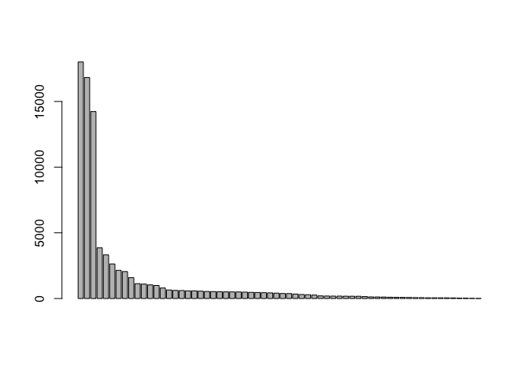
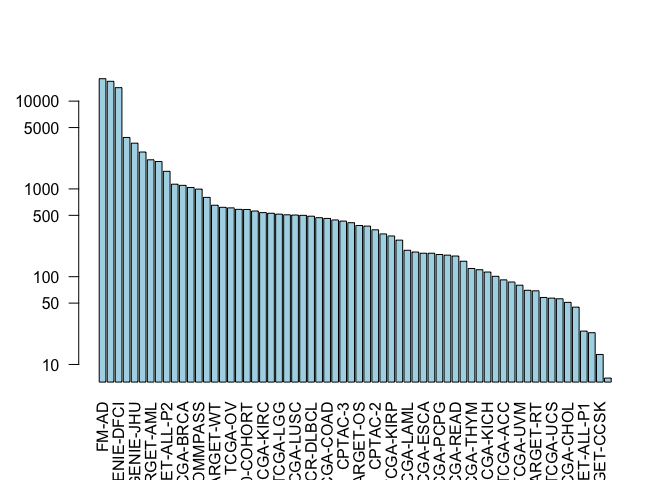
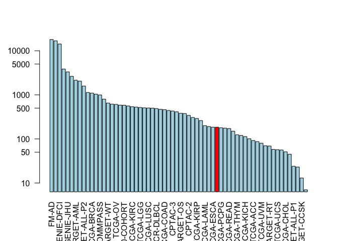
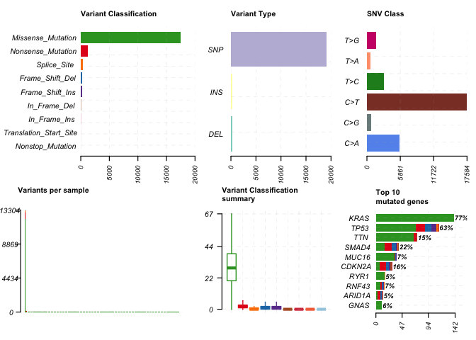
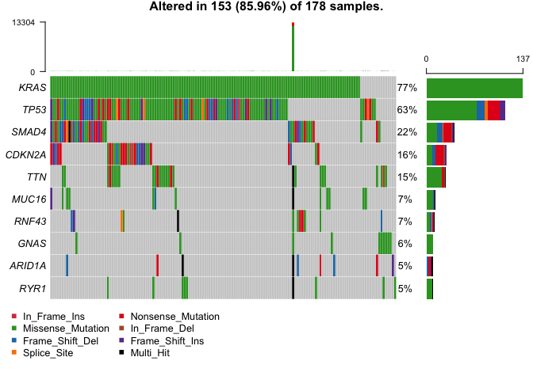

Class 18: Investigating cancer genomics datasets
================

## Connect to the NCI-GDC database

The NCI-GDC (cancer genomics commons) is a major portal for cancer
genomics data.

Here we use the bioconductor package **GenomicDataCommons** to talk to
this database and download data etc. all from R. The first thing we are
going to have to do is install new packages in the console using:
`BiocManager::install( c("GenomicDataCommons", "TCGAbiolinks",
"maftools") )`

Once installed, we must input it into the library to use it:

``` r
library(GenomicDataCommons)
```

    ## Loading required package: magrittr

    ## 
    ## Attaching package: 'GenomicDataCommons'

    ## The following object is masked from 'package:stats':
    ## 
    ##     filter

``` r
library(TCGAbiolinks)
library(maftools)
```

Now lets check on GDC status to see if we can talk to the databse:

``` r
status()
```

    ## $commit
    ## [1] "585cd1079835b7d5bec5c4dfd154fd9adde5f18e"
    ## 
    ## $data_release
    ## [1] "Data Release 22.0 - January 16, 2020"
    ## 
    ## $status
    ## [1] "OK"
    ## 
    ## $tag
    ## [1] "2.0.0"
    ## 
    ## $version
    ## [1] 1

## Querying the GDC from R

The are four main sets of metadata that we can query, namely
`projects()`, `cases()`, `files()`, and `annotations()`. We will start
with `projects()`:

``` r
projects <- getGDCprojects()
head(projects)
```

    ##                                                                                     primary_site
    ## 1 Rectosigmoid junction, Unknown, Rectum, Colon, Connective, subcutaneous and other soft tissues
    ## 2                                              Heart, mediastinum, and pleura, Bronchus and lung
    ## 3                                                                                  Adrenal gland
    ## 4                                                                                          Brain
    ## 5                                                  Hematopoietic and reticuloendothelial systems
    ## 6                                                                                  Thyroid gland
    ##                                                                                              name
    ## 1                                                                           Rectum Adenocarcinoma
    ## 2                                                                                    Mesothelioma
    ## 3                                                                        Adrenocortical Carcinoma
    ## 4                                                                        Brain Lower Grade Glioma
    ## 5 Clinical Resistance to Crenolanib in Acute Myeloid Leukemia Due to Diverse Molecular Mechanisms
    ## 6                                                                               Thyroid Carcinoma
    ##              project_id released dbgap_accession_number releasable
    ## 1             TCGA-READ     TRUE                   <NA>      FALSE
    ## 2             TCGA-MESO     TRUE                   <NA>      FALSE
    ## 3              TCGA-ACC     TRUE                   <NA>      FALSE
    ## 4              TCGA-LGG     TRUE                   <NA>      FALSE
    ## 5 BEATAML1.0-CRENOLANIB     TRUE              phs001628      FALSE
    ## 6             TCGA-THCA     TRUE                   <NA>      FALSE
    ##                                                          disease_type
    ## 1 Cystic, Mucinous and Serous Neoplasms, Adenomas and Adenocarcinomas
    ## 2                                               Mesothelial Neoplasms
    ## 3                                        Adenomas and Adenocarcinomas
    ## 4                                                             Gliomas
    ## 5                                                   Myeloid Leukemias
    ## 6             Epithelial Neoplasms, NOS, Adenomas and Adenocarcinomas
    ##                      id state      tumor
    ## 1             TCGA-READ  open       READ
    ## 2             TCGA-MESO  open       MESO
    ## 3              TCGA-ACC  open        ACC
    ## 4              TCGA-LGG  open        LGG
    ## 5 BEATAML1.0-CRENOLANIB  open CRENOLANIB
    ## 6             TCGA-THCA  open       THCA

Then we will pull all the information about the cases and group the
cases by the project type:

``` r
cases_by_project <- cases() %>%
  # %>% is the pipe operator in R that would take a vector and do the function you write after it which in this case its taking the cases function on it then running the facet and then aggregations on that data. This is clearer to read because you can read it like a sentence
  facet("project.project_id") %>%
  aggregations()
head(cases_by_project)
```

    ## $project.project_id
    ##    doc_count                   key
    ## 1      18004                 FM-AD
    ## 2      16824             GENIE-MSK
    ## 3      14232            GENIE-DFCI
    ## 4       3857             GENIE-MDA
    ## 5       3320             GENIE-JHU
    ## 6       2632             GENIE-UHN
    ## 7       2146            TARGET-AML
    ## 8       2052            GENIE-VICC
    ## 9       1587         TARGET-ALL-P2
    ## 10      1132            TARGET-NBL
    ## 11      1098             TCGA-BRCA
    ## 12      1038            GENIE-GRCC
    ## 13       995         MMRF-COMMPASS
    ## 14       801             GENIE-NKI
    ## 15       652             TARGET-WT
    ## 16       617              TCGA-GBM
    ## 17       608               TCGA-OV
    ## 18       585             TCGA-LUAD
    ## 19       583     BEATAML1.0-COHORT
    ## 20       560             TCGA-UCEC
    ## 21       537             TCGA-KIRC
    ## 22       528             TCGA-HNSC
    ## 23       516              TCGA-LGG
    ## 24       507             TCGA-THCA
    ## 25       504             TCGA-LUSC
    ## 26       500             TCGA-PRAD
    ## 27       489          NCICCR-DLBCL
    ## 28       470             TCGA-SKCM
    ## 29       461             TCGA-COAD
    ## 30       443             TCGA-STAD
    ## 31       430               CPTAC-3
    ## 32       412             TCGA-BLCA
    ## 33       383             TARGET-OS
    ## 34       377             TCGA-LIHC
    ## 35       342               CPTAC-2
    ## 36       307             TCGA-CESC
    ## 37       291             TCGA-KIRP
    ## 38       261             TCGA-SARC
    ## 39       200             TCGA-LAML
    ## 40       191         TARGET-ALL-P3
    ## 41       185             TCGA-ESCA
    ## 42       185             TCGA-PAAD
    ## 43       179             TCGA-PCPG
    ## 44       176              OHSU-CNL
    ## 45       172             TCGA-READ
    ## 46       150             TCGA-TGCT
    ## 47       124             TCGA-THYM
    ## 48       120            CGCI-BLGSP
    ## 49       113             TCGA-KICH
    ## 50       101            WCDT-MCRPC
    ## 51        92              TCGA-ACC
    ## 52        87             TCGA-MESO
    ## 53        80              TCGA-UVM
    ## 54        70   ORGANOID-PANCREATIC
    ## 55        69             TARGET-RT
    ## 56        58             TCGA-DLBC
    ## 57        57              TCGA-UCS
    ## 58        56 BEATAML1.0-CRENOLANIB
    ## 59        51             TCGA-CHOL
    ## 60        45           CTSP-DLBCL1
    ## 61        24         TARGET-ALL-P1
    ## 62        23             HCMI-CMDC
    ## 63        13           TARGET-CCSK
    ## 64         7        VAREPOP-APOLLO

``` r
# doc-count is the number of cases there are and the FM-AD is the projects
```

## Plot this overview data

Make a barplot of the information we just made:

``` r
x <- cases_by_project$project.project_id
head(x)
```

    ##   doc_count        key
    ## 1     18004      FM-AD
    ## 2     16824  GENIE-MSK
    ## 3     14232 GENIE-DFCI
    ## 4      3857  GENIE-MDA
    ## 5      3320  GENIE-JHU
    ## 6      2632  GENIE-UHN

``` r
barplot(x$doc_count)
```

<!-- -->

Now try and plot it with
log:

``` r
barplot(x$doc_count, names.arg = x$key, log="y", las=2, col = "lightblue")
```

<!-- -->

``` r
# Make a custom color vector for our plot
colvec <- rep("lightblue", nrow(x))
colvec[x$key == "TCGA-PAAD"] <- "red"

# Plot with 'log' for y axis and rotate labels with 'las'
barplot(x$doc_count, names.arg=x$key, log="y", col=colvec, las=2)
```

<!-- -->

## Variant Analysis with R

Find files avaliable for PAAD project that we can then examine variants
from:

``` r
maf.file <- GDCquery_Maf(tumor="PAAD", pipelines = "mutect")
```

    ## ============================================================================

    ##  For more information about MAF data please read the following GDC manual and web pages:

    ##  GDC manual: https://gdc-docs.nci.nih.gov/Data/PDF/Data_UG.pdf

    ##  https://gdc-docs.nci.nih.gov/Data/Bioinformatics_Pipelines/DNA_Seq_Variant_Calling_Pipeline/

    ##  https://gdc.cancer.gov/about-gdc/variant-calling-gdc

    ## ============================================================================

    ## --------------------------------------

    ## o GDCquery: Searching in GDC database

    ## --------------------------------------

    ## Genome of reference: hg38

    ## --------------------------------------------

    ## oo Accessing GDC. This might take a while...

    ## --------------------------------------------

    ## ooo Project: TCGA-PAAD

    ## --------------------

    ## oo Filtering results

    ## --------------------

    ## ooo By access

    ## ooo By data.type

    ## ooo By workflow.type

    ## ----------------

    ## oo Checking data

    ## ----------------

    ## ooo Check if there are duplicated cases

    ## ooo Check if there results for the query

    ## -------------------

    ## o Preparing output

    ## -------------------

    ## Downloading data for project TCGA-PAAD

    ## Of the 1 files for download 1 already exist.

    ## All samples have been already downloaded

    ## |==                                                              |   3%    1 MB|==                                                              |   3%    1 MB|==                                                              |   4%    1 MB|==                                                              |   4%    1 MB|===                                                             |   4%    2 MB|===                                                             |   5%    2 MB|===                                                             |   5%    2 MB|===                                                             |   5%    2 MB|===                                                             |   5%    2 MB|====                                                            |   6%    2 MB|====                                                            |   6%    2 MB|====                                                            |   6%    2 MB|====                                                            |   7%    2 MB|====                                                            |   7%    3 MB|====                                                            |   7%    3 MB|=====                                                           |   7%    3 MB|=====                                                           |   8%    3 MB|=====                                                           |   8%    3 MB|=====                                                           |   8%    3 MB|=====                                                           |   9%    3 MB|======                                                          |   9%    3 MB|======                                                          |   9%    4 MB|======                                                          |   9%    4 MB|======                                                          |  10%    4 MB|======                                                          |  10%    4 MB|======                                                          |  10%    4 MB|=======                                                         |  10%    4 MB|=======                                                         |  11%    4 MB|=======                                                         |  11%    4 MB|=======                                                         |  11%    4 MB|=======                                                         |  12%    5 MB|========                                                        |  12%    5 MB|========                                                        |  12%    5 MB|========                                                        |  12%    5 MB|========                                                        |  13%    5 MB|========                                                        |  13%    5 MB|========                                                        |  13%    5 MB|=========                                                       |  14%    5 MB|=========                                                       |  14%    6 MB|=========                                                       |  14%    6 MB|=========                                                       |  14%    6 MB|=========                                                       |  15%    6 MB|==========                                                      |  15%    6 MB|==========                                                      |  15%    6 MB|==========                                                      |  16%    6 MB|==========                                                      |  16%    6 MB|==========                                                      |  16%    6 MB|==========                                                      |  16%    7 MB|===========                                                     |  17%    7 MB|===========                                                     |  17%    7 MB|===========                                                     |  17%    7 MB|===========                                                     |  17%    7 MB|===========                                                     |  18%    7 MB|============                                                    |  18%    7 MB|============                                                    |  18%    7 MB|============                                                    |  19%    8 MB|============                                                    |  19%    8 MB|============                                                    |  19%    8 MB|============                                                    |  19%    8 MB|=============                                                   |  20%    8 MB|=============                                                   |  20%    8 MB|=============                                                   |  20%    8 MB|=============                                                   |  20%    8 MB|=============                                                   |  21%    8 MB|=============                                                   |  21%    9 MB|==============                                                  |  21%    9 MB|==============                                                  |  21%    9 MB|==============                                                  |  22%    9 MB|==============                                                  |  22%    9 MB|==============                                                  |  22%    9 MB|==============                                                  |  23%    9 MB|===============                                                 |  23%    9 MB|===============                                                 |  23%    9 MB|===============                                                 |  23%   10 MB|===============                                                 |  24%   10 MB|===============                                                 |  24%   10 MB|================                                                |  24%   10 MB|================                                                |  24%   10 MB|================                                                |  25%   10 MB|================                                                |  25%   10 MB|================                                                |  25%   10 MB|================                                                |  25%   10 MB|=================                                               |  26%   11 MB|=================                                               |  26%   11 MB|=================                                               |  26%   11 MB|=================                                               |  26%   11 MB|=================                                               |  27%   11 MB|=================                                               |  27%   11 MB|==================                                              |  27%   11 MB|==================                                              |  28%   11 MB|==================                                              |  28%   11 MB|==================                                              |  28%   12 MB|==================                                              |  28%   12 MB|==================                                              |  29%   12 MB|===================                                             |  29%   12 MB|===================                                             |  29%   12 MB|===================                                             |  30%   12 MB|===================                                             |  30%   12 MB|===================                                             |  30%   12 MB|====================                                            |  30%   13 MB|====================                                            |  31%   13 MB|====================                                            |  31%   13 MB|====================                                            |  31%   13 MB|====================                                            |  32%   13 MB|=====================                                           |  32%   13 MB|=====================                                           |  32%   13 MB|=====================                                           |  33%   13 MB|=====================                                           |  33%   14 MB|=====================                                           |  33%   14 MB|======================                                          |  33%   14 MB|======================                                          |  34%   14 MB|======================                                          |  34%   14 MB|======================                                          |  34%   14 MB|======================                                          |  34%   14 MB|======================                                          |  35%   14 MB|=======================                                         |  35%   14 MB|=======================                                         |  35%   15 MB|=======================                                         |  36%   15 MB|=======================                                         |  36%   15 MB|=======================                                         |  36%   15 MB|=======================                                         |  36%   15 MB|========================                                        |  37%   15 MB|========================                                        |  37%   15 MB|========================                                        |  37%   15 MB|========================                                        |  37%   15 MB|========================                                        |  38%   16 MB|========================                                        |  38%   16 MB|=========================                                       |  38%   16 MB|=========================                                       |  38%   16 MB|=========================                                       |  39%   16 MB|=========================                                       |  39%   16 MB|=========================                                       |  39%   16 MB|=========================                                       |  39%   16 MB|==========================                                      |  40%   16 MB|==========================                                      |  40%   17 MB|==========================                                      |  40%   17 MB|==========================                                      |  41%   17 MB|==========================                                      |  41%   17 MB|===========================                                     |  41%   17 MB|===========================                                     |  41%   17 MB|===========================                                     |  42%   17 MB|===========================                                     |  42%   17 MB|===========================                                     |  42%   18 MB|============================                                    |  43%   18 MB|============================                                    |  43%   18 MB|============================                                    |  43%   18 MB|============================                                    |  43%   18 MB|============================                                    |  44%   18 MB|============================                                    |  44%   18 MB|=============================                                   |  44%   18 MB|=============================                                   |  44%   18 MB|=============================                                   |  45%   19 MB|=============================                                   |  45%   19 MB|=============================                                   |  45%   19 MB|=============================                                   |  46%   19 MB|==============================                                  |  46%   19 MB|==============================                                  |  46%   19 MB|==============================                                  |  46%   19 MB|==============================                                  |  47%   19 MB|==============================                                  |  47%   19 MB|==============================                                  |  47%   20 MB|===============================                                 |  47%   20 MB|===============================                                 |  48%   20 MB|===============================                                 |  48%   20 MB|===============================                                 |  48%   20 MB|===============================                                 |  49%   20 MB|================================                                |  49%   20 MB|================================                                |  49%   20 MB|================================                                |  49%   20 MB|================================                                |  50%   21 MB|================================                                |  50%   21 MB|================================                                |  50%   21 MB|=================================                               |  50%   21 MB|=================================                               |  51%   21 MB|=================================                               |  51%   21 MB|=================================                               |  51%   21 MB|=================================                               |  51%   21 MB|=================================                               |  52%   21 MB|==================================                              |  52%   22 MB|==================================                              |  52%   22 MB|==================================                              |  53%   22 MB|==================================                              |  53%   22 MB|==================================                              |  53%   22 MB|==================================                              |  53%   22 MB|===================================                             |  54%   22 MB|===================================                             |  54%   22 MB|===================================                             |  54%   22 MB|===================================                             |  54%   23 MB|===================================                             |  55%   23 MB|===================================                             |  55%   23 MB|====================================                            |  55%   23 MB|====================================                            |  55%   23 MB|====================================                            |  56%   23 MB|====================================                            |  56%   23 MB|====================================                            |  56%   23 MB|=====================================                           |  56%   23 MB|=====================================                           |  57%   24 MB|=====================================                           |  57%   24 MB|=====================================                           |  57%   24 MB|=====================================                           |  58%   24 MB|======================================                          |  58%   24 MB|======================================                          |  58%   24 MB|======================================                          |  59%   24 MB|======================================                          |  59%   24 MB|======================================                          |  59%   25 MB|======================================                          |  59%   25 MB|=======================================                         |  60%   25 MB|=======================================                         |  60%   25 MB|=======================================                         |  60%   25 MB|=======================================                         |  61%   25 MB|=======================================                         |  61%   25 MB|========================================                        |  61%   25 MB|========================================                        |  61%   26 MB|========================================                        |  62%   26 MB|========================================                        |  62%   26 MB|========================================                        |  62%   26 MB|=========================================                       |  63%   26 MB|=========================================                       |  63%   26 MB|=========================================                       |  63%   26 MB|=========================================                       |  63%   26 MB|=========================================                       |  64%   26 MB|=========================================                       |  64%   27 MB|=========================================                       |  64%   27 MB|==========================================                      |  64%   27 MB|==========================================                      |  65%   27 MB|==========================================                      |  65%   27 MB|==========================================                      |  65%   27 MB|==========================================                      |  66%   27 MB|===========================================                     |  66%   27 MB|===========================================                     |  66%   27 MB|===========================================                     |  66%   28 MB|===========================================                     |  67%   28 MB|===========================================                     |  67%   28 MB|===========================================                     |  67%   28 MB|============================================                    |  67%   28 MB|============================================                    |  68%   28 MB|============================================                    |  68%   28 MB|============================================                    |  68%   28 MB|============================================                    |  69%   29 MB|=============================================                   |  69%   29 MB|=============================================                   |  69%   29 MB|=============================================                   |  70%   29 MB|=============================================                   |  70%   29 MB|=============================================                   |  70%   29 MB|==============================================                  |  70%   29 MB|==============================================                  |  71%   29 MB|==============================================                  |  71%   30 MB|==============================================                  |  71%   30 MB|==============================================                  |  72%   30 MB|===============================================                 |  72%   30 MB|===============================================                 |  72%   30 MB|===============================================                 |  73%   30 MB|===============================================                 |  73%   30 MB|===============================================                 |  73%   31 MB|================================================                |  74%   31 MB|================================================                |  74%   31 MB|================================================                |  74%   31 MB|================================================                |  74%   31 MB|================================================                |  75%   31 MB|=================================================               |  75%   31 MB|=================================================               |  75%   31 MB|=================================================               |  76%   32 MB|=================================================               |  76%   32 MB|=================================================               |  76%   32 MB|==================================================              |  77%   32 MB|==================================================              |  77%   32 MB|==================================================              |  77%   32 MB|==================================================              |  77%   32 MB|==================================================              |  78%   32 MB|===================================================             |  78%   33 MB|===================================================             |  78%   33 MB|===================================================             |  79%   33 MB|===================================================             |  79%   33 MB|===================================================             |  79%   33 MB|====================================================            |  80%   33 MB|====================================================            |  80%   33 MB|====================================================            |  80%   33 MB|====================================================            |  80%   33 MB|====================================================            |  81%   34 MB|====================================================            |  81%   34 MB|=====================================================           |  81%   34 MB|=====================================================           |  82%   34 MB|=====================================================           |  82%   34 MB|=====================================================           |  82%   34 MB|=====================================================           |  82%   34 MB|======================================================          |  83%   34 MB|======================================================          |  83%   35 MB|======================================================          |  83%   35 MB|======================================================          |  84%   35 MB|======================================================          |  84%   35 MB|======================================================          |  84%   35 MB|=======================================================         |  84%   35 MB|=======================================================         |  85%   35 MB|=======================================================         |  85%   35 MB|=======================================================         |  85%   36 MB|=======================================================         |  85%   36 MB|========================================================        |  86%   36 MB|========================================================        |  86%   36 MB|========================================================        |  86%   36 MB|========================================================        |  87%   36 MB|========================================================        |  87%   36 MB|========================================================        |  87%   36 MB|=========================================================       |  87%   36 MB|=========================================================       |  88%   37 MB|=========================================================       |  88%   37 MB|=========================================================       |  88%   37 MB|=========================================================       |  88%   37 MB|=========================================================       |  89%   37 MB|==========================================================      |  89%   37 MB|==========================================================      |  89%   37 MB|==========================================================      |  89%   37 MB|==========================================================      |  90%   37 MB|==========================================================      |  90%   38 MB|==========================================================      |  90%   38 MB|===========================================================     |  91%   38 MB|===========================================================     |  91%   38 MB|===========================================================     |  91%   38 MB|===========================================================     |  91%   38 MB|===========================================================     |  92%   38 MB|============================================================    |  92%   38 MB|============================================================    |  92%   38 MB|============================================================    |  92%   39 MB|============================================================    |  93%   39 MB|============================================================    |  93%   39 MB|============================================================    |  93%   39 MB|=============================================================   |  94%   39 MB|=============================================================   |  94%   39 MB|=============================================================   |  94%   39 MB|=============================================================   |  94%   39 MB|=============================================================   |  95%   40 MB|==============================================================  |  95%   40 MB|==============================================================  |  95%   40 MB|==============================================================  |  96%   40 MB|==============================================================  |  96%   40 MB|==============================================================  |  96%   40 MB|==============================================================  |  96%   40 MB|=============================================================== |  97%   40 MB|=============================================================== |  97%   40 MB|=============================================================== |  97%   41 MB|=============================================================== |  97%   41 MB|=============================================================== |  98%   41 MB|================================================================|  98%   41 MB|================================================================|  98%   41 MB|================================================================|  99%   41 MB|================================================================|  99%   41 MB|================================================================|  99%   41 MB|================================================================|  99%   41 MB|=================================================================| 100%   42 MB

``` r
head(maf.file)
```

    ## # A tibble: 6 x 120
    ##   Hugo_Symbol Entrez_Gene_Id Center NCBI_Build Chromosome Start_Position
    ##   <chr>                <int> <chr>  <chr>      <chr>               <int>
    ## 1 BCAN                 63827 BI     GRCh38     chr1            156651635
    ## 2 TNN                  63923 BI     GRCh38     chr1            175135891
    ## 3 PM20D1              148811 BI     GRCh38     chr1            205850012
    ## 4 CR1                   1378 BI     GRCh38     chr1            207523807
    ## 5 MLK4                 84451 BI     GRCh38     chr1            233372058
    ## 6 ITSN2                50618 BI     GRCh38     chr2             24310368
    ## # … with 114 more variables: End_Position <int>, Strand <chr>,
    ## #   Variant_Classification <chr>, Variant_Type <chr>, Reference_Allele <chr>,
    ## #   Tumor_Seq_Allele1 <chr>, Tumor_Seq_Allele2 <chr>, dbSNP_RS <chr>,
    ## #   dbSNP_Val_Status <chr>, Tumor_Sample_Barcode <chr>,
    ## #   Matched_Norm_Sample_Barcode <chr>, Match_Norm_Seq_Allele1 <lgl>,
    ## #   Match_Norm_Seq_Allele2 <lgl>, Tumor_Validation_Allele1 <chr>,
    ## #   Tumor_Validation_Allele2 <chr>, Match_Norm_Validation_Allele1 <lgl>,
    ## #   Match_Norm_Validation_Allele2 <lgl>, Verification_Status <lgl>,
    ## #   Validation_Status <lgl>, Mutation_Status <chr>, Sequencing_Phase <lgl>,
    ## #   Sequence_Source <lgl>, Validation_Method <chr>, Score <lgl>,
    ## #   BAM_File <lgl>, Sequencer <chr>, Tumor_Sample_UUID <chr>,
    ## #   Matched_Norm_Sample_UUID <chr>, HGVSc <chr>, HGVSp <chr>,
    ## #   HGVSp_Short <chr>, Transcript_ID <chr>, Exon_Number <chr>, t_depth <int>,
    ## #   t_ref_count <int>, t_alt_count <int>, n_depth <int>, n_ref_count <lgl>,
    ## #   n_alt_count <lgl>, all_effects <chr>, Allele <chr>, Gene <chr>,
    ## #   Feature <chr>, Feature_type <chr>, One_Consequence <chr>,
    ## #   Consequence <chr>, cDNA_position <chr>, CDS_position <chr>,
    ## #   Protein_position <chr>, Amino_acids <chr>, Codons <chr>,
    ## #   Existing_variation <chr>, ALLELE_NUM <int>, DISTANCE <dbl>,
    ## #   TRANSCRIPT_STRAND <int>, SYMBOL <chr>, SYMBOL_SOURCE <chr>, HGNC_ID <chr>,
    ## #   BIOTYPE <chr>, CANONICAL <chr>, CCDS <chr>, ENSP <chr>, SWISSPROT <chr>,
    ## #   TREMBL <chr>, UNIPARC <chr>, RefSeq <chr>, SIFT <chr>, PolyPhen <chr>,
    ## #   EXON <chr>, INTRON <chr>, DOMAINS <chr>, GMAF <dbl>, AFR_MAF <dbl>,
    ## #   AMR_MAF <dbl>, ASN_MAF <lgl>, EAS_MAF <dbl>, EUR_MAF <dbl>, SAS_MAF <dbl>,
    ## #   AA_MAF <dbl>, EA_MAF <dbl>, CLIN_SIG <chr>, SOMATIC <dbl>, PUBMED <chr>,
    ## #   MOTIF_NAME <lgl>, MOTIF_POS <lgl>, HIGH_INF_POS <lgl>,
    ## #   MOTIF_SCORE_CHANGE <lgl>, IMPACT <chr>, PICK <int>, VARIANT_CLASS <chr>,
    ## #   TSL <int>, HGVS_OFFSET <int>, PHENO <chr>, MINIMISED <int>, ExAC_AF <dbl>,
    ## #   ExAC_AF_Adj <dbl>, ExAC_AF_AFR <dbl>, ExAC_AF_AMR <dbl>, ExAC_AF_EAS <dbl>,
    ## #   ExAC_AF_FIN <dbl>, …

Read in the MAF file we found:

``` r
vars = read.maf(maf = maf.file, verbose = FALSE)
```

Now make a summary plot of the data:

``` r
plotmafSummary(vars)
```

<!-- -->

## Oncoplots

A very useful summary representation of this data can be obtained via
so-called oncoplots, also known as waterfall plots.

Make an oncoplot of the data:

``` r
oncoplot(maf = vars, top = 10)
```

<!-- -->

We can also send our plot to a PNG or PDF plot device directly, for
example:

``` r
# Oncoplot for our top 10 most frequently mutated genes
pdf("oncoplot_panc.pdf")
oncoplot(maf = vars, top = 10, fontSize = 12)
dev.off()
```

    ## quartz_off_screen 
    ##                 2
